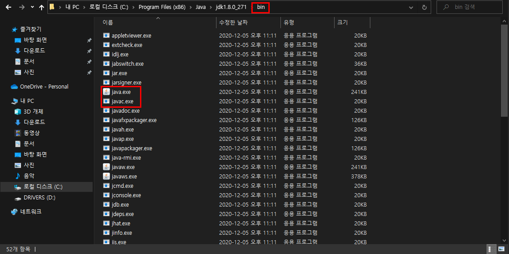
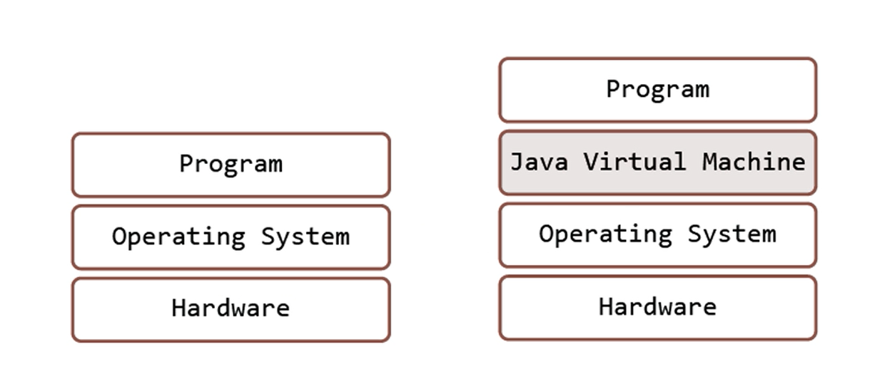

# **Let's Start Java**

# 1. 자바의 세계

## 1.1 JDK 
*Java Development Kit* 
자바 프로그램을 개발하는 데 키트.

## 1.2. 환경 변수 Path
### 1.2.1 자바의 기본 도구  
*도구 = 소프트 웨어라고 생각하자.*

```
javac.exe
 자바 컴파일러(Java Compiler)
java.exe 
 자바 런처(Java Launcher)
```

- cmd에서 `javac.exe`, `java.exe` 를 실행하기 위해서는 `환경 변수 Path` 설정을 해줘야 한다.  
cmd에 javac.exe 라고 입력을 하게되면 cmd는 javac.exe를 찾게 되는데 이 때 필요한 것이 환경 변수이기 때문이다.
  -  cmd (명령프롬프트) - 프로그램을 찾아서 대신 실행시켜주는 인터프리터.
  -  환경변수 Path - 문자열 정보.

- Path(경로)에 javac와 java가 있는 위치를 등록해 놓는다.  
cmd가 javac.exe와 java.exe를 찾을 때 Path가 알려주는 경로에 가서 이를 찾고 실행시키기 때문이다.
  
```
C:\Program Files (x86)\Java
``` 


- 다운로드 받을 때 특정 위치를 선택하지 않았다면 위 경로를 따라가면 Java 폴더 안에 jdk1.8.0_271 폴더가 있고, jdk1.8.0_271 안에 javac.exe, java.exe 가 있는 걸 확인할 수 있다.

- Path에 경로 정보를 잘못 지정했다면 cmd는 찾지 못할 것이다. 우리가 흔히 저지르는 실수가 이런 것이다. (대부분 Path 설정을 잘못한 경우)

### 1.2.2 환경 변수 설정


- javac.exe와 java.exe가 있는 bin까지의 경로를 Path에 지정해 놓아야한다. 

- 사용자 변수:  
  개인 사용자에 대한 환경변수 설정
- 시스템 변수:  
  사용자에 상관없이 전체 시스템에 대한 환경변수 설정

- Path라는 변수를 추가해보자.  
  - 
  - 변수 이름: Path
  - 값: bin이 있는 위치

- cmd에서 java, javac를 입력하면 많은 코드들이 창에 나타날텐데 이는 자바가 실행됐다는 걸 의미한다. (cmd가 찾아다 준 결과)


## 1.3 실습
*JavaStudy라는 폴더 안에 아래 파일을 만들고 저장*

```java
class FirstJavaProgram
{
    public static void main(String[] args)
    {
        System.out.println("Welcome to Java");
        System.out.println("First Java program");
    }
}
```

- C:\JavaStudy>javac FirstJavaProgram.java를 실행하면 **`javac`** 가 실행이 되면서 컴파일 하는 과정을 거치고 그 결과 아무것도 뜨지 않는다. (무언가 뜬다면 문제가 생긴 것)
    - 'FirstJavaProgram.java'라는 파일을 컴파일 하라는 의미한다.
    - 이 파일을 자바 가상머신에 의해서 실행될 수 있는 형태로 바꾸라는 정보를 전달 한 것이다.  

- JavaStudy 에 들어가보면 클래스 파일이 하나 만들어져있을 것이다.(`.class`)  
= 컴파일이 제대로 된 것.

- 여기까지 진행이 되면 실행을 할 수가 있는데, java.exe로 실행 한다.
  
- C:\JavaStudy>java FirstJavaProgram  
  - FirstJavaProgram 이라는 클래스파일을 실행하라.
  - FirstJavaProgram.class 파일을 찾아서 실행을 하게 된다.   
    (명령어를 입력할 때는 .class가 아닌 FirstJavaProgram 라고 입력)
<br>


# 2. 자바 프로그램과 실행의 원리에 대한 이해

## 2.1 일반적인 프로그램과 자바 프로그램의 차이


- 일반적인 프로그램
  - 하드웨어 위에 운영체제가 설치 된다. 여기까지 끝나야 우리가 프로그램을 사용하는 상태가 될 수 있다. (프로그램 설치 -> 실행)
  - 운영체제가 프로그램을 관리하고 실행시켜주는 구조이다.

- 자바 프로그램
  - 하드웨어 위에 운영체제가 설치 되는 것 까지는 똑같다.   
  - Program은 사실 Java Program인데 자바 프로그램이 실행되기 위해서는 자바가상머신(JVM)이라는 소프트웨어가 먼저 실행이 되어야한다.  
  - 우리가 작성하는 프로그램은 JVM 위에서 동작하는 구조이다.
  - 운영체제 입장:   
  가상머신을 동작하게 해주기 때문에 가상머신의 존재 자체는 알지만, 프로그램 자체는 모를뿐더러 관심도 없다. 프로그램은 자바 가상머신에 완전히 종속된다.

- 매칭 
    ```
    Program ───────────────>┌Program
                            └Java Virtual Machine 
    Operating System ───────>Operating System
    Hardware ───────────────>Hardware
    ``` 

- 자바만의 독특한 구조가 아니라 가상머신 위에서 동작하는 형태의 프로그램은 소프트웨어산업 여러군데에서 존재한다.
<br>


## 2.2 자바 런처

*java.exe  = `런처`라고 한다.*

java.exe는 자바가상머신을 구동 시키고 그렇게 구동된 자바가상머신 위에서 자바프로그램을 실행하도록 초기 준비를 해주고 실행까지 이어주는 역할을 한다.

누군가는 자바가상머신을 구동 시키고 프로그램을 올려줘야하는데 그 역할을 java.exe가 한다.
<br>


## 2.3 자바 프로그램과 자바 가상머신
자바로 프로그램을 작성하면 이를 어디서든 동작시킬 수가 있다.  
리눅스에서도, 윈도우에서도, 다른 운영체제에서도 특별한 이상이 없으면 동작 시킬 수 있다.

"당연한 거 아닌가?"라는 생각이 들지만, C로 리눅스에서 동작하는 프로그램을 만들었다고 가정해보자.  
이를 윈도우에서도 실행되도록 하려면 코드자체를 다시 짜야 한다. 프로그램이라는 것이 운영체제에 의존적이기 때문이다. 

리눅스 기반으로 C라는 언어를 이용해서 프로그램을 작성할 때는 리눅스를 활용해야 한다. 그리고 이를 활용하는 코드가 C안에 존재한다.
마찬가지로 윈도우 기반으로 C라는 언어를 이용해서 프로그램을 작성할 때는 윈도우를 활용하는 코드가 들어갈 수밖에 없다. 이런부분에서 자바와 차이가 나는 것이다.

작성된 코드(C)를 리눅스를 가지고 동작하게 하고 동시에 윈도우에서 동작하게 하는 건 불가능하다. 코드를 고쳐야 한다.  
하지만 자바는 가능하다는 점에서 메리트가 있다. (실무자 입장에서는 굉장히 매력적인 언어이다.) 

왜 자바는 운영체제와 상관없이 동작할 수 있는가?  
중간에, 운영체제와 프로그램 사이에 가상머신이 있기 때문이다.  

```
Windows JVM / Linux JVM 
```
윈도우용 Jvm, 리눅스용 Jvm은 다르다.  
운영체제에서 오는 차이점을 자바프로그램이 생각하지 않아도 가상머신에서 알아서 적절히 처리를 해주기 때문에 우리는 자바 코드를 수정하지 않고 어느 가상머신 위에서든 동작시킬 수 있다.
<br>


## 2.4 자바 컴파일러와 자바 바이트코드

*javac.exe  = **`자바 컴파일러`** 라고 한다.*

우리가 파일(메모장)에 소스코드를 넣는다고 가정하자.  
자바 프로그램 코드(자바 소스코드)를 담고 있는 이 파일을 소스파일이라 한다. 이 소스파일은 우리가 이해할 수 있는 문장으로 돼있는 것이지 실제로 자바 가상머신은 이 파일이 무슨 의미를 갖고 있는지 모른다.

그래서 자바 컴파일러를 이용해서 이 소스파일을, 이 소스 파일 안에 있는 소스코드를 자바가상머신이 이해할 수 있는 코드로 바꿔 줘야 한다.  
(= 컴파일러의 역할)

"자바 가상머신이 이해할 수 있는 코드로 바꿔줘"라고 하면 자바 컴파일러가 **` 클래스 파일`** 로 바꿔준다. (.class)

이 파일에는 당연히 자바가상머신이 이해할 수 있는 내용들로 채워져 있다. 이 명령문을 **`자바 바이트 코드`** 라고 한다.  
(명령문의 기본 체계가 1바이트 단위로 만들어져있기 때문.)

```
요약:

소스파일에 있는 내용을 가상머신이 이해할 수 있는 내용으로 바꿔준다.   
그리고 그렇게 만들어진 이 파일은 확장자가 '.class'인 클래스 파일이다.  
이 클래스 파일에는 자바 바이트 코드로 채워져있다.
```
<br>


# 3. 첫 번째 자바 프로그램의 관찰과 응용
```java
class FirstJavaProgram {
    public static void main(String[] args) {
        System.out.println("Welcome to Java");
        System.out.println("First Java program");
    }
}
```

- 중괄호를 이용해서 클래스와 메소드의 `영역`을 구분한다.
- 문장의 끝에는 세미콜론을 붙여서 문장의 끝을 표시한다.
    - 자바가상머신에 명령을 하는 문장에는 끝에 ';'을 붙인다고 생각하면 된다.
<br>