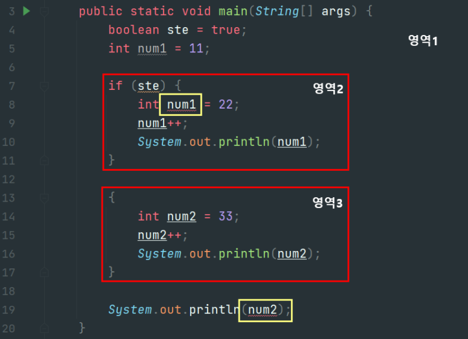

# **메소드와 변수의 스코프**

## 목차
1. [메소드에 대한 이해와 메소드의 정의](#1-메소드에-대한-이해와-메소드의-정의)  
   1.1 [메소드](#11-메소드)  
   1.2 [main 메소드에 대해서 우리가 아는 것과 모르는 것](#12-main-메소드에-대해서-우리가-아는-것과-모르는-것)  
   1.3 [값을 반환하는 메소드](#13-값을-반환하는-메소드)  
   1.4 [return의 두 가지 의미](#14-return의-두-가지-의미)

2. [변수의 스코프](#2-변수의-스코프)  
   2.1 [가시성: 여기서는 저 변수가 보여요](#21-가시성-여기서는-저-변수가-보여요)  
   2.2 [지역변수 선언의 예](#22-지역변수-선언의-예)
<br>


# 1. 메소드에 대한 이해와 메소드의 정의

## 1.1 메소드
*메소드는 기능상자이다.
기능상자에 +1을 해주는 기능(code)을 담아놓는다고 가정하자.*

- 기능상자에 숫자 5가 들어왔을 때 이 숫자는 6이 되어 나간다.

- 이런 기능상자를 제공해주는 경우도 있지만 대개는 우리가 이런 기능상자를 만들어야 한다.

- Class에 여러 개의 기능상자들을 담아야 하고, 필요할 때마다 기능상자를 활용 한다.

- main이라는 기능상자는 특별한 기능상자이다.  
자바 가상머신은 메인 기능상자를 찾고 그 안에 있는 문장들을 하나하나 실행해 나간다.
메인 상자는 다른 기능상자에 만들어놓은 기능들을 쓸 수 있다.

절차 지향적인 성격의 설명이지만 우선은 이렇게 이해하자.
<br>


## 1.2 main 메소드에 대해서 우리가 아는 것과 모르는 것
```java
public static void main(String[] args) {
    int num1 = 5;
    int num2 = 7;
    System.out.println("5 + 7 = " + (num1 + num2));
}
```
### 1.2.1 아는 것
- 메소드의 이름은 main이다.
- 자바에서 정한 규칙:   
프로그램의 시작은 main에서부터.
- 시작도 main이지만 종료도 main이다.
- 메소드의 중괄호 내에 존재하는 문장들이 위에서 아래로 순차적으로 실행된다.

### 1.2.2 모르는 것
- public, static 그리고 void가 왜 붙어있고 의미하는 바가 무엇인가?
- 이름은 왜 항상 main이어야 하는가?
- 메소드의 이름 오른편에 있는 소괄호와 그 안에 위치한 String[] args는 무엇인가?
<br>


## 1.3 값을 반환하는 메소드
```java
public static void main(String[] args) {
    int result;
    result = adder(4, 5);  // adder가 반환하는 값을 result에 저장
    System.out.println("4 + 5 = " + result);
    System.out.println("3.5 * 3.5 = " + square(3.5));
}

public static int adder(int num1, int num2) {
    int addResult = num1 + num2;
    return addResult;  // addResult의 값을 반환
}

public static double square(double num) {
    return num * num;  // num * num의 결과를 반환
}
```
- return: 값의 반환을 명령.  
= 내보내라. 결과물로 던져라.  
반환이라고 하는 이유는 값을 호출한 영역으로 전달해주기 떄문이다.

- result = adder(4, 5);  
adder(4, 5)를 실행하면 9가 return 되는데, 이 메소드 호출이 끝나면 adder(4, 5) 문장을 대체하고 9라는 숫자가 등장하게 된다.   
이것이 반환이고 이것을 명령하는 것이 return이다.

- 값을 반환한다는 것은 그 메소드 호출문을 그 결과로 대체한다는 의미이다.
  
- 내가 반환하는 값의 자료형(int, double)을 메소드 앞에 꼭, 굳이 표시하는 이유가 있을까?  
값이 반환이 됐다는 사실, 그 메소드 호출문장을 대신했다는 의미는 사실은 어딘가의 메모리 공간에 저장을 해야 된다는 의미니까 자바 가상 머신에게 힌트를 준다고 생각하면 된다.  
'결과물로 더블형 실수가 반환이 되겠구나, 미리 메모리 공간 만들어놔야지' 라고 생각하자.(지금은 이정도로 이해)

## 1.4 return의 두 가지 의미
```java
public static void main(String[] args) {
    divide(4, 2);
    divide(6, 2);
    divide(9, 0);
}

public static void divide(int num1, int num2) {
    if (num2 == 0) {
        System.out.println("0으로 나눌 수 없습니다.");
        return;  // 값의 반환 없이 메소드만 종료
    }
    System.out.println("나눗셈 결과: " +(num1 / num2));
}
```
1. 메소드를 호출한 영역으로 값을 반환한다.
2. 메소드의 종료
<br>


# 2. 변수의 스코프
*이 장에서는 지역 변수를 소개한다.  
중괄호(**`{ }`**)로 구분, 이 지역 내에 선언된 변수를 지역 변수라고 한다.*
 
## 2.1 가시성: 여기서는 저 변수가 보여요
### 2.1.1 지역변수
```java
if(...) {
    int num = 5;
    ...
}
```
- 지역변수는 중괄호를 빠져나가는 순간에 소멸되는 특징이 있다.
- 지역 내에서만 유효한 변수이다.
  
### 2.1.2 매개변수
```java
public static void myFunc(int num) {
    ...
}
```
- 지역 변수의 범주에 포함되는 매개변수도 지역변수와 마찬가지로 동일한 성격을 갖는다. 
- { }내에서만 유효하다.
  
### 2.1.3 조건문

```java
for(int num = 1; num < 5; num++) {
    ...
}
```
- for문 내에서 유효한 지역 변수 num도 지역변수의 성격을 갖는다.
- num은 반복문이 반복되는 동안에는 유효하다.  
하지만 조건을 만족시키지 못하여 for문을 완전히 빠져나가는 순간 num이라는 변수도 소멸된다.
- for문을 들어오는 순간 메모리 공간에 num이 할당이 되고, 조건을 만족시키지 못해서 빠져나가는 순간에 소멸된다.
<br>


## 2.2 지역변수 선언의 예


- 같은 영역 내에서 동일 이름의 변수는 선언이 불가능하다. 
- 영역2의 num1은 컴파일 오류가 발생한다.
  ```
  Variable 'num1' is already defined in the scope
  ```

  영역1과 영역2는 다른 영역인데, 왜 영역2에까지 영향을 미치는 걸까?  
  독립된 지역이긴 하지만 영역1의 영역은 20번째 줄의 } 까지 유효하기 때문이다. 따라서 영역1에 속하는 영역에서는 num1을 선언하지 못한다.

  다른 언어 중에서는 이렇게 별도의 영역(영역2)을 선언하면 그 영역이 다른 영역에 속해있더라도 영역2 안에서 num1을 허용하게하는 프로그래밍 언어들도 있지만 자바는 이를 허용하지 않는다.

- 19번째 줄의 코드에서도 컴파일 오류가 발생한다.
  ```
  Cannot resolve symbol 'num2'  
  ```

  13번째 ~ 17번째 { }처럼 내가 원하면 어느위치에서든간에 영역을 형성할 수 있다.  
  num2라는 변수명은 num1과는 다르기 때문에 이 영역에서 유효하다.  
  하지만 num2는 이 영역을 빠져나가면 사라지는데, 이 영역 밖에서 19번째처럼 num2를 참조하려고 하면 컴파일 오류가 발생한다.
<br>


# 3. 메소드의 재귀 호출