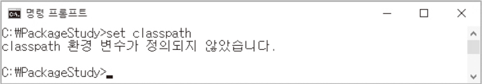
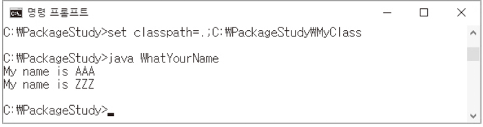
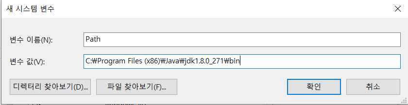

# **패키지와 클래스 패스**

## 목차
1. [클래스 패스(Class Path)](#1-클래스-패스class-path)  
   
2. [패키지(Package)의 이해]()
<br>

# 1. 클래스 패스(Class Path)
## 1.1 전반적 과정
```   
소스 파일                클래스 파일
┌────┐                  ┌─────────┐
│ A, │ ────compile────> │ A.class │
│ B  │                  └─────────┘
└────┘                  ┌─────────┐ 
S.java                  │ B.class │ 
                        └─────────┘ 
```
- 소스파일* 을 작성할 때 이 안에 둘 이상의 클래스를 담는다고 가정하자.   
S.java 파일 안에 A클래스, B클래스를 생성했다.
그리고 이것을 컴파일 하는 과정을 거치면 소스파일 당 하나의 클래스 파일이 아니라 클래스 하나 당 클래스 파일 하나가 생긴다.  
즉, S.class 파일이 아닌 A.class, B.class 파일 총 2개가 생긴다.
   - 소스 파일: 확장자가 `.java`인 자바 파일.  

- 컴파일 후 실행을 할 때, A, B 둘 중에 하나는 반드시 main 메소드를 가지고 있어야 한다.  
A가 메인 메소드를 가지고 있다면 `java main` 이라는 명령어를 통해서 실행을 하면된다.
<br>

## 1.2 컴파일 실행 과정
### 1.2.1 컴파일
```bash
C:\PS>javac S.java
```
- PS라는 디렉토리안에 java파일이 들어있고, 위 명령어로 컴파일을 실행한다.

- C:\PS>  
현재 디렉토리(Current Directory)*에서 아무런 경로 지시 없이 javac S.java 명령어를 입력하면 명령프롬프트의 현재 디렉토리(PS)를 근거로 해서 S.java 파일을 찾는다.  
만일 PS 디렉토리에 S.java 파일이 없으면 없다고 알려줄 것이다.
  - 현재 디렉토리: 작업 디렉토리. 그 프로그램이 작업을 하는 주된 디렉토리.
<br>

### 1.2.2 컴파일 결과, 그리고 실행
① 컴파일 결과
```bash
├── 📁PS
│   ├── A.class
│   ├── B.class
```
- 컴파일을 하면 명령프롬프트의 현재 디렉토리인 PS 이 위치에 클래스 파일들을 쭉 만들어놓는다.

- 실행은 A.class에 메인 메소드가 있으므로 A.class를 실행해야 한다.
<br>

② 실행
```bash
C:\PS>java A
```
- java.exe도 현재 디렉토리(PS)에서 A.class 파일을 찾아서 메인 메소드를 실행한다.

## 1.3 클래스 패스
- javac, java를 실행시켰을 때, A.class 파일을 현재 디렉토리(PS)에서만 찾는데, 클래스를 찾는 경로를 내가 별도로 지정을 해줄 수가 있다.  
그 경로를 **`클래스 패스`** 라고 한다.

- 클래스 패스를 지정하면 다양한 경로에서 자바 가상머신 혹은 자바 런처가 클래스 파일을 찾을 수 있도록 유도할 수 있다.
<br>

## 1.4 현재 디렉토리에 대한 이해
```java
WhatYourName.java
class AAA {...}
class ZZZ {...}
class WhatYourName {
    public static void main(String args[]) {
        AAA aaa = new AAA();
        aaa.showName();

        ZZZ zzz = new ZZZ();
        zzz.showName(); 
    }
}
```
```
C:\PackageStudy
```
- 현재 디렉토리: 실행 중인 프로그램의 작업 디렉토리  
- 현재 디렉토리는 PackageStudy이다. 
<br>

### 1.4.1 컴파일 하고 실행시키기
```
C:\PackageStudy>javac WhatYourName.java
```
- 현재 디렉토리 PackageStudy를 기준으로 WhatYourName.java 파일을 찾고 컴파일 한다.
<br>

```java
WhatYourName.java
class AAA {...}
class ZZZ {...}
class WhatYourName {
    public static void main(String args[]) {
        AAA aaa = new AAA();
        aaa.showName();

        ZZZ zzz = new ZZZ();
        zzz.showName(); 
    }
}
```

```bash
├── 📁PackageStudy
│   ├── AAA.class
│   ├── ZZZ.class
│   └── WhatYourName.class
```
- AAA 클래스 파일, ZZZ클래스 파일, WhatYourName 클래스 파일이 PackageStudy에 생성된다.
<br>

### 1.4.2 자바 가상머신 실행
```
C:\PackageStudy>java WhatYourName
```
- WhatYourName에 있는 메인 메소드를 실행 한다.
  
- AAA 인스턴스 생성, ZZZ 인스턴스 생성  
자바 가상머신이 실행 되면서 메인 메소드가 실행이 되는데, 제일 먼저 해야하는 일은 `AAA aaa = new AAA();` 이다.

- AAA 인스턴스를 실행하려면 자바 가상머신은 AAA클래스가 어떻게 생겼는지, 이를 알아야 인스턴스를 생성하든, 참조변수를 선언하든 할 것이다. 이제 자바가상머신은 `AAA.class` 파일을 찾아야 한다.

- 어디서 찾아야할까?   
어디서 실행 했는지를 알아야한다. PackageStudy에서 실행을 했고, 그 디렉토리를 찾아보니 AAA.class 파일이 있다.  

- AAA.class 파일을 읽어들인다. 나중에 또 AAA 인스턴스를 생성하면 그 때 또 읽어야할까?  
한 번만 읽어들이면 된다.  
읽어들여서 그 정보를 기준으로 인스턴스를 생성하면 되고, 마찬가지로 ZZZ 인스턴스 생성도 동일한 과정을 거친다.
<br>
<br>
___

## 1.5 디렉토리 구조 변경 및 컴파일
### 1.5.1 디렉토리 구조 변경
```java
WhatYourName.java
class AAA {...} ①
class ZZZ {...} ②
class WhatYourName {    ③
    public static void main(String args[]) {
        AAA aaa = new AAA();
        aaa.showName();

        ZZZ zzz = new ZZZ();
        zzz.showName(); 
    }
}
```
- ① WhatYourName.class  
    C:\PackageStudy 에 위치시킨다.
- ② AAA.class  
    C:\PackageStudy\MyClass에 위치시킨다.
- ③ ZZZ.class  
    C:\PackageStudy\MyClass에 위치시킨다.

```bash
├── 📦PackageStudy
│   ├── WhatYourName.class 
│   └── 📦MyClass
│       ├── AAA.class
│       └── ZZZ.class
```
<br>

### 1.5.2 컴파일 실행
- C:\PackageStudy>java WhatYourName  
실행이 가능하게 하려면?  
실행은 된다. 자바 가상머신이 실행되면서 WhatYourName 클래스를 읽어들이고 그 안에 있는 메인 메소드를 호출하는데, WhatYourName 파일은 그대로 있기 때문에 문제가 없다.

- 문제는 AAA 를 찾아서 읽어들여야 하는데, AAA.class 파일을 PackageStudy에서 찾으려고 하니 찾을 수가 없다. 위치를 MyClass 디렉토리로 옮겼기 때문이다.

- 클래스 패스를 지정해주지 않으면 명령프롬프트의 현재 디렉토리에서만 찾는다.  
클래스 패스라는 것을 지정해주면 자바 가상머신이 클래스를 찾을 경로 정보를 지정 해줄 수가 있다.

- 클래스패스에 MyClass를 포함시켜놨다면?
C:\PackageStudy>java WhatYourName 이렇게 실행해도 실행 가능하다.
경로를 바꿀 필요도 없고, 실행 방법을 달리할 필요도 없다. 클래스 패스에 MyClass만 추가 시켜주면 실행이 된다.
<br>
<br>

## 1.6 클래스 패스 설정하기
*클래스패스: 자바 가상머신의 클래스 탐색 경로*

### 1.6.1 명령 프롬프트에서 클래스 패스 설정하는 방법
#### 1.6.1.1 실패
```bash
C:\PackageStudy>set classpath
```



- 실패했다.

- 클래스 패스를 고정시키는 방법도 있는데, 이 방법은 좋지않다. 프로그램의 실행이라는 것은 유동적이기 때문에 고정보다는 필요할 때마다 설정을 해주는 것이 좋다.

- 명령 프롬프트에서 클래스 패스를 설정하면 명령 프롬프트에서만 유효하다.   
오른쪽 상단의 `x` 버튼을 눌러서 종료시키면 클래스 파일들도 다 날아간다.  
(하지만 이 점이 실무 개발에서는 장점으로 적용한다.)
<br>

#### 1.6.1.2 성공
```bash
C:\PackageStudy>set classpath=.;C:\PackageStudy\MyClass
```
- 클래스 패스는 환경변수 이름이다.  
이름에 대한 값 정보가 대입(=) 오른쪽에 온다. 두 가지의 정보가 있는데, 각각의 정보는 `;`으로 구분한다.

- **`C:\PackageStudy\MyClass`**  
이 값을 일단 하나 전달 한 것이다. (클래스패스로 지정)  
자바가상머신은 클래스 패스를 찾아와서 클래스를 찾을 때 어디를 뒤져야 하는지 이것을 참조해서 순차적으로 뒤져나간다.

- **`.`**  
현재 명령 프롬프트가 PackageStudy 에서 실행중인데, 이 때의 이 현재 디렉토리를 의미한다.  

- **`.`** 은 명시적으로 적어주어야 한다.  
클래스 패스 설정 전에는 C:\PackageStudy> 여기서 바로 찾았는데 이 때는 아무것도 안적어줬기 때문에 PackageStudy에서 찾았던 것이다.

- 클래스 패스를 지정해주면 더 이상 이 위치에서 클래스 파일을 찾지 않는다. 그러므로 명시적으로 적어주어야한다.   
여전히 PackageStudy 이 경로에서 클래스 파일을 찾게끔 설정해주었다.
<br>

#### 1.6.1.3 결과

MyClass를 클래스 패스로 추가를 하나 더 해줬더니 제대로 실행되는 걸 확인할 수 있다.  
;뒤에 입력하여 클래스 패스를 얼마든지 추가하고 싶은 만큼 추가해줄 수 있다.

## 1.7 절대 경로 vs 상대 경로
### 1.7.1 절대 경로

```bash
C:\PackageStudy>set classpath=.;C:\PackageStudy\MyClass
```

- 루트 디렉토리를 시작으로 지정한 `절대 경로`

- 죽었다 깨어나도 현재 디렉토리가 바뀌든지 말든지 상관없이 그 디렉토리를 경로로 포함시키겠다 라고 하면 루트 디렉토리(최상위 디렉토리)부터 시작해서 전부 명시해주면 된다. 

- 실무 개발에서는 절대 경로를 사용하지 않는다.
사용자의 설치 경로에 상관없이 무조건 필요한 파일들을 MyClass에 저장해야 된다는 문제가 생기기 때문이다.
<br>

### 1.7.2 상대경로

```bash
C:\PackageStudy>set classpath=.;.\MyClass
```

- 현재 디렉토리를 기준으로 지정한 `상대 경로`

- `.` = PackageStudy  
현재 디렉토리인 PackageStudy를 클래스 패스로 지정한다.

- 상대적으로 변한다.
명령프롬프트가 지시하고 있는 디렉토리가 바뀌면 현재 디렉토리는 당연히 바뀐다.

```bash
C:\AB>set classpath=.;.\MyClass
```
- 여기서 설정한 클래스 패스는 AB 디렉토리 밑에 있는 MyClass 디렉토리를 의미한다.  
상대경로에 익숙해지자.
<br>

## 1.8 클래스 패스를 고정시키는 방법
*안좋은 방법이니 지양하자.*



- Path 설정했었던 방식처럼 변수의 이름으로 classpath, 변수 값으로 경로 정보를 전달하면 클래스 패스가 시스템 전체에 적용이 된다.

- 좋은 방법이 아니므로 클래스 패스를 고정시키는 일이 가능하다는 사실 정도만 알고 있자.

- 한 예제를 위해서 클래스 패스를 고정시키면 다른 예제를 실행할 때마다 계속 추가 시켜줘야 하는데, 이는 좋은 방법은 아니다.
<br>
<br>


# 2. 패키지(Package)의 이해