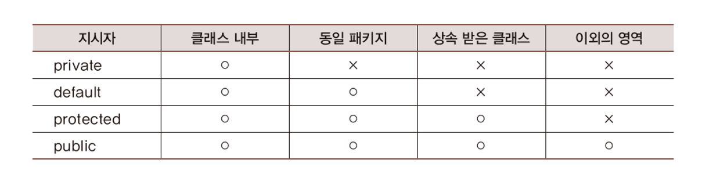

# 정보 은닉 그리고 캡슐화

## 목차
1. [정보 은닉(Informaiotn Hiding)](#1-정보-은닉informaiotn-hiding)  
   1.1 [정보 은닉의 주체](#11-정보-은닉의-주체)    
   1.2 [정보 은닉의 의미](#12-정보-은닉의-의미)  
   1.3 [정보를 은닉해야 하는 이유](#13-정보를-은닉해야-하는-이유)  
   1.4 [정보의 은닉을 위한 private 선언](#14-정보의-은닉을-위한-private-선언)
  
2. [접근 수준 지시자(Access-level Modifiers)](#2-접근-수준-지시자access-level-modifiers)  
   2.1 [네 가지 종류의 접근 수준 지시자](#21-네-가지-종류의-접근-수준-지시자)  
   2.2 [클래스 정의 대상의 public과 default선언이 갖는 의미](#22-클래스-정의-대상의-public과-default-선언이-갖는-의미)  
   2.3 [클래스의 public, default 선언 관련 예](#23-클래스의-public-default-선언-관련-예)  
   2.4 [인스턴스 멤버 대상의 접근 수준 지시자 선언](#24-인스턴스-멤버-대상의-접근-수준-지시자-선언)  
   2.5 [인스턴스 멤버의 public, default 선언 관련 예](#25-인스턴스-멤버의-public-default-선언-관련-예)  
   2.6 [인스턴스 멤버의 private 선언이 갖는 의미](#26-인스턴스-멤버의-private-선언이-갖는-의미)  
   2.7 [상속에 대한 약간의 설명: protected 선언의 의미 이해를 위한](#27-상속에-대한-약간의-설명-protected-선언의-의미-이해를-위한)  
   2.8 [인스턴스 멤버의 prtected 선언이 갖는 의미](#28-인슨턴스-멤버의-protected-선언이-갖는-의미)  
   2.9 [인스턴스 멤버 대상 접근 수준 지시자 정리](#29-인스턴스-멤버-대상-접근-수준-지시자-정리)

3. [캡슐화(Encapsulation)](#3-캡슐화encapsulation)  
   3.1 [캡슐화의 정의](#31-캡슐화의-정의)  
   3.2 [캡슐화를 시켜주는 이유](#32-캡슐화를-시켜주는-이유)  
   3.3 [캡슐화 무너진 예](#33-캡슐화-무너진-예)  
   3.4 [무너진 캡슐화의 결과](#34-무너진-캡슐화의-결과)  
   3.5 [적절한 캡슐화의 예](#35-적절한-캡슐화의-예)  
   3.6 [적절한 캡슐화로 인한 코드 수준의 향상](#36-적절한-캡슐화로-인한-코드-수준의-향상)  
   3.7 [포함 관계로 캡슐화 완성하기](#37-포함-관계로-캡슐화-완성하기)  
<br>

# 1. 정보 은닉(Informaiotn Hiding)
```   
클래스                   인스턴스
┌────┐                   ┌────┐
│    │ ────────────────> │    │
└────┘                   └────┘
```
- 클래스를 기반으로 해서 만들어진 게 인스턴스이므로 클래스에서 되는 것은 당연히 인스턴스에서도 되고 그 역도 마찬가지다.

- 클래스에는 대표적으로 2가지가 들어간다. 바로 데이터와 기능이다.
<br>

## 1.1 정보 은닉의 주체
- 인스턴스 혹은 클래스에 선언된 데이터에 인스턴스 혹은 클래스 외부에서 접근 하는 것을 허용하지 않겠다는 의미이다.
  
- 그럼 누가 접근을 하냐?  
클래스 내부에서만 접근을 허용하겠다.

- 클래스를 기준으로 `외부`에서는 이 데이터가 보이지도 않게하겠다.   
`접근 불가능`한 상태가 되도록 하겠다.

## 1.2 정보 은닉의 의미
*외부에서 접근이 불가능하고 내부에서만 접근을 하면 이게 어떤 의미를 갖는가.*
<br>

- 데이터를 가리고, 이 데이터에 접근을 하도록 하되 기능을 통해서 접근을 하도록 유도하겠다.  
= 클래스 외부에서 데이터에 **`직접`** 접근하는 것을 막겠다.
<br>
<br>


## 1.3 정보를 은닉해야 하는 이유
### 1.3.1 serRad() 메소드를 통한 접근  
```java
class Circle {
    double rad = 0;
    final double PI = 3.14;

    public Circle(double r) {
        setRad(r);
    }

    public void serRad(double r) {
        if( r < 0 ) {
            rad = 0;
            return;
        }
        rad = r;
    }

    public double getArea() {
        return (rad * rad) * PI;
    }
}
``` 
- 안정성이 높아진다. 잘못된 값이 전달 됐을 때 대처 방안을 마련할 수 있다.    
(r < 0 -> rad = 0으로 초기화.)
<br>

### 1.3.2 변수에 직접 접근
```java
...
public static void main(String arg[]) {
    Circle c = new Circle(1.5);
    System.out.println(c.getArea());

    c.setRad(2.5);
    System.out.println(c.getArea());

    c.setRad(-3.3);
    System.out.println(c.getArea());

    c.rad = -4.5;
    System.out.println(c.getArea());
}
```
- c.rad = -4.5;  
컴파일 오류가 발생하지 않는다.

- setRad() 메소드를 통해서만 rad를 초기화, 수정해주길 원하는데, 이렇게 변수에 직접 접근하는 것을 막아낼 수 있는 방법이 없다.   
직접 접근이 허용이 된다. (c.rad)

- 반지름이라는 것은 0보다 작을 수가 없는데, 0보다 작은 값을 갖는 상황이 발생한다.  
논리적 오류가 발생했음에도 불구하고 이런 논리적 오류는 컴파일 오류로 이어지지 않기 때문에 문제가 된다.

- 컴파일 오류로도 발생이 안되고 실행 과정에서도 문제가 생기지 않는다.   
그 결과 엉뚱한 값이 출력이 된다.
<br>

### 1.3.3 정보를 은닉하는 이유와 방법
#### 1.3.3.1 정보 은닉 이유
- 이러한 논리적 오류가 발생했을 때, `논리적 오류를 문법적 오류가 되게끔 해주는 방법`중의 하나가 `정보 은닉`이다.
 
- 직접 접근을 허용하지 않는다. 무조건 강제한다.  
메소드를 통해서 접근하도록 클래스를 정의했는데 직접 접근을 했을 때, 컴파일 오류로 이어지도록 문법적으로 강제하는 것이다.
<br>

#### 1.3.3.2 정보 은닉 방법
- 멤버 앞에 private이라는 선언을 넣어주면 된다.

- private 이름이 의미 하듯이 이 클래스에게 private한 멤버가 된다.   
private이 선언되면 클래스 내부에서는 언제든 접근이 가능하지만 클래스 외부에서 **`.`** 을 통해서 접근할 때, 컴파일 오류로 이어진다. 
<br>
<br>


## 1.4 정보의 은닉을 위한 private 선언
### 1.4.1 getter와 setter
```java
class Circle {
    private double rad = 0;
    final double PI = 3.14;

    public Circle(double r) {
        setRad(r);
    }

    public void serRad(double r) {  //setter
        if( r < 0 ) {
            rad = 0;
            return;
        }
        rad = r;
    }

    public double getRad() {  //getter
        return rad;
    }

    public double getArea() {
        return (rad * rad) * PI;
    }
}
``` 

- 접근하는 형태는 두 가지로 나뉜다.  
  ① 값을 가져가기 위한 접근 (getter)  
  ② 값을 초기화, 수정하기 위한 접근 (setter)  

- 이 두 가지 접근을 허용하기 위해 메소드 이름을 set-, get- 2개로 정의했다.  
그리고 rad라는 변수에 private을 넣어서 rad에 직접 접근을 할 수 없게 정의했다.
<br>

### 1.4.2 컴파일 오류
```java
...
public static void main(String arg[]) {
    Circle c = new Circle(1.5);
    System.out.println(c.getArea());

    c.setRad(2.5);
    System.out.println(c.getArea());

    c.setRad(-3.3);
    System.out.println(c.getArea());

    c.rad = -4.5;
    System.out.println(c.getArea());
}
```

- c.rad = -4.5;  
private을 선언했기 때문에 컴파일 오류로 이어진다.

- 클래스 안에 정의되고 있는 인스턴스 변수들은 어떠한 경우에도 불구하고 직접적으로 접근하는 것을 허용하지 않게 하는것이 좋은 코드이고, 접근할 수 있는 별도의 메소드를 제공하는 것이 좋은 객체지향을 기반으로 한 클래스 설계의 기본 원칙이다.

- private = 접근 수준 지시자  
접근할 수 있는 수준을 지시하는 지시자.  
`클래스 외부의 모든 접근을 원칙적으로 막겠다.`  
이러한 유형의 키워드들이 있다. 알아보자.
<br>
<br>


# 2. 접근 수준 지시자(Access-level Modifiers)

## 2.1. 네 가지 종류의 접근 수준 지시자
```text
public > protected > default > private
```

- ① public   
접근을 제한하지 않겠다. 어디서든 접근이 가능하다. public으로 선언되면 어디서든지 접근이 가능하다.

- ②private  
  정보은닉을 위해 인스턴스 변수를 private으로 선언하고 끝내면 의미가 있는 경우도 있지만, 상당부분 의미가 없어진다.  

  외부에서 접근해서 사용할 수 있어야 한다.  
  그래서 제공하는 2개의 메서드가 있는데( getter, setter) 보편적으로 getter, setter 메소드를 public으로 선언한다.

- ③ protected  
protected 수준의 접근 수준을 허용하겠다.


- ④ default  
키워드를 의미하는 것은 아니고, 아무런 선언도 하지 않은 것을 의미한다. 

- 기준을 private로 두고, private 보다 한 군데 더 접근을 허용하는 것이 default 이다.

  default 보다 한 군데 더 접근을 허용하는 것이 protected 이다.

  - private + ① =  default.  
    private + ② = protected.

- 클래스 정의 대상: public, default  
  인스턴스 변수와 메소드 대상: public, protected, default, private

*인스턴스 변수와 메소드 대상 에 집중해서 공부하자.*
<br>
<br>


## 2.2 클래스 정의 대상의 public과 default 선언이 갖는 의미

```java
public class AAA {
    ...
}
```
- public 으로 선언된 AAA 클래스

- 소스파일의 이름은 AAA로 지정해야 한다. (AAA.java)

- 이런 제약 사항을 두는 이유는, public 클래스는 외부에 노출시키기 위한 클래스이기 떄문이다. 소스파일의 이름만가지고도 그 안에 위치한 public 클래스의 이름, 내용이 유추 가능하다.
  
- 하나의 소스 파일에 두 개의 public 클래스를 넣을 수 있을까?
불가능하다. 클래스 이름 = 소스파일 이름 규칙이 지켜지지 않기 때문이다.  
<br>

```java
class ZZZ {
    ...
}
```
- default로 선언된 ZZZ 클래스

- 소스파일의 이름은 내가 원하는 파일명으로 지정하면 된다.
<br>

```text
public : 어디서든 인스턴스 생성이 가능하다.  
default: 동일 패키지로 묶인 클래스 내에서만 인스턴스 생성을 허용한다.
```
<br>
<br>


## 2.3 클래스의 public, default 선언 관련 예

```java
pacakage zoo;

class Duck {
    // 빈 클래스
}

public class Cat {
    public void makeCat() {
        Duct quack = new Duck();
    }
}
```
- Cat.java
- 이 소스 파일의 클래스들은 zoo라는 패키지로 묶여 있다.
<br>

```java
pacakage animal;

public class Dog {
    public void makeCat() {
        zoo.Cat yaong = new zoo.Cat();
    }   // OK

    public void makeDuck() {
        zoo.Duck quack = new zoo.Duck();
    }   // ERROR
}
```
- Dog.java
- Duck 이 default class 이기 때문에, Duck 인스턴스 생성을 할 수가 없다.
<br>
<br>


## 2.4 인스턴스 멤버 대상의 접근 수준 지시자 선언
```java
class AAA {
    public int num1;
    protected int num2;
    private int num3;
    int num4;   // default 선언

    public void md1() {...}
    protected void md2() {...}
    private void md3() {...}
    void md4() {...}   // default 선언
}
```
- private은 `.` 찍고 못들어온다.   
`.`찍는 것 자체가 외부에서 접근한다는 의미이기 때문이다.

- default는 private보다 하나 더 허용한다.  
  하나가 어디냐? 동일 패키지이다.  
  동일 패키지 내부에서라면 .찍고 접근이 가능하다.

- protected는 상속 개념을 알아야 하므로, 뒷부분에서 설명한다.
<br>
<br>


## 2.5 인스턴스 멤버의 public, default 선언 관련 예
```java
pacakage zoo;

public class Cat {
    public void makeSound() {
        System.out.println("야옹");
    }

    void makeHappy() {
        System.out.println("스마일");
    }
}
```
- default   
외부에서 전부 안되지만, 단 하나! 동일 패키지에서는 접근 가능하다.
<br>

```java
pacakage animal;

public class Dog {
    public void welcome(zoo.Cat c) {
        c.makeSount();  // OK

        c.makeHappy();  // ERROR
    }   
}
```
<br>
<br>


## 2.6 인스턴스 멤버의 private 선언이 갖는 의미
*정리해보자.*

```java
pacakage zoo;

class Duck {
    
    private int numLeg = 2;   // 클래스 내부에서만 접근 가능  

    public void md1() {
        System.out.println(numLeg); // 접근 가능
        md2();  // 호출 가능
    }

    private void md2() {
        System.out.println(numLeg); // 접근 가능
    }

    void md3() {
        System.out.println(numLeg); // 접근 가능
        md2();  // 호출 가능
    }
}
```
<br>
<br>


## 2.7 상속에 대한 약간의 설명: protected 선언의 의미 이해를 위한
*아주 간단하게 알아보자.*

AAA.java

```java
public class AAA {
    int num;
}
```
<br>


ZZZ.java
```java
public class ZZZ extends AAA {
    
    public void init(int n) {
        num = n;  // 상속된 변수 num의 접근
    }
}
```
- ZZZ.java 에는 num 변수를 선언한 적이 없는데, num에 n으로 초기화가 가능한 이유가 AAA.java를 상속했기 때문이다.  
ZZZ의 영역에 int num; 이 존재한다.

- 둘 다 패키지 선언이 안되어있는데, 저런 클래스들은 디폴트 패키지로 묶어준다. 

- 디폴트 패키지는 패키지 선언이 되어 있지 않은 클래스들을 하나의 패키지로 묶기 위한 개념이다.

- AAA와 ZZZ는 서로 다른 클래스이다.
  상속 관계로 묶여 있지만 ZZZ에서 num = n;은 엄연히 외부 접근이다.

  여기서 얘기하는 외부접근, 내부접근은 코드레벨에서 봐야한다.  
  인스턴스 레벨에서 보면 헷갈린다. 인스턴스 안에는 전부 다 있어서 같이 있는 것처럼 보이기 때문이다.    
  인스턴스 안에 ZZZ만 있는 게 아니라 AAA도 있으니 당연히 돼야 되는 거 아닌가 라고 생각할 수 있다.

  접근 수준 지시자를 근거로 얘기할 때는 코드 레벨 수준에서 봐야 한다는 사실을 기억하자.  
  외부 접근이지만 허용해 주는 근거는 AAA와 ZZZ가 같은 디폴트 패키지로 묶여 있기 때문이다.
<br>
<br>


## 2.8 인슨턴스 멤버의 protected 선언이 갖는 의미

alpha패키지 / AAA.java

```java
package alpha;

public class AAA {
    protected int num;
}
```
<br>

default 패키지 / ZZZ.java
```java
public class ZZZ extends alpha.AAA {
    
    public void init(int n) {
        num = n;   // 상속된 변수 num의 접근
    }
}
```
- 동일 패키지로 묶이지 않았더라도 protected 선언으로 인해 상속 관계에서 접근이 가능하다. 

- AAA 클래스의 멤버변수가 'default int num;' 이었다면 다른 패키지이기 때문에 접근이 불가능하다.
<br>

```
private: 클래스 외부에서의 접근은 다 막는 것.
default: +1 (동일 패키지)
protected: +1 (상속 관계)
```
<br>
<br>


## 2.9 인스턴스 멤버 대상 접근 수준 지시자 정리

<br>
<br>


# 3. 캡슐화(Encapsulation)
*자바 문법이라기보다는 소프트웨어 공학적 측면이 강한 개념*

## 3.1 캡슐화의 정의
- 클래스를 정의하는 데 있어서 하나의 클래스에 필요한 것들을 잘 담는 것이다.

- Car라는 클래스를 정의한다면 Car와 관련이 있는 것들을 잘 담는 것이다.  
무조건 관련있는 것을 담는 것이 아니라 `적절히` 담는 것이 중요하다.  
  - A라는 시스템에서 Car가 갖는 역할과 기능, B라는 시스템에서 Car가 갖는 역할과 기능은 완전히 다르다.

- 클래스들은 각각의 역할이 있다. 역할을 가지고 관계를 맺고선 서로간의 관계 형성을 통해서 프로그램이 흘러간다.

- 문제는 C가 가지고 있는 역할 일부를 잘못 판단해서 D에 넘기고, B가 가지고 있는 역할 일부를 잘못 판단해서 I에 넘겼을 때 나타난다.

- 자기고 가지고 있어야 될 기능을 적절히 가지고 있지 않고, 다른 위치로 옮겼을 때 코드의 복잡도가 엄청나게 올라간다. (캡슐화가 무너졌을 때)  
즉, C, B와 관련있는 모든 클래스들이 무너진다.
<br>
<br>

## 3.2 캡슐화를 시켜주는 이유
- 클래스가 자기가 담당해야 될 역할을 안정적으로 해서 나와 관련있는 클래스들이
편하게 존재할 수 있도록 돕기 위해서이다.

- 사람의 네트워킹과 비슷한 맥락이다.  
각자 역할을 충실히 담당하면 문제 생길일이 없지만, 내 역할을 충실히 담당하지 못하도록 디자인이 되면 주변 사람들이 고생을 하고 고생을 하다보면 전체 시스템의 성공 확률이 낮아진다. 

- 캡슐화의 수준, 완성도를 높여 나가는 것이지, 캡슐화의 정답은 없다.  
하나의 예제를 보며 감을 익히고, 계속 만들어 나가면서 연습을 하고 경험을 쌓자.
<br>
<br>


## 3.3 캡슐화 무너진 예
*(가정: 코감기는 콧물, 재채기, 코막힘을 `늘` 동반한다.)*

```java
class SinivelCap {  // 콧물 처치용 캡슐
    void take() {
        System.out.println("콧물이 싹~ 낫습니다.");
    }
}

class SneezeCap {   // 재채기 처치용 캡슐
    void take() {
        System.out.println("재채기가 멎습니다.");
    }
}

class SnuffleCap {   // 코막힘 처치용 캡슐
    void take() {
        System.out.println("코가 뻥 뚫립니다.");
    }
}
```
- 약의 복용 순서가 중요하다면?
- 클래스 SinivelCap, SneezeCap, SnuffleCap의 적용 및 사용 방법이 별도로 존재한다면? 그 순서는 위배되면 안된다.
<br>

```java
class ColdPatient {   
    void takeSnivelCap(SinivelCap cap) {
        cap.take();
    }

    void takeSneezeCap(SneezeCap cap) {
        cap.take();
    }

    void takeSnuffleCap(SnuffleCap cap) {
        cap.take();
    }
}
```
- 코감기 환자 클래스: 
코감기 환자의 역할에 충실해야 한다. 여행을 간다든지, 밥을 먹는다든지 해서는 안된다.
<br>
<br>

## 3.4 무너진 캡슐화의 결과
```java
class BadEncapsulation {

    public static void main(String[] args) {
        // 코감기 환자 등장
        ColdPatient suf = new ColdPatient();

        // 콧물 캡슐 구매 후 복용
        suf.takeSinivelCap(new SinivelCap());

        // 재채기 캡슐 구매 후 복용
        suf.takeSinivelCap(new SinivelCap());

        // 코막힘 캡슐 구매 후 복용
        suf.takeSinivelCap(new SinivelCap());
    }
}
```
- 코감기 치료를 진행하는 메인 메소드는
세 클래스가 존재함을 알고, 세 클래스의 인스턴스를 생성을 해서 복용 순서가 어떻게 되는지에 대한 순서 정보도 알아야 한다.

- 캡슐화가 무너지면 이렇듯 클래스 사용 방법과 관련하여 알아야 할 사항들이 많이 등장한다.
  - 복용해야 할 약의 종류
  - 복용해야 할 약의 순서
  
- 결론적으로 코드가 복잡해진다.
<br>
<br>


## 3.5 적절한 캡슐화의 예
*(가정: 코감기는 콧물, 재채기, 코막힘을 늘 동반한다.)*

```java
class SinivelCap {  // 콧물 처치용 캡슐
    void take() {
        System.out.println("콧물이 싹~ 낫습니다.");
    }
}

class SneezeCap {   // 재채기 처치용 캡슐
    void take() {
        System.out.println("재채기가 멎습니다.");
    }
}

class SnuffleCap {   // 코막힘 처치용 캡슐
    void take() {
        System.out.println("코가 뻥 뚫립니다.");
    }
}
```
<br>

```java
class SinusCap {   
    void sniTake(SinivelCap cap) {
        System.out.println("콧물이 싹~ 낫습니다.");
    }

    void takeSneezeCap(SneezeCap cap) {
        System.out.println("재채기가 멎습니다.");
    }

    void takeSnuffleCap(SnuffleCap cap) {
        System.out.println("코가 뻥 뚫립니다.");
    }

    void take() {   // 약의 복용 방법 및 순서가 담긴 메소드
        sniTake();
        sneTake();
        snuTake();
    }
}
```
- 하나의 클래스가 기능을 다 가지고 있다.

- 세 가지를 적절히 담았더니 가이드 메소드를 적용할 수 있게 된다. (take 메소드)

- take() 메소드가 호출이 되면, 알아서 복용순서에 맞게 복용을 하게끔 메소드를 디자인 해놨다.
<br>
<br>


## 3.6 적절한 캡슐화로 인한 코드 수준의 향상
```java
class ColdPatient {
    void takeSinus(SinusCap cap) {
        cap.take();
    }
}

class OneClassEncapsulation {

    public static void main(String[] args) {
        ColdPatient suf = new ColdPatient();
        suf.takeSinus(new SinusCap());
    }
}
```
- ColdPatient 클래스는 SinivelCap, SneezeCap, SnuffleCap 클래스들은 몰라도 된다. SinusCap 클래스 하나만 알면 된다.

- 복용 순서를 몰라도 된다. take 메소드를 통해 복용 과정이 모두 자동화 된다.

- 클래스 내에 필요한 기능을 적절히 잘 담을 경우에, 클래스의 인스턴스를 생성해서 활용하는 방법이 단순해진다.   
주변 클래스, 메소드들이 그 클래스를 활용함에 있어서 알아야할 정보들이 훨씬 줄어든다.
<br>
<br>


## 3.7 포함 관계로 캡슐화 완성하기
```java
class SinivelCap {  // 콧물 처치용 캡슐
    void take() {
        System.out.println("콧물이 싹~ 낫습니다.");
    }
}

class SneezeCap {   // 재채기 처치용 캡슐
    void take() {
        System.out.println("재채기가 멎습니다.");
    }
}

class SnuffleCap {   // 코막힘 처치용 캡슐
    void take() {
        System.out.println("코가 뻥 뚫립니다.");
    }
}
```
<br>

```java
class SinusCap {
    SinivelCap siCap = new SinivelCap();
    SneezeCap szCap = new SneezeCap();
    SnuffleCap sfCap = new SnuffleCap();

    void take() {
        siCap.take();
        szCap.take();
        sfCap.take();
    }
}
```
- 의미는 같다.  
앞 예제에서는 메소드를 새로운 클래스에 넣는 형태로 기존에 있던 클래스를 완전히 무너뜨리고  새로운 클래스를 정의 했다면, 이 클래스는 클래스의 정의를 무너뜨리지 않고 새로운 클래스를 등장시켜서 캡슐화를 완성(포함 관계)했다.