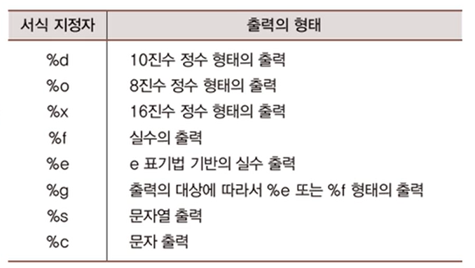

# 콘솔 입력과 출력

## 목차
1. [콘솔 출력 (Console Output)](#1-콘솔-출력-console-output)  
   1.1 [toString 메소드](#11-tostring-메소드)  
   1.2 [문자열의 조합 printf 메소드](#12-문자열의-조합-printf-메소드)  
   1.3 [printf 메소드 호출의 예](#13-printf-메소드-호출의-예)  

2. []()
<br>

# 1. 콘솔 출력 (Console Output)
- 콘솔  
    컴퓨터로 데이터를 입력하고 컴퓨터로부터 데이터를 확인하는 장치
    키보드, 모니터, 마우스 등을 콘솔이라고 한다.   

    키보드로 `입력`하는 방법, 모니터로 `출력`하는 방법
<br>

## 1.1 toString 메소드
```java
class Box {
    private String conts;

    Box(String cont) {
        this.conts = cont;
    }
    
    public String toString() {
        return conts;
    }
}
```

```java
public static void main(String[] args) {
    StringBuilder stb = new StringBuilder("12");
    stb.append(34);
    System.out.println(stb.toString());
    System.out.println(stb);

    Box box = new Box("Camera");
    System.out.println(box.toString());
    System.out.println(box);
}
```
```bash
1234
1234
Camera
Camera
```
- System.out.println(stb);  
stb만 던졌는데 어떻게 stb.toString 과 결과가 같을까?

- box.toString()은 String의 참조값을 반환하고, box만 출력한 코드는 Box 인스턴스의 참조값을 반환해야 하는데 어떻게 Camera 문자열이 출력이 되는 것일까?
<br>

### 1.1.1 println의 특성

- 인스턴스의 참조값이 전달이 되면 println은 전달된 참조값을 바탕으로 해당 인스턴스의 toString 메소드를 호출한다.  
(인자를 받지 않는 toString 메소드)  
그 때 반환된 문자열을 println이 출력한다.  
print 메소드도 마찬가지이고, 차이점은 출력 후에 개행을 하느냐 안하느냐이다.

- println은 참조되는 인스턴스에는 관심이 없다.  
 '그 인스턴스의 toString 메소드를 호출하겠다'라는 것밖에는 관심이 없다.

- 그렇다면 인스턴스에 toString 메소드가 없다면 println은 무엇을 출력하는가?

- 모든 클래스는 toString 메소드를 가지고 있다.  
내가 정의할 수도 있고, 내가 정의하지 않아도 기본적으로 갖게 되는 toString 메소드가 있다.
<br>
<br>


## 1.2 문자열의 조합 printf 메소드

```java
System.out.printf("정수는 %d, 실수는 %f, 문자는 %c", 12, 24.5, 'A');
```
- print **`f`**  
format의 약자. format을 구성해서 문자열을 출력하겠다는 의미이다.  
출력할 문자열을 다양하게 조합시킬 수 있다.  
첫번째 인자로 문자열을 전달하고, 데이터를 어떤 형태로 출력할 것인지 서식 지정자에 맞춰 적는다.

- 서식 지정자  


- , 뒤에 출력할 데이터의 값을 넣는다.
<br>
<br>


## 1.3 printf 메소드 호출의 예
```java
public static void main(String[] args) {
    int age = 20;
    double height = 178.2;
    String name = "YOON SUNG WOO";

    System.out.printf(" name: %s \n", name);
    System.out.printf(" age: %d \n height: %e \n\n",age, height);

    System.out.printf(" %d - %o - %x \n\n", 77, 77, 77);
    System.out.printf(" %g \n", 0.00014);
    System.out.printf(" %g \n", 0.000014);
}
```

```bash
name: YOON SUNG WOO
age: 20
height: 1.782000e+02

77 - 115 - 4d

0.00014000
1.40000e-05
```

- 0.1 은 실수로 표기하는 것이 편하다.   
누구나 다 0.1을 0.1로 잘 받아들인다.   
하지만 0.000000000000001 같은 숫자는 e표기법(지수 방식)으로 표시하는 게 낫다. 0이 몇 개인지 한 눈에 파악하기가 어려워서 몇 개인지 세어봐야하기 때문이다.  

- %g  
숫자의 소수점 자리 수가 몇 개인지에 따라서 어떤 경우에는 실수 표현 방식이 더 좋고, 어떤 경우에는 지수 기반 표기 방식이 더 좋은데 이를 알아서 결정해달라는 의미로 사용하는 것이 %g 이다. 

- printf 는 전달되는 인자의 수가 다양하다.
2개도, 6개도 전달 되는데 이를 가변 인자 라고 한다.
<br>
<br>


# 2. 콘솔 입력(Console Input)