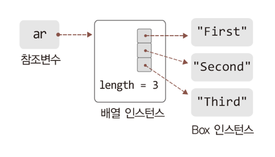

# 배열

## 목차
1. [1차원 배열의 이해와 활용(1)](#1-1차원-배열의-이해와-활용1)  
   1.1 [1차원 배열의 이해와 선언 방법](#11-1차원-배열의-이해와-선언-방법)  
   1.2 [배열 선언문에 대한 세세한 이해와 결과](#12-배열-선언문에-대한-세세한-이해와-결과)  
   1.3 [1차원 배열의 예](#13-1차원-배열의-예)  
   1.4 [인스턴스 대상 1차원 배열의 예](#14-인스턴스-대상-1차원-배열의-예)

2. [1차원 배열의 이해와 활용(2)](#2-1차원-배열의-이해와-활용2)  
   2.1 [배열의 활용: 값의 저장과 참조](#21-배열의-활용-값의-저장과-참조)  
   2.2 [값의 저장과 참조의 예](#22-값의-저장과-참조의-예)  
   2.3 [배열 기반 반복문 활용의 예](#23-배열-기반-반복문-활용의-예)

3. [1차원 배열의 이해와 활용(3)](#3-1차원-배열의-이해와-활용3)  
   3.1 [배열을 생성과 동시에 초기화 ](#31-배열을-생성과-동시에-초기화)  
   3.2 [배열 대상 참조변수 선언의 두 가지 방법](#23-배열-기반-반복문-활용의-예)  
   3.3 [배열의 참조 값과 메소드](#33-배열의-참조-값과-메소드)

4. [1차원 배열의 이해와 활용(4)](#4-1차원-배열의-이해와-활용4)  
   4.1 [배열의 디폴트 초기화](#41-배열의-디폴트-초기화)  
   4.2 [배열의 초기화 메소드](#42-배열의-초기화-메소드)  
   4.3 [배열 복사 메소드](#43-배열-복사-메소드)  
   4.4 [배열 초기화와 복사의 예](#44-배열-초기화와-복사의-예)  
   4.5 [main 메소드의 매개변수 선언](#45-main-메소드의-매개변수-선언)  
   4.6 [main의 매개변수로 인자를 전달하는 예](#46-main의-매개변수로-인자를-전달하는-예)  

5. [enhanced for문](#5-enhanced-for문)  
   5.1 [enhanced for문(for-each문)의 이해](#51-enhanced-for문for-each문의-이해)  
   5.2 [for-each문의 예](#52-for-each문의-예)  
   5.3 [인스턴스 배열 대상 for-each문의 예](#53-인스턴스-배열-대상-for-each문의-예)  

6. [다차원 배열의 이해와 활용](#6-다차원-배열의-이해와-활용)  
   6.1 [2차원 배열의 생성](#61-2차원-배열의-생성)  
   6.2 [2차원 배열의 접근](#62-2차원-배열의-접근)  
   6.3 [2차원 배열의 예](#63-2차원-배열의-예)  
   6.4 [2차원 배열의 실제 구조](#64-2차원-배열의-실제-구조)  
   6.5 [2차원 배열의 초기화](#65-2차원-배열의-초기화)  
<br>

# 1. 1차원 배열의 이해와 활용(1)
*배열은 동일한 자료형의 변수를 둘 이상 나란히 할당하는 것이다.*
## 1.1 1차원 배열의 이해와 선언 방법
- 1차원 배열이란?  
타입이 같은 둘 이상의 데이터를 저장할 수 있는 1차원 구조의 메모리 공간
  - 1차원 : 일렬로 나란히 할당된 메모리 공간

- 1차원 배열의 선언 방법  
int[] ref = new int[5];  
길이가 5인 int형 1차원 배열의 생성문
ref 라는 참조 변수가 배열을 가리키고 있다.  
  - = 을 기준으로 왼쪽은 참조변수 선언, 오른쪽은 배열 생성
<br>
<br>

## 1.2 배열 선언문에 대한 세세한 이해와 결과

- new 라는 키워드는 인스턴스 생성을 의미한다.  
 -> '자바에서는 배열도 사실은 인스턴스구나' 라고 짐작할 수 있다.
<br>
<br>

## 1.3 1차원 배열의 예
```java
public static void main(String[] args) {
    // 길이가 5인 int 형 1차원 배열의 생성
    int[] ar1 = new int[5];

    // 길이가 7인 double 형 1차원 배열의 생성
    double[] ar2 = new double[5];
    
    // 배열의 참조변수와 인스턴스 생성 분리
    float[] ar3;
    ar3 = new float[9];
    
    // 배열의 인스턴스 접근 변수
    System.out.println("배열 ar1 길이: " + ar1.length);
    System.out.println("배열 ar2 길이: " + ar2.length);
    System.out.println("배열 ar3 길이: " + ar3.length);
}
```
```bash
배열 ar1 길이: 5 
배열 ar2 길이: 7
배열 ar3 길이: 9
```
<br>
<br>

## 1.4 인스턴스 대상 1차원 배열의 예
```java
class Box {
    private String conts;

    Box(String cont) {
        this.conts = cont;
    }
    
    public String toString() {
        return conts;
    }
}

class ArrayIsInstance2 {
    public static void main(String[] args) {
        Box[] ar = new Box[5];  // 길이가 5인 Box 형 1차원 배열의 생성
        System.out.println("length = " + ar.length);    // length = 5
    }
}
```
<br>
<br>


# 2. 1차원 배열의 이해와 활용(2)
## 2.1 배열의 활용: 값의 저장과 참조
```java
int[] ar = new int[3];

ar[0] = 7;      // 값의 '저장': 첫 번째 요소
ar[1] = 8;      // 값의 '저장': 두 번째 요소
ar[2] = 9;      // 값의 '저장': 세 번째 요소

int num = ar[0] + ar[1] + ar[2];    // 값의 '참조'
```
<br>
<br>


## 2.2 값의 저장과 참조의 예

```java
class Box {
private String conts;

    Box(String cont) {
        this.conts = cont;
    }

    public String toString() {
        return conts;
}
```

```java
public static void main(String[] args) {
    Box[] ar = new Box[3];

    // 배열에 인스턴스 저장
    ar[0] = new Box("First");
    ar[1] = new Box("Second");
    ar[2] = new Box("Third");

    // 저장된 인스턴스의 참조
    System.out.println(ar[0]);
    System.out.println(ar[1]);
    System.out.println(ar[2]);
}
```
<br>
<br>


## 2.3 배열 기반 반복문 활용의 예
```java
public static void main(String[] args) {
    String[] sr = new String[7];
    sr[0] = new String("Java");
    sr[1] = new String("System");
    sr[2] = new String("Compiler");
    sr[3] = new String("Park");
    sr[4] = new String("Three");
    sr[5] = new String("Dinner");
    sr[6] = new String("Brunch Cafe");
    
    int cnum = 0;
    for (int i = 0; i < sr.length; i++) {
        cnum += sr[i].length();
    }

    System.out.println("총 문자의 수 = " + cnum);
}
```
- 배열 요소는 반복문을 통해 순차적 접근이 가능하며, 이것은 배열이 가진 큰 장점 중 하나이다.

- sr.length
배열의 인스턴스 변수 length에 접근한 것이다.

- sr[i].length()
String 인스턴스의 length() 메소드에 접근한 것이다.
<br>
<br>


# 3. 1차원 배열의 이해와 활용(3)
## 3.1 배열을 생성과 동시에 초기화 
```java
// 배열 생성
int[] arr = new int[3];

// 배열 생성 및 초기화 1
int[] arr = new int[]{1, 2, 3};

// 배열 생성 및 초기화 2
int[] arr = {1, 2, 3};
```
- int[] arr = new int[]{1, 2, 3};  
내가 정한 값으로 초기화를 하려면, 배열의 길이 정보를 컴파일러가 알아서 계산해서 넣어주도록 [] 안에는 길이 정보를 넣으면 안된다.
<br>
<br>


## 3.2 배열 대상 참조변수 선언의 두 가지 방법
```java
int[] arr = new int[3];     // 조금 더 선호하는 방법

int arr[] = new int[3];
```
- 둘 다 가능하지만 가급적이면 첫 번째 방법을 쓰도록 하자.
<br>
<br>


## 3.3 배열의 참조 값과 메소드
```java
public static void main(String[] args) {
    int[] arr = {1, 2, 3, 4, 5, 6, 7};
    int sum = sumOfAry(arr);    // 배열의 참조 값 전달
    ...
}

static int sumOfAry(int[] arr) {
    int sum = 0;
    for (int i = 0; i < arr.length; i++) {
        sum += arr[i];
    }
    return sum;
}

static int[] makeNewIntAry(int len) {
    int[] ar = new int[len];
    return ar;
}
```
- 매개 변수 선언 위치에도 참조 변수 선언을 할 수 있다.  
메소드의 전달 인자로 배열의 참조값이 전달된다는 의미이다.

- main 메소드 안에 있는 arr은 main 메소드에서만 유효한 arr이고, sumOfAry의 매개변수로 선언된 arr은 sumOfAry 메소드에서 유효한 arr이다.

- 배열의 참조 값도 반환이 가능하다.  
배열은 반환형 정보로도 명시할 수 있다.

- 참조 값을 가지고 있으면 누구나 배열에 접근이 가능하고, 참조 값은 주거니 받거니가 가능하다. 이것이 배열의 특성이다.
<br>
<br>


# 4. 1차원 배열의 이해와 활용(4)
## 4.1 배열의 디폴트 초기화
- 기본 자료형 배열은 모든 요소 **`0`** 으로 초기화  
int[] ar = new int[10];

- 인스턴스 배열(참조변수 배열)은 모든 요소 **`null`** 로 초기화  
String[] ar = new String[10];
<br>
<br>


## 4.2 배열의 초기화 메소드
```text
public static void fill(int[] a, int val)  
-> 두 번째 인자로 전달된 값으로 배열 초기화

public static void fill(int[] a, int fromIndex, int toIndex, int val)
-> 인덱스 fromIndex ~ (toIndex-1)의 범위까지 val의 값으로 배열 초기화
```

- java.util.Arrays 클래스에 정의되어 있는 메소드  
원하는 값으로 배열 전부 또는 일부를 채울 때 사용하는 메소드

- **`toIndex - 1`** 까지인 걸 잊지 말자.
<br>
<br>


## 4.3 배열 복사 메소드
```text
public static void arraycopy(Object src, int srcPos, Object dest, int destPos, int length)

복사 원본의 위치: 배열 src의 인덱스 srcPos
복사 대상의 위치: 배열 dest의 인덱스 destPos
복사할 요소의 수: length
```

```text
src  = 1 2 3 4 5 6 7
dest = 0 0 2 3 4 0 0 
```
- src에 있는 것을 dest에 복사해라.
srcPos = 1, destPos = 2 -> src의 인덱스 1번 째부터 복사해서 값들을 dest의 2번째 인덱스에서부터 가져다 놓기 시작해라.
length = 3 -> 몇개? 3개만 복사하여라.

- java.lang.System 클래스에 정의되어 있는 메소드, 한 배열에 저장된 값을 다른 배열에 복사할 때 사용하는 메소드
<br>
<br>


## 4.4 배열 초기화와 복사의 예
```java
import java.util.Arrays;


class ArrayUtils {
    public static void main(String[] args) {
        int[] ar1 = new int[10];
        int[] ar2 = new int[10];

        Arrays.fill(ar1, 7);    // 배열 ar1 을 7로 초기화
        System.arraycopy(ar1, 0, ar2, 3, 4);    // 배열 ar1을 ar2로 부분 복사

        for (int i = 0; i < ar1.length; i++) {
            System.out.println(ar1[i] + " ");
        }
        System.out.println();   // 단순 줄 바꿈

        for (int i = 0; i < ar2.length; i++) {
            System.out.println(ar2[i] + " ");
        }
    }
}
```

```bash
7 7 7 7 7 7 7 7 7 7
0 0 0 7 7 7 7 0 0 0 
```
<br>
<br>


## 4.5 main 메소드의 매개변수 선언
```java
public static void main(String[] args) {....}
```
- 이제 main 메소드의 매개변수 안에 기입된 것들이 무엇인지 의미를 알 수 있다.

- main 을 호출해야 한다면?  
  ```java
    String[] arr = new String[] {"Coffee", "Milk", "Orange"};
    main(arr);
  ```

- 하지만 우리는 위와 같은 작업을 해준 적이 없다.  
누가 해준 것인가? 실행이 되면서 자동으로 자바 가상머신에 의해서 자동으로 만들어져서 전달이 된다.

- ```bash
  C:\JavaStudy>java Simple
  ```
  Simple에 있는 메인메소드를 실행하라는 명령어를 입력하면,
  자바 가상머신은 빈 배열(길이가 0인)을 만들고 이를 전달한다.
  ```java
  String[] arr = new String[] {};
  main(arr);
  ```

- ```bash
  C:\JavaStudy>java Simple Coffee Milk Orange
  ```
  명령어에 이렇게 입력하면 어떻게 될까?  
  자바 가상머신은 전달된 Coffee를 String 인스턴스로 만든다. Milk도, Orange도.  
  공백을 기준으로 전달되는 문자열 정보를 가지고 String 인스턴스를 만든다.   
  이렇게 프로그램을 실행하면 세 개의 String 인스턴스가 생성이 되고, 이를 하나의 배열로 묶어버리고 참조값을 인자로 전달한다.
  ```java
  String[] arr = new String[] {};
  main(arr);
  ```

  ```text
    arr <──────{ [  ][  ][  ] }
                  │   │    │
                 "C" "M"  "O"
  ```
<br>  
<br>  


## 4.6 main의 매개변수로 인자를 전달하는 예
```java
class Simple {
    public static void main(String[] args) {
        for (int i = 0; i < args.length; i++) {
            System.out.println(args[i]);
        }
    }
}
```

```bash
C:\JavaStudy>java Simple Coffee Milk Orange
Coffee
Milk
Orange
```
<br>
<br>


# 5. enhanced for문
## 5.1 enhanced for문(for-each문)의 이해
```java
int[] ar = {1, 2, 3, 4, 5};

for (int i = 0; i < ar.length; i++) {
    System.out.println(ar[i]);
}
```
- 코드의 특징: 배열 요소의 순차적 접근
- 위 유형의 코드는 for-each문으로 다음과 같이 구성 가능
<br>

```java
int[] ar = {1, 2, 3, 4, 5};
        
for (int e : ar) {
    System.out.println(e);
}
```
- 이렇게 구성을 해도 배열 요소에 순차적으로 접근한다.

- ar이 저장하고 있는 모든 요소를 대상으로 반복 실행하겠다.   
ar이 가지고 있는 값을 하나씩 e에 저장할 것이니 저장한 값을 가지고 중괄호 영역을 계속 반복 하여라.

- 코드의 양이 줄고 배열의 길이와 요소에 신경 쓸 필요 없다.
<br>
<br>


## 5.2 for-each문의 예
```java
public static void main(String[] args) {
    int[] ar = {1, 2, 3, 4, 5};

    // 배열 요소 전체 출력
    for (int e : ar) {
        System.out.println(e);
    }
    System.out.println();   // 단순 줄 바꿈
    
    int sum = 0;
    
    // 배열 요소의 전체 합 출력
    for (int e : ar) {
        sum += e;
    }
    System.out.println("sum = " + sum);
}
```

```bash
1 2 3 4 5
sum = 15
```
<br>
<br>


## 5.3 인스턴스 배열 대상 for-each문의 예
```java
public static void main(String[] args) {
    Box[] ar = new Box[5];
    ar[0] = new Box(101, "Coffee");
    ar[1] = new Box(202, "Computer");
    ar[2] = new Box(303, "Apple");
    ar[3] = new Box(404, "Dress");
    ar[4] = new Box(505, "Fairy-tale book");

    // 배열에서 번호가 505인 Box 를 찾아 그 내용물을 출력하는 반복문
    for (Box e : ar) {
        if (e.getBoxNum() == 505) {
            System.out.println(e);
        }
    }
}
```
- ar에 저장되어있는 값을 e에 하나씩 넘겨주는데 타입이 일치하지 않으면 넣을 수가 없다.  
Box 인스턴스의 참조값을 넘겨주면 받는 쪽에서도 당연히 Box여야한다.

```bash
Fairy-tale book
```
<br>
<br>


# 6. 다차원 배열의 이해와 활용
## 6.1 2차원 배열의 생성

```text
1차원 배열

int[] arr1 = new int[4];

arr1 ──> arr1[0] arr1[1] arr1[2] arr1[3]
```
<br>

```text
2차원 배열

int[][] arr2 = new int[3][4];

arr2 ──> arr1[0][0] arr1[0][1] arr1[0][2] arr1[0][3]
         arr1[1][0] arr1[1][1] arr1[1][2] arr1[1][3]
         arr1[2][0] arr1[2][1] arr1[2][2] arr1[2][3]  
```
- 길이가 4인 1차원 배열을 3개 묶어서 2차원 배열을 생성하겠다.

- 세로가 3, 가로가 4인 2차원 배열을 만드는 것 이라고 이해해도 된다.

- int[5][3][4]  
세로가 3, 가로가 4인 2차원 배열을 5개 만들겠다는 의미이다. (3차원 배열)
<br>
<br>


## 6.2 2차원 배열의 접근
```text
int[][] arr = new int[3][3];

arr[0][0] = 1;      [1][ ][ ]
                    [ ][ ][ ]
                    [ ][ ][ ]

arr[1][0] = 5;      [ ][ ][ ]
                    [5][ ][ ]
                    [ ][ ][ ]       

arr[2][2] = 9;      [ ][ ][ ]
                    [ ][ ][ ]
                    [ ][ ][9]             
```
<br>
<br>


## 6.3 2차원 배열의 예
```java
public static void main(String[] args) {
    int[][] arr = new int[3][4];
    int num = 1;
    
    // 배열에 값을 저장
    for (int i = 0; i < 3; i++) {
        for (int j = 0; j < 4; j++) {
            arr[i][j] = num;
            num++;
        }
    }
    
    // 배열에 저장된 값을 출력
    for (int i = 0; i < 3; i++) {
        for (int j = 0; j < 4; j++) {
            System.out.println(arr[i][j] + "\t");
        }
        System.out.println();
    }
}
```
```bash
1   2   3   4
5   6   7   8 
9   10  11  12
```
- 2차원 배열의 구조상 순차적 접근을 할 때 2중 for문을 쓸 수밖에 없다.
<br>
<br>


## 6.4 2차원 배열의 실제 구조
```text
int[][] arr = new int[3][4];
```
- 2차원 배열은 1차원 배열이 여러 개가 묶인 것이다.
(다수의 1차원 배열을 엮어서 구성이 되는 2차원 배열)
<br>
<br>


## 6.5 2차원 배열의 초기화
```text
int[][] arr = {     
                {11, 22, 33},    [11][22][33]
                {44, 55, 66},    [44][55][66]
                {77, 88, 99}     [77][88][99]
}; 

int[][] arr = {     
                {11},            [11]
                {22, 33},        [22][33]
                {44, 55, 66}     [44][55][66]
}; 
```
<br>

```java
public static void main(String[] args) {
    int[][] arr = {
            {11},
            {22, 33},
            {44, 55, 66}
    };

    // 배열의 구조대로 내용 출력
    for (int i = 0; i<arr.length; i++) {
        for (int j = 0; j < arr[i].length; j++) {
            System.out.println(arr[i][j] + "\t");
        }
        System.out.println();
    }
}
```
- arr.length;
2차원 배열 arr의 길이를 참조하고 있는 것이다.   
(arr의 길이는 3.)

- arr[i].length;
arr[0], arr[1], arr[2]의 길이를 참조하고 있다.  
(arr[0]의 길이는 1, arr[1]의 길이는 2, arr[2]의 길이는 3 )
<br>

```bash
11
22  33
44  55  66
```