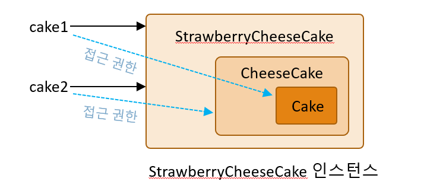

# 클래스의 상속 2: 오버라이딩

## 목차
1. [상속을 위한 두 클래스의 관계](#1-상속을-위한-두-클래스의-관계)  
   1.1 [상속 관계에 놓은 두 대상의 관찰](#11-상속-관계에-놓은-두-대상의-관찰)  
   1.2 [상속과 IS-A 관계](#12-상속과-is-a-관계)  
   1.3 [IS-A 관계의 예](#13-is-a-관계의-예)  

2. [메소드 오버라이딩](#2-메소드-오버라이딩)  
   2.1 [상위 클래스의 참조변수가 참조할 수 있는 대상의 범위](#21-상위-클래스의-참조변수가-참조할-수-있는-대상의-범위)  
   2.2 [참조변수의 참조 가능성 관련 예제](#22-참조변수의-참조-가능성-관련-예제)  
   2.3 [참조변수의 참조 가능성에 대한 정리](#23-참조변수의-참조-가능성에-대한-정리)  
   2.4 [참조변수 간 대입과 형 변환](#24-참조변수-간-대입과-형-변환)  
   2.5 [참조변수의 참조 가능성: 배열 기반](#25-참조변수의-참조-가능성-배열-기반)  


<br>

# 1. 상속을 위한 두 클래스의 관계
*자바는 현실 세계를 모델링해서 만든 언어이다.  
상위 클래스와 하위 클래스의 관계를 잘 생각해보자.  
노트북이 지우개를 상속할 순 없다. 노트북 클래스가 지우개 클래스를 상속하게 프로그래밍을 할 수는 있지만, 이는 잘못된 기능이다.   
노트북이 지우개를 상속했다면 노트북을 가지고 노트를 지우겠다는 기능을 의미한다.*
<br>

## 1.1 상속 관계에 놓은 두 대상의 관찰
### 1.1.1 상속의 특성
- 하위 클래스는 상위 클래스의 모든 특성을 지닌다.
  
- 거기에 더하여 하위 클래스는 자신만의 추가적인 특성을 더하게 된다.

- 모바일폰(전화기능이 전부)을 스마트폰이 상속한다.  
    ```text
    class 스마트폰 extends 모바일폰 {...}  
    ```

- 이렇듯 상속 관계에 있는 두 대상은 IS-A 관계를 가져야 한다.
A is a B ─> A는 일종의 B이다.  
어렵게 생각하지말고 사과(A)는 일종의 과일(B)이다 를 떠올리자.  
스마트폰은 일종의 모바일폰이다. -> 성립  
노트북은 일종의 지우개이다. -> 문제 발생
<br>
<br>


## 1.2 상속과 IS-A 관계
..은 ~이다

- IS-A 관계가 성립한다고 해서 전부 상속 시켜야 하는 것은 아니다.  
IS-A 관계가 100가지가 있다고 한다면, 이 중 상속 관계로 묶어줘야 하는 것은 50가지도 안될 것이다.   
기본적으로 IS-A 관계는 상속을 위한 기본 최소 조건이다.  
IS-A 관계가 성립 되는 것들을 모아놓고, 이 중에서 상속을 시킬지 말지를 결정한다.

- IS-A 관계를 갖지 않는 두 클래스가 상속으로 연결되어 있다면, 적절한 상속인지 의심해야 한다.
<br>
<br>


## 1.3 IS-A 관계의 예
```java
class MobilePhone {
    protected String number;    // 전화번호

    public MobilePhone(String num) {
        number = num;
    }
    
    public void answer() {
        System.out.println("Hi~ from " + number);
    }
}
```
- 전화를 받는 기능이 있다.
<br>

```java
class SmartPhone extends MobilePhone {
    private String androidVer;  // 안드로이드 운영체제 네임(버전)
    
    public SmartPhone(String num, String ver) {
        super(num);
        androidVer = ver;
    }
    
    public void playApp() {
        System.out.println("App is running in " + androidVer);
    }
}
```
- 전화를 받는 기능뿐만 아니라 스마트폰만이 가질 수 있는 기능 playApp()을 가지고 있다.

<br>

```java
public static void main(String[] args) {
    SmartPhone phone = new SmartPhone("010-555-777", "Nougat");
    phone.answer();     // 전화를 받는다.
    phone.playApp();    // 앱을 선택하고 실행한다.
}
```
<br>

```bash
Hi~ from 010-555-777
App is running in Nougat
```
<br>
<br>


# 2. 메소드 오버라이딩
*시나리오1: 스마트폰의 기능을 사용하지 않는 내가 핸드폰(전화만 됨)을 사러 간 상황*  

*시나리오2: 직원인 내가 스마트폰을 구매하러 온 고객에게 핸드폰 보여주고 있는 상황*
<br>

## 2.1 상위 클래스의 참조변수가 참조할 수 있는 대상의 범위
```java
class SmartPhone extends MobilePhone {...}

SmartPhone phone = new SmartPhone("010-555-777", "Nougat");

MobilePhone phone = new SmartPhone("010-555-777", "Nougat");
```
- SmartPhone 참조변수로 SmartPhone은 당연히 참조가 가능하다.

- MobilePhone 참조변수로 SmartPhone을 참조하는 것도 가능하다.

- SmartPhone 참조변수로 MobilePhone을 참조하는 것은 성립하지 않는다.
<br>
<br>


## 2.2 참조변수의 참조 가능성 관련 예제
```java
class MobilePhone {
    protected String number;    // 전화번호

    public MobilePhone(String num) {
        number = num;
    }

    public void answer() {
        System.out.println("Hi~ from " + number);
    }
}
```
<br>

```java
class SmartPhone extends MobilePhone {
    private String androidVer;  // 안드로이드 운영체제 네임(버전)

    public SmartPhone(String num, String ver) {
        super(num);
        androidVer = ver;
    }

    public void playApp() {
        System.out.println("App is running in " + androidVer);
    }
}
```
<br>

```java
public static void main(String[] args) {
    SmartPhone phone1 = new SmartPhone("010-555-777", "Nougat");
    MobilePhone phone2 = new SmartPhone("010-999-3333", "Nougat");

    phone1.answer();
    phone1.playApp();
    System.out.println();

    phone2.answer();
    // phone2.playApp();
}
```
- phone2는 스마트폰 인스턴스를 참조 하고 있다.  
하지만 스마트폰 인스턴스를 참조하고 있음에도 불구하고 호출할 수 있는 메소드의 범위는 모바일폰에 정의된 메소드로 제한된다.  
주석을 없애면 컴파일 오류가 발생한다.
<br>
<br>


## 2.3 참조변수의 참조 가능성에 대한 정리
```java
class Cake {
    public void sweet() {...}
}

class CheeseCake extends Cake {
    public void milky() {...}
}

class StrawberryCheeseCake extends CheeseCake {
    public void sour() {...}
}
```
<br>

```java
Cake cake1 = new StrawberryCheeseCake();

CheeseCake = cake2 = new StrawberryCheeseCake();
```
<br>

- StrawberryCheeseCake 인스턴스


<br>
<br>


## 2.4 참조변수 간 대입과 형 변환
```java
class Cake {
    public void sweet() {...}
}

class CheeseCake extends Cake {
    public void milky() {...}
}
```
<br>

```java
CheeseCake ca1 = new CheeseCake();
Cake ca2 = ca1;     // 가능

Cake ca3 = new CheeseCake();
CheeseCake ca4 = ca3;   // 불가능
```
- 참조 변수가 어떤 인스턴스를 가리키고 있는지 떠올리면 헷갈리지 않는다.

- ca3가 참조하고 있는 인스턴스는 치즈케이크 인스턴스이고, 이 치즈케이크 인스턴스를 치즈케이크 형으로 다시 가리키려고 하는 건데 왜 불가능하는 걸까? 

- 컴파일러 및 가상머신은 ca3가 참조하는 대상을 Cake 인스턴스로 판단한다. 
ca3가 참조하는 인스턴스의 정확한 클래스 정보는 유지하지 않는다.

- "ca3가 가지고 있는 게 케이크가 아니야, 치즈케이크 인스턴스야, 이거 허용해도 돼!" 라고 따지려면 형변환을 시켜야한다.
자바 컴파일러가 자동으로는 안해준다. 허용을 안한다.

- 허용을 하지 않는 이유는 프로그램의 복잡도가 높아지기 때문이다. (경험이 많지 않으니 쉽게 이해를 해보자.)  
  - **`Cake ca3 = new CheeseCake();`**  
    치즈케이크가 케이크를 상속했으니 가능하다는 판단을 내린다.

  - **`CheeseCake ca4 = ca3; `**  
    컴파일러는 문장단위로 기억을 한다. 이전에 있었던 일을 기억하지 못한다.   
    ca3가 사실은 누구를 가리키는지 모른다. ca3가 케이크라는 클래스의 참조변수라는 사실밖에 모른다. 전 문장에서 OK라고 컴파일을 해줬지만 다음 문장으로 넘어가면서 까먹는다.  

    이 문장을 보며 'ca4는 치즈케이크의 참조변수, ca3는 케이크의 참조변수... 말이 안되네?' 라고 판단하여 허용하지 않는다.

    허용해버리면 케이크 인스턴스를 ca4로 참조하는 문제가 생길 수 있기 때문에 컴파일러가 이 경우 컴파일 에러를 띄워버린다.  
    "문제가 없어!" 라고 얘기하려면 명시적으로 치즈케이크로 형변환 해야 한다.
<br>
<br>


## 2.5 참조변수의 참조 가능성: 배열 기반
```java
class Cake {
    public void sweet() {...}
}

class CheeseCake extends Cake {
    public void milky() {...}
}
```
<br>

```java
Cake cake = new CheeseCake();   // 가능

CheeseCake[] cakes = new CheeseCake[10]; // 가능

Cake[] cakes = new CheeseCake[10];  // 가능
```
- 상속의 관계가 배열 인스턴스의 참조 관계까지 이어진다.

- 상속의 영향력이 배열로까지 확장이된다고 생각하자.
<br>
<br>


## 2.6 메소드 오버라이딩 1
```java
class Cake {
    public void yummy() {
        System.out.println("Yummy cake");
    }
}

class CheeseCake extends Cake {
    public void yummy() {
        System.out.println("Yummy Cheese cake");
    }
}
```
- 오버라이딩 관계
  CheeseCake의 yummy 메소드가 Cake의 yummy 메소드를 오버라이딩
<br>

```java
public static void main(String[] args) {
    Cake c1 = new CheeseCake();
    CheeseCake c2 = new CheeseCake();

    c1.yummy();
    c2.yummy();
}
```

<br>
<br>

## 2.7 메소드 오버라이딩 2
```java
class Cake {
    public void yummy() {...}
}

class CheeseCake extends Cake {
    public void yummy() {...}   // Cake의 yummy를 오버라이딩
}

class StrawberryCheeseCake extends CheeseCake {
    public void yummy() {...}   //  그리고 CheeseCake의 yummy를 오버라이딩
}
```
<br>

```java
public static void main(String[] args) {
    Cake c1 = new StrawberryCheeseCake();
    CheeseCake c2 = new StrawberryCheeseCake();
    StrawberryCheeseCake c3 = new StrawberryCheeseCake();

    c1.yummy();
    c2.yummy();
}
```
<br>
<br>

## 2.8 오버라이딩 된 메소드 호출하는 방법
```java
class Cake {
    public void yummy() {
        System.out.println("Yummy Cake");
    }
}

class CheeseCake extends Cake {
    public void yummy() {
        super.yummy();
        System.out.println("Yummy Cheese Cake");
    }

    public void yummy() {
        super.yummy();
        System.out.println("Yummy Tasty Cake");
    }
}
```
- 오버라이딩 된 메소드를 인스턴스 외부에서 호출하는 방법은 없다.
그러나 인스턴스 내부에서는 키워드 super를 이용해 호출 가능하다.

<br>
<br>


## 2.9 인스턴스 변수와 클래스 변수도 오버라이딩이 되는가?
```java
class Cake {
    public int size;
    ...
}

class CheeseCake extends Cake {
    public int size;
    ...
}
```
<br>

```java
CheeseCake c1 = new CheeseCake();
c1.size = ...   // CheeseCake의 size에 접근

Cake c2 = new CheeseCake();
c2.size = ...   // Cake의 size에 접근
```
- 인스턴스 변수는 오버라이딩 되지 않는다. 따라서 참조변수의 형에 따라 접근하는 멤버가 결정된다.

<br>
<br>


# 3. instanceof 연산자