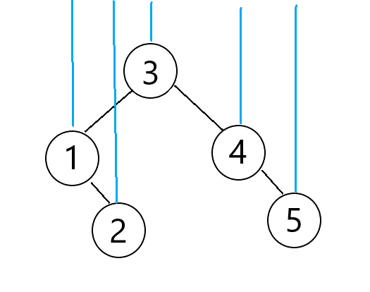
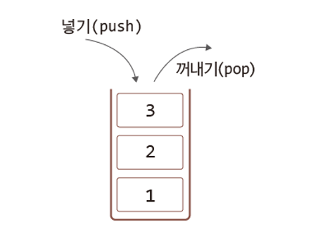
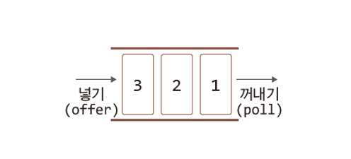
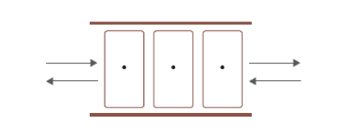

# 컬렉션 프레임워크 1

## 목차
1. [컬렉션 프레임워크의 이해](#1-컬렉션-프레임워크의-이해)  
   1.1 [컬렉션 프레임워크](#11-컬렉션-프레임워크)  

2. [List\<E> 인터페이스를 구현하는 컬렉션 클래스들](#2-liste-인터페이스를-구현하는-컬렉션-클래스들)  
   2.1 [List\<E> 인터페이스](#21-liste-인터페이스)  
   2.2 [ArrayList\<E> 클래스](#22-arrayliste-클래스)   
   2.3 [LinkedList\<E> 클래스](#23-linkedliste-클래스)  
   2.4 [ArrayList\<E> vs LinkedList\<E>](#24-arrayliste-vs-linkedliste)   
   2.5 [저장된 인스턴스의 순차적 접근 방법 1: enhanced for문의 사용](#25-저장된-인스턴스의-순차적-접근-방법-1-enhanced-for문의-사용)  
   2.6 [저장된 인스턴스의 순차적 접근 방법 2](#26-저장된-인스턴스의-순차적-접근-방법-2)  
   2.7 [Iterator 반복자의 세 가지 메소드](#27-iterator-반복자의-세-가지-메소드)  
   2.8 [배열보다는 컬렉션 인스턴스가 좋다: 컬렉션 변환 1](#28-배열보다는-컬렉션-인스턴스가-좋다-컬렉션-변환-1)  
   2.9 [배열보다는 컬렉션 인스턴스가 좋다: 컬렉션 변환 2](#29-배열보다는-컬렉션-인스턴스가-좋다-컬렉션-변환-2)    
   2.10 [배열 기반 리스트를 연결 기반 리스트로](#210-배열-기반-리스트를-연결-기반-리스트로)  
   2.11 [기본 자료형 데이터의 저장과 참조](#211-기본-자료형-데이터의-저장과-참조)  
   2.12 [리스트만 갖는 양방향 반복자](#212-리스트만-갖는-양방향-반복자)  
   2.13 [양방향 반복자의 예](#213-양방향-반복자의-예)  

3. [Set\<E> 인터페이스를 구현하는 컬렉션 클래스들](#3-sete-인터페이스를-구현하는-컬렉션-클래스들)  
   3.1 [Set\<E>를 구현하는 클래스의 특성과 HashSet\<E> 클래스](#31-sete를-구현하는-클래스의-특성과-hashsete-클래스)  
   3.2 [동일 인스턴스에 대한 기준은?](#32-동일-인스턴스에-대한-기준은)  
   3.3 [해쉬 알고리즘의 이해](#33-해쉬-알고리즘의-이해)  
   3.4 [HashSet\<E>의 인스턴스 동등 비교](#34-hashsete의-인스턴스-동등-비교)  
   3.5 [HashSet\<E> 인스턴스에 저장할 클래스 정의 예](#35-hashsete-인스턴스에-저장할-클래스-정의-예)  
   3.6 [hashCode 메소드의 다양한 정의의 예](#36-hashcode-메소드의-다양한-정의의-예)  
   3.7 [해쉬 알고리즘을 일일이 정의하기가 그렇다면](#37-해쉬-알고리즘을-일일이-정의하기가-그렇다면)  
   3.8 [TreeSet\<E> 클래스의 이해와 활용](#38-treesete-클래스의-이해와-활용)  
   3.9 [TreeSet\<E> 클래스의 오름차순 출력이란?](#39-treesete-클래스의-오름차순-출력이란)  
   3.10 [TreeSet 인스턴스에 저장될 것을 고려한 클래스의 예](#310-treeset-인스턴스에-저장될-것을-고려한-클래스의-예)  
   3.11 [Comparator\<T> 인터페이스 기반으로 TreeSet\<E>의 정렬 기준 제시하기](#311-comparatort-인터페이스-기반으로-treesete의-정렬-기준-제시하기)  
   3.12 [Comparator\<T> 인터페이스 기반 TreeSet\<E>의 예](#312-comparatort-인터페이스-기반-treesete의-예)  
   3.13 [Comparator\<T> 인터페이스 기반 TreeSet\<E>의 예 2](#313-comparatort-인터페이스-기반-treesete의-예-2)  
   3.14 [중복된 인스턴스의 삭제](#314-중복된-인스턴스의-삭제)  

4. [Queue\<E> 인터페이스를 구현하는 컬렉션 클래스들](#4-queuee-인터페이스를-구현하는-컬렉션-클래스들)  
   4.1 [스택과 큐의 이해](#41-스택과-큐의-이해)  
   4.2 [큐 인터페이스](#42-큐-인터페이스)  
   4.3 [큐의 구현](#43-큐의-구현)  
   4.4 [스택(Stack)의 구현](#44-스택stack의-구현)  
   4.5 [스택의 예](#45-스택의-예)

5. [Map\<K, V> 인터페이스를 구현하는 컬렉션 클래스들](#5-mapk-v-인터페이스를-구현하는-컬렉션-클래스들)  
   5.1 [Key-Value 방식의 데이터 저장과 HashMap<K, V> 클래스](#51-key-value-방식의-데이터-저장과-hashmapk-v-클래스)  
   5.2 [HashMap\<K, V>의 순차적 접근 방법](#52-hashmapk-v의-순차적-접근-방법)  
   5.3 [HashMap\<K, V>의 순차적 접근의 예](#53-hashmapk-v의-순차적-접근의-예)  
   5.4 [TreeMap\<K, V>의 순차적 접근의 예](#54-treemapk-v의-순차적-접근의-예)  
<br>

# 1. 컬렉션 프레임워크의 이해
- 인스턴스의 저장에 관련된 것이다.  
어떻게 저장할 것인가?   
어떻게 저장할 것인가를 고민하는 것이 아니라 저장하는 방법을 클래스로 정의를 해서 우리에게 제공해준다. 그렇게해서 만들어진 것이 **`컬렉션 프레임워크`** 이다.

- 저장을 했으면 경우에 따라서 참조, 삭제도 가능해야한다. 전반적으로 인스턴스의 저장, 참조, 삭제에 대한 것을 모아 놓은 것이 컬렉션 프레임워크이다.

- 인스턴스를 저장하는 데는 다양한 방법이 있다.   
이런 다양한 방법들을 모아놓은 학문을 자료구조 라고 한다.  
자바에서는 이 방법을 클래스별로 만들어놓았다.  
<br>

## 1.1 컬렉션 프레임워크
```text
      Collection<E>
            ↑               Map<K, V>
┌───────────┴──────────┐
Set<E>   List<E>   Queue<E>
```
- 컬렉션 프레임워크의 골격에 해당하는 **`인터페이스`** 들

- 자료구조 및 알고리즘을 구현해 놓은 일종의 라이브러리이다.  
제네릭 기반으로 구현이 되어 있다.

- 구현하는 인터페이스에 따라 **`사용방법`** 과 **`특성`** 이 결정된다.

- Set\<E> 이라는 것은 인스턴스의 저장, 삭제, 참조하는 방법의 하나이다.   
List\<E>도 마찬가지이다.   
"List\<E>, Set\<E>을 기반으로 인스턴스를 저장하고 삭제하겠다."  
List\<E>, Set\<E> 등은 자료구조의 이름이다.
<br>
<br>


# 2. List\<E> 인터페이스를 구현하는 컬렉션 클래스들
## 2.1 List\<E> 인터페이스
- List\<E> 인터페이스를 구현하는 대표적인 컬렉션 클래스 둘은 다음과 같다.
  - **`ArrayList<E>`**  
    **`배열 기반`** 자료구조, 배열을 이용하여 인스턴스 저장
  - **`LinkedList<E>`**  
    **`리스트 기반`** 자료구조, 리스트를 구성하여 인스턴스 저장

- List\<E> 인터페이스를 구현하는 컬렉션 클래스들의 공통 특성
  - 인스턴스 `저장 순서 유지`
    - 나란히 
  - 동일 인스턴스의 `중복 저장을 허용`한다.

- 저장이라는 기능을 기반으로 ArrayList\<E>와 LinkedList\<E>를 봤을 때는 차이가 없다.

- 배열을 기반으로, 리스트를 기반으로 한다는 의미는 무엇인가?  
    ```text
    리스트
    ┌────┐   ┌────┐    ┌────┐   ┌────┐
    │   ·┼───┼>  ·┼────┼>  ·┼───┼>   │
    └────┘   └────┘    └────┘   └────┘
    ```

    ```text
    배열
    ┌────┐┌────┐┌────┐┌────┐
    │    ││    ││    ││    │
    └────┘└────┘└────┘└────┘
    ```
    배열은 공간을 미리 만들어둔다.  
    리스트는 필요할 때마다 공간을 만든다. 그리고 줄로 다음 바구니와 연결해놓는다고 생각하자.  
    해당 바구니는 다음 바구니랑만 연결해놓으면 된다.

- 배열의 경우 한 칸만 덧붙이면 얼마나 좋을까?   
하지만 배열은 이렇게 덧붙여서 늘릴 수가 없다.  
배열은 뒤에 덧붙이는 자료구조가 아니다.  
이보다 더 긴 배열을 만들어서 데이터들을 새 배열에 옮겨야한다.  
더 긴 배열을 만들고 기존 배열에 있던 값들을 새로운 배열로 옮기고 기존 배열은 삭제해야 하는 일련의 과정을 거쳐야한다.

- 리스트는 필요할 때마다 늘리면 되기 때문에 공간을 신경쓰지 않아도 된다.  
링크드는 언제든지 바구니 하나만 추가하면 100개든 1000개든 늘릴 수 있다.

- 이처럼 상황에 따른 성능적 차이가 있다.  
내가 구현하는 프로그램에 맞도록 자료구조를 선택하면 된다.
<br>
<br>


## 2.2 ArrayList\<E> 클래스
```java
public static void main(String[] args) {
    List<String> list = new ArrayList<>();  // 컬렉션 인스턴스 생성

    // 컬렉션 인스턴스에 문자열 인스턴스 저장
    list.add("Toy");
    list.add("Box");
    list.add("Robot");

    // 저장된 문자열 인스턴스의 참조
    for (int i = 0; i < list.size(); i++) {
        System.out.print(list.get(i) + '\t');
    }
    System.out.println();

    list.remove(0); // 첫 번째 인스턴스 삭제

    // 첫 번째 인스턴스 삭제 후 나머지 인스턴스들을 참조
    for (int i = 0; i < list.size(); i++) {
        System.out.print(list.get(i) + '\t');
    }
    System.out.println();
}
```

```bash
Toy	Box	Robot	
Box	Robot
```
- 배열 기반 자료구조이지만 공간의 확보 및 확장은 ArrayList 인스턴스가 스스로 처리한다.

- List\<String> list = new ArrayList<>();  
실제로 대부분 ArrayList 클래스 중에서 List 인터페이스가 가지고 있는 메소드들만 호출을 한다.  

- list.remove(0);  
배열의 삭제 방법을 알아야한다.  
    ```
    ┌────┐┌────┐┌────┐┌────┐┌────┐
    │ 1  ││ 2  ││ 3  ││ 4  ││ 5  │
    └────┘└────┘└────┘└────┘└────┘
    ```
    3을 삭제해야한다고 했을 때, 3만 지우는 게 아니라 뒤에 있는 4, 5 를 앞으로 한 칸씩 당겨온다.
     ```
    ┌────┐┌────┐┌────┐┌────┐┌────┐
    │ 1  ││ 2  ││ 4  ││ 5  ││    │
    └────┘└────┘└────┘└────┘└────┘
    ```
    이렇게되면 인덱스의 값이 바뀐다.  
    삭제하기 전의 2번 인덱스에는 3이 저장되어있었지만, 3을 삭제 한 후 2번 인덱스를 출력해보면 4가 저장되어있는 걸 확인할 수 있다.  
<br>
<br>


## 2.3 LinkedList\<E> 클래스
```java
public static void main(String[] args) {
    List<String> list = new LinkedList<>();  // 유일한 변화

    // 컬렉션 인스턴스에 문자열 인스턴스 저장
    list.add("Toy");
    list.add("Box");
    list.add("Robot");

    // 저장된 문자열 인스턴스의 참조
    for (int i = 0; i < list.size(); i++) {
        System.out.print(list.get(i) + '\t');
    }
    System.out.println();

    list.remove(0); // 첫 번째 인스턴스 삭제

    // 첫 번째 인스턴스 삭제 후 나머지 인스턴스들을 참조
    for (int i = 0; i < list.size(); i++) {
        System.out.print(list.get(i) + '\t');
    }
    System.out.println();
}
```
- 리스트 기반 자료구조는 열차 칸을 더하고 빼는 형태의 자료구조이다.
  - 일반적으로 `리스트` 라함은 연결 리스트를 말한다.
  
- 인스턴스 저장:  
열차 칸을 하나 더한다.  

- 인스턴스 삭제:  
해당 열차 칸을 삭제한다.

```text
       ┌─────┐   ┌─────┐   ┌──────┐
list·──┼>Toy·┼───┼>Box·┼───┼>Robot│
       └─────┘   └─────┘   └──────┘
```
- Box를 삭제한다면?  
Box 뒤에 만개가 연결되어있다하더라도 Box를 통째로 빼주면 된다. (기차처럼)  
Toy와 Robot을 연결해주고 Box를 빼버리면 된다.  

- 배열이었다면?   
Box 뒤에 있는 만개를 하나씩 다 앞으로 이동시켜야한다.  
배열이 가지고 있는 취약점을 Linked에서는 해결하고 있다.  

- 데이터를 저장할 때는 배열이 더 빨리 저장할 수 있고 데이터를 삭제할 때는 리스트가 유리하다.
<br>
<br>


## 2.4 ArrayList\<E> vs LinkedList\<E>
### 2.4.1 ArrayList\<E>
- ArrayList\<E>의 단점  
  - 저장 공간을 늘리는 과정에서 시간이 비교적 많이 소요된다.
    - 그냥 아주 되게 많이 소요된다.
  - 인스턴스의 삭제 과정에서 많은 연산이 필요할 수 있다. 따라서 느릴 수 있다.
    - 엄청 많은 연산이 필요하고, 완전 많이 느려진다.

- ArrayList\<E>의 장점
  - 저장된 인스턴스의 참조가 빠르다.  
    - 저장된 데이터의 양이 100개이고, 50번째 값을 얻고자 한다면 50번째 값의 인덱스를 전달하면 된다.  
    반면 리스트라면?  
    리스트가 50번째 바구니를 잡고 있는 것이 아니다.  
    첫 번째 바구니에서부터 50번째 바구니까지 건너가야한다.
<br>

### 2.4.2 LinkedList\<E>
- LinkedList\<E>의 단점
  - 저장된 인스턴스의 참조 과정이 배열에 비해 복잡하다. 따라서 느릴 수 있다.  
    - 50번째 바구니를 찾기 위해서 첫 번째 바구니에서부터 건너가야 한다.   
    데이터의 양에 비례해서 느려질 수 있다.

- LinkedList\<E>의 장점
  - 저장 공간을 늘리는 과정이 간단하다.
  - 저장된 인스턴스의 삭제 과정이 단순하다.
<br>
<br>


## 2.5 저장된 인스턴스의 순차적 접근 방법 1: enhanced for문의 사용
```java
public static void main(String[] args) {
    List<String> list = new LinkedList<>(); 

    // 인스턴스 저장
    list.add("Toy");
    list.add("Box");
    list.add("Robot");

    // 전체 인스턴스의 참조
    for (String s : list) {
        System.out.print(s + '\t');
    }
    ...
}
```
- for-each문의 대상이 되기 위한 조건  
    Interable\<T> 인터페이스의 구현

- public interface Collection\<E> extends Iterable\<E>

- 반복자 Iterable 등장과 iterator() 메소드
<br>
<br>


## 2.6 저장된 인스턴스의 순차적 접근 방법 2
A에서 값을 꺼내오는 방법, B에서 값을 꺼내오는 방법, C에서 값을 꺼내오는 방법이 각각 다르다.  
사용자의 입장에서는 A,B,C에서 값을 꺼내오는 방법이 동일한 것이 좋은데, 이를 가능하게 해주는 것이 반복자이다.

```java
public static void main(String[] args) {
    List<String> list = new LinkedList<>();
    ...
    Iterator<String> itr = list.iterator();  // 반복자 획득. itr이 지팡이를 참조한다.

    // 반복자를 이용한 순차적 참조
    while (itr.hasNext()) {    // next 메소드가 반환할 대상이 있다면, 
        str = itr.next();      // next 메소드를 호출한다.
        ...
    }
}
```
- Iterator<String> itr = list.iterator();  
iterator() 반복자를 호출했다. 

- str = itr.next();  
반복자가 값을 하나씩 꺼내준다. 우리는 반복자가 어떤 방법을 써서 값을 꺼내오는지는 알 필요가 없다.  
next() 메소드를 사용하기만 하면 된다.  
반복자를 사용하는 방법만 일단 습득하면 대상이 누구이든지간에 순차적인 참조를 쉽게할 수 있다.

- itr.hasNext()  
반환받을 값이 있는지 반복자에게 물어보는 메소드이다.  
있다면 true를 반환해주고, 없다면 false를 반환해준다.  

```java
public interface Iterble<T> {
    Iterator<T> iterator();
    ...
}
```
<br>
<br>


## 2.7 Iterator 반복자의 세 가지 메소드
```java
E next()              다음 인스턴스의 참조 값을 반환  
boolean hasNext()     next 메소드 호출 시 참조 값 반환 가능 여부 확인
void remove()         next 메소드 호출을 통해 반환했던 인스턴스 삭제
```

```java
// 반복자를 이용한 참조 과정 중 인스턴스의 삭제
while (itr.hasNext()) {    
    str = itr.next();      
    if (str.equals("Box")) {
        itr.remove();   // 위에서 next 메소드가 반환한 인스턴스 삭제
    }
}
```
  
- str = itr.next();   
반복자가 지팡이를 가지고 있다.  
아무것도 참조하고 있지 않다가 next() 메소드를 호출함과 동시에 지팡이로 0번째 인덱스의 값을 가리키고, 그 값을 반환한다.  

- itr.remove();  
현재 가리키고 있는 대상을 삭제한다.
<br>
<br>

## 2.8 배열보다는 컬렉션 인스턴스가 좋다: 컬렉션 변환 1
```text
1. 인스턴스의 저장과 삭제가 편하다.
2. 반복자를 쓸 수 있다.
```
- 두 가지의 이유로 배열보다 ArrayList\<E>가 더 좋다.

- 하지만 배열처럼 선언과 동시에 초기화가 불가능하다.
<br>

```java
List<String> list = Arrays.asList("Toy", "Robot", "Box");
```
- 초기화를 위해 쓸 수 있는 방법

- 인자로 전달된 인스턴스들을 저장한 컬렉션 인스턴스의 생성 및 반환

- 이렇게 생성된 리스트 인스턴스는 Immutable 인스턴스이다.
<br>
<br>


## 2.9 배열보다는 컬렉션 인스턴스가 좋다: 컬렉션 변환 2
```java
public ArrayList(Collection<? extends E> c) {...}
```
- 생성자를 통해서 새로운 ArrayList 인스턴스 생성이 가능하다.

- Collection\<E>를 구현한 컬렉션 인스턴스를 인자로 전달받는다.  
그리고 E는 인스턴스 생성 과정에서 결정되므로 무엇이든 될 수 있다.  
덧붙여서 매개변수 c로 전달된 컬렉션 인스턴스에서는 참조만(꺼내기만) 가능하다.

- new ArrayList<>(list);    
그대로 값을 복사해와야 하기때문에 ArrayList 생성자에 set() 메소드가 들어가면 안되므로 와일드카드에 상한 제한을 뒀다.  
<br>

```java
public static void main(String[] args) {
    List<String> list = Arrays.asList("Toy", "Box", "Robot", "Box");

    // 생성자 public ArrayList(Collection<? extends E> c)를 통한 인스턴스 생성
    list = new ArrayList<>(list);
    ...
}
```
- list는 "Toy", "Box", "Robot", "Box"를 저장하고 있는 컬렉션 인스턴스를 참조한다.  
list가 참조하고 있는 인스턴스는 Immutable 인스턴스이므로 데이터를 변경 하지 못하므로, 컬렉션 인스턴스를 다시 만든다.

- new ArrayList<>(list);  
ArrayList를 생성하면서 list를 인자로 전달하면 이 인스턴스는 list가 가지고 있던 데이터를 그대로 복사하고 참조값을 반환한다.
<br>
<br>

## 2.10 배열 기반 리스트를 연결 기반 리스트로
```java
public ArrayList(Collection<? extends E> c)     // ArrayList<E> 생성자 중 하나
```
- 인자로 전달된 컬렉션 인스턴스로부터 ArrayList\<E> 인스턴스 생성
<br>

```java
public LinkedList(Collection<? extends E> c)     // LinkedList<E> 생성자 중 하나
```
- 인자로 전달된 인스턴스로부터 LinkedList\<E> 인스턴스 생성
<br>

```java
public static void main(String[] args) {
    List<String> list = Arrays.asList("Toy", "Box", "Robot", "Box");
    list = new ArrayList<>(list);

    ...   
    // ArrayList<E> 인스턴스 기반으로 LinkedList<E> 인스턴스 생성
    list = new LinkedList<>(list);
    ...

}
```
- ArrayList를 LinkedList로 바꾸었다.
LinkedList를 생성하면서 인자로 list를 넘기면 list가 참조하고 있던 값이 그대로 LinkedList로 복사된다.
<br>
<br>


## 2.11 기본 자료형 데이터의 저장과 참조
```java
public static void main(String[] args) {
    LinkedList<Integer> list = new LinkedList<>();
    list.add(10);   // 저장 과정에서 오토 박싱 진행
    list.add(20);
    list.add(30);
    
    int n;
    for (Iterator<Integer> itr = list.iterator(); itr.hasNext(); ) {
        n = itr.next();     // 오토 언박싱 진행
        System.out.print(n + "\t");
    }
    System.out.println();
}
```
- 오토 박싱과 오토 언박싱 덕분에 컬렉션 인스턴스에 기본 자료형의 값도 저장 가능하다.
<br>
<br>

## 2.12 리스트만 갖는 양방향 반복자
```java
public ListIterator<E> listIterator()   // List<E> 인터페이스의 메소드
```
- ListIterator\<E>는 Iterator\<E>을 상속한다.

```java
E next()                다음 인스턴스의 참조 값을 반환
boolean hasNext()       next 메소드 호출 시 참조 값 반환 가능 여부 확인
void remove()           next 메소드 호출을 통해 반환했던 인스턴스를 삭제

E previous()            next 메소드와 기능은 같고 방향만 반대
boolean hasPrevious()   hasNext 메소드와 기능은 같고 방향만 반대

void add(E e)           인스턴스의 추가
void set(E e)           인스턴스의 변경
```
- 지팡이를 반대쪽 방향으로도 가리킬 수 있는 반복자이다.
<br>
<br>


## 2.13 양방향 반복자의 예
```java
public static void main(String[] args) {
    List<String> list = Arrays.asList("Toy", "Box", "Robot", "Box");
    list = new ArrayList<>(list);

    ListIterator<String> litr = list.listIterator();    // 양방향 반복자 획득

    String str;
    while (litr.hasNext()) {    // 왼쪽에서 오른쪽으로 이동을 위한 반복문
        str = litr.next();
        System.out.print(str + '\t');
        if (str.equals("Toy")) {     // "Toy" 만나면 "Toy2" 저장
            litr.add("Toy2");
        }
    }
    System.out.println();

    while (litr.hasPrevious()) {    // 오른쪽에서 왼쪽으로 이동을 위한 반복문
        str = litr.previous();
        System.out.print(str + '\t');
        if (str.equals("Robot")) {  // "Robot" 만나면 "Robot2" 저장
            litr.add("Robot2");
        }
    }
    ...
}
```
- 양방향 반복자를 획득함으로써 왼쪽에서 오른쪽 뿐만 아니라 오른쪽에서 왼쪽으로도 가리킬 수 있게 되었다.
```bash
Toy	Box	Robot	Box	
Box	Robot	Robot2	Box	Toy2	Toy	
```
<br>
<br>


# 3. Set\<E> 인터페이스를 구현하는 컬렉션 클래스들
## 3.1 Set\<E>를 구현하는 클래스의 특성과 HashSet\<E> 클래스
```text
저장 순서가 유지되지 않는다.
데이터의 중복 저장을 허용하지 않는다.
```
- Set\<E> 인터페이스를 구현하는 제네릭 클래스들의 특징이다.

```java
public static void main(String[] args) {
    Set<String> set = new HashSet<>();
    set.add("Toy");
    set.add("Box");
    set.add("Robot");
    set.add("Box");
    System.out.println("인스턴스 수: " + set.size());
    
    // 반복자를 이용한 전체 출력
    for (Iterator<String> itr = set.iterator(); itr.hasNext();) {
        System.out.print(itr.next() + '\t');
    }
    System.out.println();
    
    // for-each 문을 이용한 전체 출력
    for (String s : set) {
        System.out.print(s + '\t');
    }
    System.out.println();
}
```

```bash
인스턴스 수: 3
Box	Robot	Toy	
Box	Robot	Toy	
```
- 인스턴스의 수와 출력 결과를 통해 동일 인스턴스가 저장되지 않음을 알 수 있다.  
그렇다면 동일 인스턴스의 기준이 무엇일까?
<br>
<br>

## 3.2 동일 인스턴스에 대한 기준은?
```java
public boolean equals(Object obj)
```
- Object 클래스의 **`equals`** 메소드 호출 결과를 근거로 동일 인스턴스를 판단한다.

```java
public int hashCode()
```
- 그에 앞서 Object 클래스의 hashCode 메소드 호출 결과가 같아야 한다.

- 두 인스턴스가 hashCode 메소드 호출 결과로 반환하는 값이 동일해야 한다.  
그리고 이어서 두 인스턴스를 대상으로 equals 메소드의 호출 결과 true가 반환되면 동일 인스턴스로 간주한다.

- 인스턴스를 하나 저장한다고 가정하자.  
HashSet에는 이미 100개의 인스턴스가 저장되어있다.  
인스턴스를 저장할 때 Set은 중복을 허용하지 않으므로 인스턴스의 equals 메소드의 결과 값을 비교하는 과정을 거치고 저장이 된다.  
101번째 인스턴스를 저장하려고 할 때, 기존의 100개의 인스턴스들의 각 equals 메소드 호출 결과와 101번째 인스턴스의 equals 메소드 호출 결과를 일일이 비교해야 한다.  
이는 곧 저장에 걸리는 시간이 인스턴스의 수에 비례한다는 의미이다.    
동일 인스턴스가 있는지 없는지 검사하는 데 있어서 속도를 획기적으로 향상시킬 수 있는 방법이 필요했다.  
그것이 해쉬 알고리즘이다.  
<br>
<br>

## 3.3 해쉬 알고리즘의 이해
```text
분류 대상: 3, 5, 7, 12, 25, 31
적용 해쉬 알고리즘: num % 3
```
- 6개의 숫자가 있다.  
여기에 기존의 수들과 중복되지 않는 하나의 숫자를 더 저장하려고 한다.  
19를 저장한다고 했을 때, 3과, 5와, 7과, 12와, 25와, 31과 19가 같은 건지 6번을 비교해야 한다.  
이 6번 비교하는 횟수를 낮추는 알고리즘이 해쉬 알고리즘이다.  

- 3, 5, 7, 12, 25, 31을 이대로 두는 게 아니라, 나눠놓자.  
num % 3 알고리즘을 사용해서 분류를 해놓는다.  
```text
분류

 나머지 0  나머지 1   나머지 2
┌──────┐  ┌──────┐  ┌──────┐  
│  3   │  │ 7 25 │  │  5   │ 
│  12  │  │ 31   │  │      │
└──────┘  └──────┘  └──────┘ 
```
- 3개의 소그룹으로 만들어졌다.  
19 % 3 알고리즘을 사용해서 19를 넣어보자.  
나머지가 2이므로 '나머지2' 그룹과 비교를 한다.  
비교 횟수가 6번에서 1번으로 줄었다.  

- 분류를 해 놓으면 탐색의 속도가 매우 빨라진다.  
즉 존재 유무 확인이 매우 빠르다.

- Objcet 클래스의 hashCode 메소드는 이렇듯 인스턴스들을 분류하는 역할을 한다.
<br>
<br>

## 3.4 HashSet\<E>의 인스턴스 동등 비교
- 탐색 1단계  
Object 클래스에 정의된 hashCode 메소드의 반환 값을 기반으로 부류 결정

- 탐색 2단계  
선택된 부류 내에서 equals 메소드를 호출하여 동등 비교

- 동등 비교 과정에서 hashCode 메소드의 반환 값을 근거로 탐색의 대상이 줄어든다.

<br>
<br>

## 3.5 HashSet\<E> 인스턴스에 저장할 클래스 정의 예
```java
class Num {
    private int num;

    public Num(int n) {
        num = n;
    }

    @Override
    public String toString() {
        return String.valueOf(num);
    }

    @Override
    public int hashCode() {
        return num % 3; // num 의 값이 같으면 부류도 같다.
    }

    @Override
    public boolean equals(Object obj) {
        if (num == ((Num) obj).num) {   // num 의 값이 같으면 true 반환
            return true;
        } else {
            return false;
        }
    }
}
```
<br>
<br>

## 3.6 hashCode 메소드의 다양한 정의의 예
```java
class Car {
    private String model;
    private String color;

    @Override
    public int hashCode() {
        return (model.hashCode() + color.hashCode()) / 2;
    }
}
```
- 모든 인스턴스 변수의 정보를 다 반영하여 해쉬 값을 얻으려는 노력이 깃든 문장이다.  
결과적으로 더 세밀하게 나뉘고, 따라서 그만큼 탐색 속도가 높아진다.

- model도 참조하고, color도 참조했다.    
모든 정보를 다 반영해서 hashCode 메소드를 정의하라는 것이 보편적인 권고사항이다.
<br>
<br>

## 3.7 해쉬 알고리즘을 일일이 정의하기가 그렇다면
```java
public static int hash(Object...values)
```
- java.**`util`**.Objects에 정의된 메소드.  
전달된 인자 기반의 해쉬 값 반환

```java
@Override
public int hashCode() {
    return Objects.hash(model, color);  // 전달인자 model, color 기반의 해쉬 값 반환
}
```
- 전달된 인자를 모두 반영한 해쉬 값을 반환한다.
<br>
<br>

## 3.8 TreeSet\<E> 클래스의 이해와 활용
```java
public static void main(String[] args) {
    TreeSet<Integer> tree = new TreeSet<>();
    tree.add(3);
    tree.add(1);
    tree.add(2);
    tree.add(4);
    System.out.println("인스턴스 수 = " + tree.size());
    
    // for-each 문에 의한 반복
    for (Integer n : tree) {
        System.out.print(n.toString() + '\t');
    }
    System.out.println();
    
    // Iterator 반복자에 의한 반복
    for (Iterator<Integer> itr = tree.iterator(); itr.hasNext();) {
        System.out.print(itr.next().toString() + '\t');
    }
    System.out.println();
}
```

```bash
인스턴스 수 = 4
1	2	3	4	
1	2	3	4
```
- Set\<E> 인터페이스를 구현하는 TreeSet\<E> 클래스  
- 트리(Tree) 자료구조를 기반으로 인스턴스를 저장한다.  
이는 `정렬 상태가 유지`되면서 인스턴스가 저장됨을 의미한다.

- 반복자의 인스턴스 참조 순서는 오름차순을 기준으로 한다는 특징이 있다.

- 어떻게 오름차순을 하는 걸까?  
3, 1, 2, 4를 저장하고 있다.  
처음 3을 저장하고, 다음 1을 저장하려 할 때 저장된 값 3과 저장하려는 값 1을 비교를 한다.  
1은 3보다 작기 때문에 3의 왼편에 저장이 된다.  
2를 저장해보자. 2는 3보다 작기 때문에 3의 왼편에 저장이 되는데 1이 있다.  
1과 2를 비교했을 때 2가 1보다 크기 때문에 1의 오른편에 저장이 된다.  

      

- 왼쪽에서 오른쪽으로 쭉 스캔해서 갈 때 만나는 값은 1, 2, 3, 4, 5가 된다.
  
- 저장 위치를 결정하는 데 있어서 크고 작음을 비교한다.  

- Set이라는 공통적인 특성은 갖고 있지만 내부적으로 인스턴스를 저장하는 방법도 성격도 HashSet과 TreeSet은 다르다.

- TreeSet 에 인스턴스를 저장한다면 인스턴스의 크고 작음의 기준은 클래스를 디자인하는 프로그래머가 디자인한다.      
그리고 그 기준을 정의할 때 사용하는 것이 Comparable 인터페이스이다.  
  - weight를 기준으로 할 것인지, height를 기준으로 할 것인지.
  - Comparable 인터페이스의 compareTo 메소드 호출.
<br>
<br>

## 3.9 TreeSet\<E> 클래스의 오름차순 출력이란?
```java
interface Comparable
-> int compareTo(Object o)
```
- 인자로 전달된 o가 작다면 양의 정수 반환  
인자로 전달된 o가 크다면 음의 정수 반환  
인자로 전달된 o와 같다면 0을 반환
<br>

```java
interface Comparable<T>
-> int compareTo(T o)
```
- 제네릭 등장 이후로 추가된 인터페이스 

- Comparable 인터페이스를 제네릭화 시킨 것이다.  

- 인자로 전달된 o가 작다면 양의 정수 반환  
인자로 전달된 o가 크다면 음의 정수 반환  
인자로 전달된 o와 같다면 0을 반환
<br>
<br>

## 3.10 TreeSet 인스턴스에 저장될 것을 고려한 클래스의 예
```java
class Person implements Comparable<Person> {
    private String name;
    private int age;
    
    @Override
    public int compareTo(Person p) {
        return this.age - p.age;    
    }
}
```
- Comparable\<T> 인터페이스의 구현 결과를 근거로 저장이 이뤄지고 또 참조가 진행이 된다.

- TreeSet\<T>에 저장할 인스턴스들은 모두 Comparable\<T> 인터페이스를 구현한 클래스의 인스턴스이어야 한다. 아니면 예외가 발생한다.  
<br>
<br>

## 3.11 Comparator\<T> 인터페이스 기반으로 TreeSet\<E>의 정렬 기준 제시하기
```java
public interface Comparator<T>
```
- int compare(T o1, T o2) 의 구현을 통해 정렬 기준을 결정할 수 있다.

- o1이 o2보다 크면 양의 정수 반환  
o1이 o2보다 작으면 음의 정수 반환  
o1과 o2가 같다면 0을 반환

 ```java
public TreeSet(Comparator<? super E> comparator)
```
- 위 인터페이스를 구현한 클래스의 인스턴스를 TreeSet\<E>의 다음 생성자를 통해 전달한다.

- String 클래스도 Comparable 인터페이스를 구현한 클래스여서 compareTo 메소드가 정의되어있다. 
문자열의 정렬기준은 사전편찬 순이다.  
사전 편찬 순으로 문자열이 정렬이 되는데, 이 기준을 사전편찬 순이 아니라 문자열의 길이라든지 다른 기준으로 바꾸고 싶다면 String 클래스의 compareTo 메소드를 뜯어 고칠 수도 없고 어떻게 해야 할까?  
바꾸는 방법을 TreeSet 에서 제공해준다.

- TreeSet 인스턴스를 생성할 때, 이 생성자 호출 시에 정렬의 기준 정보를 인자로 전달해주면 이 기준 정보를 가지고 Tree 구조로 인스턴스들을 저장하겠다는 의미이다.  

- public MyClass Comparator\<T>  
Comparator\<T> 인터페이스를 구현하고 있는 클래스를 하나 만든다.  
그리고 int compare(T o1, T o2) 메소드를 사용해서 내가 원하는 정렬 기준을 만들고 이 클래스를 TreeSet 생성자의 인자로 넘겨준다.   
<br>
<br>

## 3.12 Comparator\<T> 인터페이스 기반 TreeSet\<E>의 예
```java
class Person implements Comparable<Person> {
    private String name;
    private int age;
    
    @Override
    public int compareTo(Person p) {
        return this.age - p.age;    
    }
}
```
- Person 클래스에는 compareTo 메소드가 정의되어있다.  
정의 기준이 age 이므로 나이 순으로 Tree 구조로 저장이 될 것이다.
  - 나이가 작은 순으로
<br>

```java
class PersonComparator implements Comparator<Person> {
    
    public int compare(Person p1, Person p2) {
        return p2.age - p1.age;    
    }
}
```
- Comparator<Person> 을 구현하고 있는 클래스이다.  

- 기준이 나이가 많은 순으로 정의가 되어있다. (기준을 바꿨다.)
<br>

```java
public static void main(String[] args) {
    TreeSet<Person> tree = new TreeSet<>(new PersonComparator());
    tree.add(new Person("YOON", 37));
    tree.add(new Person("HONG", 53));
    tree.add(new Person("PARK", 22));

    for (Person p : tree) {
        System.out.println(p);
    }
}
```
- TreeSet 생성자를 생성하면서 PersonComparator 인스턴스를 인자로 넘겼다.  
정렬은 PersonComparator의 compare 메소드에서 정의해 놓은대로 된다.
<br>

```bash
HONG: 53
YOON: 37
PARK: 22
```
- Person 클래스에 TreeSet을 위한 정렬 기준이 마련되어 있으나 Comparator 구현 인스턴스를 전달하여 새로운 기준을 제공한다.
<br>
<br>

## 3.13 Comparator\<T> 인터페이스 기반 TreeSet\<E>의 예 2
```java
class StringComparator implements Comparator<String> {
    
    public int compare(String s1, String s2) {
        return s1.length() - s2.length();    
    }
}
```

```java
public static void main(String[] args) {
    TreeSet<String> tree = new TreeSet<>(new StringComparator());
    tree.add("Box"));
    tree.add("Rabbit"));
    tree.add("Robot"));

    for (String s : tree) {
        System.out.print(s.toString() + '\t');
    }
    System.out.println();
}
``` 
```bash
Box     Robot     Rabbit
```
- String 클래스의 정렬 기준은 사전 편찬순이다.  
이 정렬 기준을 길이 순으로 바꿔서 정의하였다.
<br>
<br>

## 3.14 중복된 인스턴스의 삭제
```java
public static void main(String[] args) {
    // 중복을 허용하는 리스트
    List<String> lst = Arrays.asList("Box", "Toy", "Box", "Toy");
    ArrayList<String> list = new ArrayList<>(lst);

    for (String s : list) {
        System.out.print(s.toString() + '\t');
    }
    System.out.println();

    // 중복된 인스턴스를 걸러내기 위한 작업
    HashSet<String> set = new HashSet<>(list);

    // 원래대로 ArrayList<String> 인스턴스로 저장물을 옮긴다.
    list = new ArrayList<>(set);

    for (String s : list) {
        System.out.print(s.toString() + '\t');
    }
    System.out.println();
}
```
```bash
Box	Toy	Box	Toy	
Box	Toy	
```
<br>
<br>


# 4. Queue\<E> 인터페이스를 구현하는 컬렉션 클래스들
## 4.1 스택과 큐의 이해
### 4.1.1 스택

- LIFO(last-in-first-out)  
먼저 저장된 데이터가 마지막에 빠져나간다.
<br>

### 4.1.2 큐

- FIFO(first-in-first-out)  
먼저 저장된 데이터가 먼저 빠져나간다.  
들어간 순서대로 나온다.
<br>
<br>

## 4.2 큐 인터페이스
```text
Queue\<E> 인터페이스의 메소드들

boolean add(E e)        넣기
E remove()              꺼내기
E element()             확인하기

boolean offer(E e)      넣기, 넣을 공간이 부족하면 false반환
E poll()                꺼내기, 꺼낼 대상 없으면 null 반환
E peek()               확인하기, 확인할 대상이 없으면 null 반환
```
- remove()도 element()도 인스턴스의 참조값을 반환을 한다.  
remove는 참조값을 반환하면서 Queue 에서 빼버리고, element는 Queue에서 꺼내지않고 내버려둔다는 차이가 있다. 

- 차이점  
    add(E e), remove(), element()   
    offer(E e), poll(), peek()은 기능은 동일하다.  
    차이는 위의 3가지 메소드들은 더 이상 넣거나, 꺼내거나 확인할 수 없는 상황일 때 자바의 예외처리 메커니즘이 동작한다. (예외가 발생한다.)  

    예외가 아니라 이런 상황 자체가 알고리즘의 일부일 수도 있는데 예외처리가 돼버리면 상황 자체를 활용할 수 없다. (Queue\<E>가 다른 알고리즘 구현에 일부러 적용될 경우)  
    이를 위해 offer(E e), poll(), peek() 메소드들을 제공해준다.  
<br>
<br>

## 4.3 큐의 구현
```java
public static void main(String[] args) {
    Queue<String> que = new LinkedList<>();    // LinkedList<E> 인스턴스 생성
    que.offer("Box");
    que.offer("Toy");
    que.offer("Robot");

    // 무엇이 다음에 나올지 확인
    System.out.println("next: " + que.peek());

    // 첫 번째, 두 번째 인스턴스 꺼내기
    System.out.println(que.poll());
    System.out.println(que.poll());

    // 무엇이 다음에 나올지 확인
    System.out.println("next: " + que.peek());

    // 마지막 인스턴스 꺼내기
    System.out.println(que.poll());
}
```
```bash
next: Box
Box
Toy
next: Robot
Robot
```
- Queue\<String> que = new LinkedList<>();  
LinkedList\<E>는 List\<E>와 동시에 Queue\<E>를 구현하는 컬렉션 클래스이다.  
따라서 어떠한 타입의 참조변수로 참조하느냐에 따라 '리스트'로도 '큐'로도 동작한다.  

- 데이터를 꺼내는 방법에서 차이가 나지만 List와 Queue는 데이터가 저장되는 방식은 같다.  
<br>
<br>

## 4.4 스택(Stack)의 구현
  
- Deque  
Queue는 입구와 출구가 명확했다.  
Deque같은 경우는 양쪽이 뚫려 있기 때문에 뚫려 있는 쪽으로 넣고 꺼낼 수 있다.

- Deque를 기준으로 스택을 구현하는 것이 자바에서의 원칙이다.
<br>

### 4.4.1 Deque\<E> 인터페이스의 메소드들
```text
앞으로 넣고, 꺼내고, 확인하기
boolean offerFirst(E e)     넣기, 공간 부족하면 false 반환
E pollFirst()               꺼내기, 꺼낼 대상 없으면 null 반환
E peekFirst()               확인하기, 확인할 대상 없으면 null 반환

뒤로 넣고, 꺼내고, 확인하기
boolean offerLast(E e)      넣기, 공간이 부족하면 false반환
E pollLast()                꺼내기, 꺼낼 대상 없으면 null 반환
E peekLast()                확인하기, 확인할 대상이 없으면 null 반환
```
- 앞, 뒤라는 상대적인 개념으로 이해하자.  

- 예외가 발생되지 않는다.
<br>

```text
앞으로 넣고, 꺼내고, 확인하기
void addFirst(E e)          넣기
E removeFirst()             꺼내기
E getFirst()                확인하기

뒤로 넣고, 꺼내고, 확인하기
void addLast(E e)          넣기
E removeLast()             꺼내기
E getLast()                확인하기
```
- 예외가 발생한다.
<br>
<br>

## 4.5 스택의 예
```java
public static void main(String[] args) {
    Deque<String> deq = new ArrayDeque<>();

    // 앞으로 넣고
    deq.offer("1. Box");
    deq.offer("2. Toy");
    deq.offer("3. Robot");

    // 앞에서 꺼내기
    System.out.println(deq.pollFirst());
    System.out.println(deq.pollFirst());
    System.out.println(deq.pollFirst());
}
```
```bash
1. Box
2. Toy
3. Robot
```
- Deque\<String> deq = new ArrayDeque<>();  
Deque를 구현하고 스택처럼 쓰고 있다. (배열을 기반으로 Deque를 구현했다.)  
그리고 이 문장은 다음 문장으로도 구성 가능하다.  
`Deque<String> deq = new LinkedList<>();`

- LinkedList\<E>가 구현하는 인터페이스들  
  - Deque\<E>, List\<E>, Queue\<E>
<br>
<br>


# 5. Map\<K, V> 인터페이스를 구현하는 컬렉션 클래스들
## 5.1 Key-Value 방식의 데이터 저장과 HashMap<K, V> 클래스
```java
public static void main(String[] args) {
    HashMap<Integer, String> map = new HashMap<>();

    // Key-Value 기반 데이터 저장
    map.put(45, "Marcelline");
    map.put(37, "Bubblegum");
    map.put(23, "Lumpy");
    
    // 데이터 탐색
    System.out.println("23번: " + map.get(23));
    System.out.println("37번: " + map.get(37));
    System.out.println("45번: " + map.get(45));
    System.out.println();
    
    // 데이터 삭제
    map.remove(37);
    
    // 데이터 삭제 확인
    System.out.println("37번: " + map.get(37));
}
```
```bash
23번: Lumpy
37번: Bubblegum
45번: Marcelline

37번: null
```
<br>
<br>

## 5.2 HashMap\<K, V>의 순차적 접근 방법
- HashMap\<K, V>클래스는 Iterable\<T> 인터페이스를 구현하지 않으니 for-each문을 통해서, 혹은 '반복자'를 얻어서 순차적 접근을 진행할 수 없다.

- 대신 keySet() 메소드 호출을 통해서 Key를 따로 모아 놓은 컬렉션 인스턴스를 얻을 수 있다.  
그리고 이때 반환된 컬렉션 인스턴스를 대상으로 반복자를 얻을 수 있다.
  - public **`Set<K>`** keySet()
<br>
<br>

## 5.3 HashMap\<K, V>의 순차적 접근의 예
```java
public static void main(String[] args) {
    HashMap<Integer, String> map = new HashMap<>();

    map.put(45, "Marcelline");
    map.put(37, "Bubblegum");
    map.put(23, "Lumpy");

    // Key 만 담고 있는 컬렉션 인스턴스 생성
    Set<Integer> ks = map.keySet();

    // 전체 Key 출력 (for-each 문 기반)
    for (Integer n : ks) {
        System.out.print(n.toString() +'\t');
    }
    System.out.println();

    // 전체 Value 출력 (for-each 문 기반)
    for (Integer n : ks) {
        System.out.print(map.get(n).toString() + '\t');
    }
    System.out.println();

    // 전체 Value 출력 (반복자 기반)
    for (Iterator<Integer> itr = ks.iterator(); itr.hasNext();) {
        System.out.print(map.get(itr.next()) + '\t');
    }
    System.out.println();
}
```
```bash
37	23	45	
Bubblegum	Lumpy	Marcelline	
Bubblegum	Lumpy	Marcelline	
```
<br>
<br>

## 5.4 TreeMap\<K, V>의 순차적 접근의 예
```java
public static void main(String[] args) {
    TreeMap<Integer, String> map = new TreeMap<>();

    map.put(45, "Marcelline");
    map.put(37, "Bubblegum");
    map.put(23, "Lumpy");

    // Key 만 담고 있는 컬렉션 인스턴스 생성
    Set<Integer> ks = map.keySet();

    // 전체 Key 출력 (for-each 문 기반)
    for (Integer n : ks) {
        System.out.print(n.toString() +'\t');
    }
    System.out.println();

    // 전체 Value 출력 (for-each 문 기반)
    for (Integer n : ks) {
        System.out.print(map.get(n).toString() + '\t');
    }
    System.out.println();

    // 전체 Value 출력 (반복자 기반)
    for (Iterator<Integer> itr = ks.iterator(); itr.hasNext();) {
        System.out.print(map.get(itr.next()) + '\t');
    }
    System.out.println();
}
```
```bash
23	37	45	
Lumpy	Bubblegum	Marcelline	
Lumpy	Bubblegum	Marcelline	
```
- Tree 자료구조의 특성상 반복자가 **`정렬된 순서`** 대로 key들에 접근을 하고 있다.  
이렇듯 반복자의 접근 순서는 컬렉션 인스턴스에 따라 달라질 수 있다.