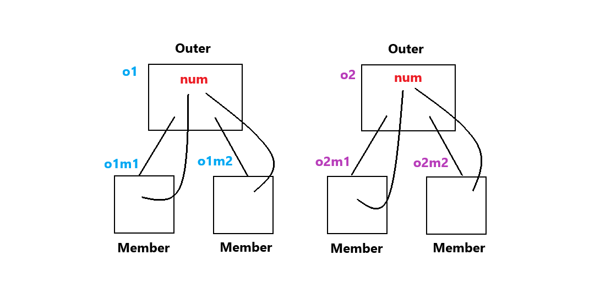

# 네스티드 클래스와 람다의 소개

## 목차
1. [네스티드(Nested) 클래스와 이너(Inner) 클래스](#1-네스티드nested-클래스와-이너inner-클래스)  
   1.1 [네스티드 클래스의 구분](#11-네스티드-클래스의-구분)  
   1.2 [Static 네스티드 클래스](#12-static-네스티드-클래스)  
   1.3 [이너 클래스의 구분](#13-이너-클래스의-구분)  
   1.4 [멤버 클래스](#14-멤버-클래스)   
   1.5 ['멤버 클래스'를 언제 사용하는가?](#15-멤버-클래스를-언제-사용하는가)   
   1.6 [반복자가 멤버 클래스라는 사실](#16-반복자가-멤버-클래스라는-사실)   

2. []()

<br>

# 1. 네스티드(Nested) 클래스와 이너(Inner) 클래스
## 1.1 네스티드 클래스의 구분
```java
class Outer {   // 외부 클래스
    class Nested {...}  // 네스티드 클래스
}
```

```java
class OuterClass {
    static class StaticNestedClass {...}    // Static 네스티드 클래스
}
```

```java
class OuterClass {
    class InnerClass {...}  // Non-static 네스티드 클래스, 이너 클래스
}
```
- 클래스 안에 정의된 클래스를 네스티드 클래스라고 한다.  
네스티드 클래스에는 static이 붙은 클래스와, static이 붙지 않은 클래스가 있다.
  - Static 네스티드 클래스, 이너 클래스
<br>

```java
멤버 (이너) 클래스 (Member Inner Class)
로컬 (이너) 클래스 (Local Inner Class)
익명 (이너) 클래스 (Anonymous Inner Class)
```
- static 네스티드 클래스, 멤버 클래스, 로컬 클래스, 익명 클래스
<br>
<br>

## 1.2 Static 네스티드 클래스
```java
class Outer {
    private static int num = 0;

    static class Nested1 {  // Static 네스티드 클래스
        void add(int n) { num += n; }   // Outer 클래스의 static 변수 공유
    }

    static class Nested2 {
        int get() { return num; }
    }

}

class StaticNested {
    public static void main(String[] args) {
        Outer.Nested1 nst1 = new Outer.Nested1();   // 인스턴스 생성 방법
        nst1.add(5);

        Outer.Nested2 nst2 = new Outer.Nested2();
        System.out.println(nst2.get());
    }
}
```
- Static 네스티드 클래스는 static 선언이 갖는 특성이 반영된 클래스이다.  
따라서 자신을 감싸는 외부 클래스의 인스턴스와 상관없이 Static 네스티드 클래스의 인스턴스 생성이 가능하다. 

- num  
Outer 클래스의 static 변수 공유.
Nested1, Nested2 인스턴스들끼리만 공유하는 static 변수이다.
<br>
<br>

## 1.3 이너 클래스의 구분
- 멤버 클래스 (Member Class)  
인스턴스 변수, 인스턴스 메소드와 동일한 위치에 정의
   ```java
    class Outer {
        class MemberInner {...}
    }
    ```
    - Outer 클래스와 MemberInner클래스는 깊은 관계를 맺고 있다.  
    어떤 관계를 맺고 있을지 아래에서 확인하자.

- 로컬 클래스 (Local Class)    
중괄호 내에, 특히 메소드 내에 정의
  ```java
  void method() {
      class LocalInner {...}
  } 
  ```
  - 지역 변수를 떠올리자. 
  - MemberInner클래스는 Outer 관점에서 보면 Outer 안에 존재한다.  
  하지만 더 깊이 숨기고 싶을 때 특정 메소드 내로 완전히 숨겨버린다. 이처럼 보이는 범위를 좁혀버린 것이 로컬 클래스이다.  


- 익명 클래스 (Anonymous Class)  
클래스인데 이름이 없다.
<br>
<br>

## 1.4 멤버 클래스
```java
class Outer {
    private int num = 0;

    class Member {  // 멤버 클래스의 정의
        void add(int n) { num += n; }
        int get() { return num; }
    }
}
```
- Member 클래스의 메소드 내에서 Outer 클래스의 인스턴스 변수 num에 직접 접근을 하고 있다.  

- 위 코드에 인스턴스 메소드가 있었다면 인스턴스 메소드도 num에 직접 접근을 할 수가 있다.  
인스턴스 메소드 내에서 변수에 접근하는 것을 가능하게 했던 것처럼 Member 클래스도 허용하게 해준다. (우리는 패밀리다!)  
<br>

```java
class MemberInner {
    public static void main(String[] args) {
        Outer o1 = new Outer();
        Outer o2 = new Outer();

        // o1 기반으로 두 인스턴스 생성
        Outer.Member o1m1 = o1.new Member();
        Outer.Member o1m2 = o1.new Member();

        // o2 기반으로 두 인스턴스 생성
        Outer.Member o2m1 = o2.new Member();
        Outer.Member o2m2 = o2.new Member();

        // o1 기반으로 생성된 두 인스턴스의 메소드 호출
        o1m1.add(5);
        System.out.println(o1m2.get());

        // o2 기반으로 생성된 두 인스턴스의 메소드 호출
        o2m1.add(7);
        System.out.println(o2m2.get());
    }
}
```
```bash
5
7
```
- 멤버 클래스의 인스턴스는 외부 클래스의 인스턴스에 종속적이다.

- Member 클래스는 Outer 클래스 없이 독립적으로 존재할 수 없다.  
main 메소드에서 Outer 인스턴스도 없이 먼저 Member 인스턴스를 떡하니 만들어 내는 게 불가능하다.   
무조건 Member 클래스의 인스턴스는 외부에 존재하는 Outer 클래스의 인스턴스에 종속되어야 한다.
  - o1.new Member();

- 관계   
    
  Member 클래스의 메소드 내에서 Outer 클래스의 인스턴스 변수 num에 직접 접근이 가능하다는 것이 중요하다.
<br>
<br>

## 1.5 '멤버 클래스'를 언제 사용하는가?
```java
interface Printable {
    void print();
}

class Papers {
    private String con;
    public Papers(String s) { con = s; }
    
    public Printable getPrinter() {
        return new Printer();
    }

    private class Printer implements Printable {
        public void print() {
            System.out.println(con);
        }
    }
}
```
- 멤버 클래스는 클래스의 정의를 감추어야 할 때 유용하게 사용이 된다. 

- Printer 클래스를 private으로 선언해서 외부에서 접근하지 못하도록 막아놓았다.  
외부에서 getPrinter() 메소드를 호출하면 Printer 인스턴스를 생성해주는데, Printable 인터페이스형 참조변수로 받게끔 해놓았다.  
<br>

```java
public static void main(String[] args) {
    Papers p = new Papers("서류 내용: 행복합니다.");
    Printable prn = p.getPrinter();
    prn.print();
}
```
- 클래스 사용자 입장에서 Printable 인터페이스는 알지만 Printer 클래스는 모른다. 알 필요도 없다.

- Papers 클래스 입장에서는 Printer 클래스를 완전히 감춰버렸다.  
Printer라는 클래스가 바뀌어도 메인 메소드 입장에서는 그것을 신경 쓰지 않아도 된다.  
마치 반복자가 떠오른다.
<br>
<br>

## 1.6 반복자가 멤버 클래스라는 사실
```java
public static void main(String[] args) {
    List<String> list = new ArrayList<>();
    ...
    Iterator<String> itr = list.iterator(); // 반복자 획득
    ...
}
```

```java
public class ArrayList<E> implements List<E> {
    ...
    public Iterator<E> iterator() {
        return new Itr();   // 멤버 클래스의 인스턴스 생성 및 반환
    }

    private class Itr implements Iterator<E> {  // 멤버 클래스의 정의
        ...
    }
}
```
- 실제 ArrayList\<E>에 정의되어 있는 반복자 클래스이다.  
반복자 클래스의 이름은 Itr 이고 private으로 선언되어 있다. 하지만 우리는 이를 알 필요가 없다. 

- 반복자는 ArrayList에 정의되어있는 저장소에 직접 접근이 가능하다.   
그래서 반복자가 우리에게 저장되어있는 값을 하나씩 넘겨준 것이었다.  
<br>
<br>

## 1.7 로컬 클래스 (Local Class)
```java
interface Printable {
    void print();
}

class Papers {
    private String con;
    public Papers(String s) { con = s; }

    public Printable getPrinter() {
        class Printer implements Printable {
            public void print() {
                System.out.println(con);
            }
        }
        return new Printer();
    }
}

public static void main(String[] args) {
    Papers p = new Papers("서류 내용: 행복합니다.");
    Printable prn = p.getPrinter();
    prn.print();
}
```
```bash
서류 내용: 행복합니다.
```
- 로컬 클래스는 멤버 클래스와 상당 부분 유사하다.  
다만 지역 내에 정의된다는 점에서만 차이를 보인다.
<br>
<br>

## 1.8 익명 클래스 (Anonymous Class)
```java
public Printable getPrinter() {
    class Printer implements Printable {
        public void print() {
            System.out.println(con);
        }
    }
    return new Printer();
}
```
- 로컬 클래스 Printer의 정의이다.
  
```java
public Printable getPrinter() {
    return new Printable() {
        public void print() {
            System.out.println(con);
        }
    };
}
```
- 익명 클래스의 정의와 인스턴스 생성
<br>
<br>

## 1.9 익명 클래스 사용의 예
```java
class StrComp implements Comparator<String> {
    @Override
    public int compare(String s1, String s2) {
        return s1.length() - s2.length();
    }
}

class SortComparator {
    public static void main(String[] args) {
        List<String> list = new ArrayList<>();
        list.add("ROBOT");
        list.add("APPLE");
        list.add("BOX");

        StrComp cmp = new StrComp();
        Collections.sort(list, cmp);
        System.out.println(list);
    }
}
```

```java
class AnonymousComparator {
    public static void main(String[] args) {
        List<String> list = new ArrayList<>();
        list.add("ROBOT");
        list.add("APPLE");
        list.add("BOX");

        Comparator<String> cmp = new Comparator<String>() {
            @Override
            public int compare(String s1, String s2) {
                return s1.length() - s2.length();
            }
        };

        Collections.sort(list, cmp);
        System.out.println(list);
    }
}
```
<br>
<br>

# 2. 람다의 소개
## 2.1 람다의 이해 1
```java
interface Printable {
    void print(String s);
}

class Printer implements Printable {

    public void print(String s) {
        System.out.println(s);
    }
}

class Lambda1 {
    public static void main(String[] args) {
        Printable prn = new Printer();
        prn.print("What is Lambda?");
    }
}

class Lambda2 {
    public static void main(String[] args) {
        // 익명 클래스
        Printable prn = new Printable() {
            public void print(String s) {
                System.out.println(s);
            }
        };
        prn.print("What is Lambda?");
    }
}
```


