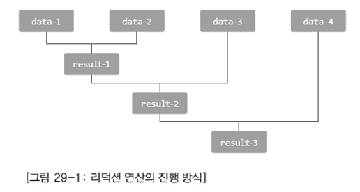

# 스트림 1

## 목차
1. [스트림의 이해와 스트림의 생성](#1-스트림의-이해와-스트림의-생성)  
   1.1 [스트림(Stream)의 이해](#11-스트림stream의-이해)  
   1.2 [스트림의 첫 번째 예제와 이해](#12-스트림의-첫-번째-예제와-이해)  
   1.3 [스트림 생성하기: 배열](#13-스트림-생성하기-배열)  
   1.4 [스트림 생성하기: 배열 대상 다양한 메소드들](#14-스트림-생성하기-배열-대상-다양한-메소드들)  
   1.5 [스트림 생성하기: 컬렉션 인스턴스](#15-스트림-생성하기-컬렉션-인스턴스)  

2. [필터링과 맵핑](#2-필터링과-맵핑)  
   2.1 [필터링](#21-필터링)  
   2.2 [맵핑 1](#22-맵핑-1)  
   2.3 [맵핑 1: map의 친구들](#23-맵핑-1-map의-친구들)  
   2.4 [맵핑 2: 필터링 후 맵핑의 예](#24-맵핑-2-필터링-후-맵핑의-예)  

3. [리덕션, 병렬 스트림](#3-리덕션-병렬-스트림)  
   3.1 [리덕션과 reduce 메소드: 최종 연산](#31-리덕션과-reduce-메소드-최종-연산)  
   3.2 [병렬 스트림](#32-병렬-스트림)  

<br>

# 1. 스트림의 이해와 스트림의 생성
## 1.1 스트림(Stream)의 이해
```text
· 정화 파이프 A형
· 정화 파이프 C형
· 플랑크 파이프

정화 파이프 A형 -> 정화 파이프 C형 -> 플랑크 파이프
정화 파이프 C형 -> 정화 파이프 A형 -> 플랑크 파이프
────────────────────────────────────────────────
       중간 파이프(중간 연산)       최종 파이프(최종 연산)
```
- 스트림을 생성하고 이를 대상으로 '중간 연산'과 '최종 연산'을 진행하면, 원하는 기준으로 데이터를 필터링하고 필터링 된 데이터의 가공된 결과를 얻을 수 있다. 그것도 매우 적은 양의 코드로.
<br>
<br>

## 1.2 스트림의 첫 번째 예제와 이해
```java
public static void main(String[] args) {
    int[] ar = {1, 2, 3, 4, 5};
    
    // 학습용 코드
    IntStream stm1 = Arrays.stream(ar);     // 배열 ar 로부터 스트림 생성
    IntStream stm2 = stm1.filter(n -> n % 2 == 1);  // 중간 연산 진행
    int sum = stm2.sum();   // 최종 연산 진행
    System.out.println(sum);

    // 실제 코드
    int brief = Arrays.stream(ar)
                      .filter(n -> n % 2 == 0)
                      .sum();
    System.out.println(brief);
}
```
<br>
<br>

## 1.3 스트림 생성하기: 배열
*배열 대상 스트림 생성 대표 메소드*

```java
public static <T> Stream<T> stream(T[] array)     // Arrays 클래스에 정의

public static void main(String[] args) {
    String[] names = {"Marcelline", "Bubblegum", "Lumpy"};
    Stream<String> stm = Arrays.stream(names);  // 스트림 생성
    stm.forEach(s -> System.out.println(s));    // 최종 연산 진행
    
    // 실제 코딩 스타일
    Arrays.stream(names)
          .forEach(s -> System.out.println(s));
}
```
<br>
<br>

## 1.4 스트림 생성하기: 배열 대상 다양한 메소드들
```java
public static IntStream stream(int[] array);

public static IntStream stream(int[] array, int startInclusive, int endExclusive);

public static DoubleStream stream(double[] array);

public static DoubleStream stream(double[] array, int startInclusive, int endExclusive);

public static LongStream stream(double[] array);

public static LongStream stream(double[] array, int startInclusive, int endExclusive
```

```java
public static void main(String[] args) {
    double[] ds = {1.1, 2.2, 3.3, 4.4, 5.5};

    Arrays.stream(ds)
            .forEach(d -> System.out.print(d + "\t"));
    System.out.println();

    Arrays.stream(ds, 1, 4)     // 인덱스 1부터 인덱스 4 이전까지
            .forEach(d -> System.out.print(d + "\t"));
    System.out.println();

}
```
```bash
1.1	2.2	3.3	4.4	5.5	
2.2	3.3	4.4	
```
<br>
<br>

## 1.5 스트림 생성하기: 컬렉션 인스턴스
컬렉션 인스턴스를 대상으로 스트림 생성 시 호출하는 메소드

```java
//  java.util.Collection<E>의 디폴트 메소드
default Stream<E> stream()
```

```java
public static void main(String[] args) {
        List<String> list = Arrays.asList("Toy", "Robot", "Box");
        list.stream()
            .forEach(s -> System.out.print(s + "\t"));
        System.out.println();
    }
```
```bash
Toy	Robot	Box	
```
- 컬렉션 인스턴스는 스트림을 생성하는 방법이 다르다.
<br>
<br>


# 2. 필터링과 맵핑
## 2.1 필터링
*스트림을 구성하는 데이터 중 일부를 조건에 따라 걸러내는 연산*

```java
Stream<T> filter(Predicate<? super T> predicate)

public interface Predicate<T> {
    boolean test(T t);
    ...
}
```
```java
public static void main(String[] args) {
    int[] ar = {1, 2, 3, 4, 5};
    Arrays.stream(ar)
            .filter(n -> n % 2 == 1)
            .forEach(n -> System.out.print(n + "\t"));
    System.out.println();

    List<String> s1 = Arrays.asList("Toy", "Robot", "Box");
    s1.stream()
            .filter(s -> s.length() == 3)
            .forEach(s -> System.out.print(s + "\t"));
    System.out.println();
}
```
```bash
1	3	5	
Toy	Box	
```
<br>
<br>

## 2.2 맵핑 1
```java
public static void main(String[] args) {
    List<String> s1 = Arrays.asList("Marcelline", "Bubblegum", "Lumpy");
    s1.stream()
            .map(s -> s.length())
            .forEach(n -> System.out.print(n + "\t"));
    System.out.println();
}
```
```bash
10	9	5	
```
<br>
<br>

## 2.3 맵핑 1: map의 친구들
```java
IntSream mapToInt(ToIntFunction<? super T> mapper)

LongStream mapToLong(ToLongFunction<? super T> mapper)

DoubleStream mapToDouble(ToDoubleFunction<? super T> mapper)
```
- 불필요한 박싱과 언박싱을 피하기 위해서 정의.

- mapToInt   
나가는 자료형이 int 임을 고정했다. (박싱과 언박싱이 발생하지 않는다.)  


```java
public static void main(String[] args) {
    List<String> ls = Arrays.asList("Marcelline", "Bubblegum", "Lumpy");

    ls.stream()
            .mapToInt(s -> s.length())
            .forEach(n -> System.out.print(n + "\t"));
    System.out.println();
}
```
<br>
<br>

## 2.4 맵핑 2: 필터링 후 맵핑의 예
```java
class ToyPriceInfo {
    private String model;
    private int price;

    public ToyPriceInfo(String m, int p) {
        this.model = m;
        this.price = p;
    }

    public int getPrice() {
        return price;
    }
}

public static void main(String[] args) {
    List<ToyPriceInfo> ls = new ArrayList<>();
    ls.add(new ToyPriceInfo("GUN_LR_45", 200));
    ls.add(new ToyPriceInfo("TEDDY_BEAR_S_)!$", 350));
    ls.add(new ToyPriceInfo("CAR_TRANSFORM_VER_7719", 550));

    int sum = ls.stream()
            .filter(p -> p.getPrice() < 500)
            .mapToInt(t -> t.getPrice())
            .sum();
    System.out.println("sum = " + sum);
}
```
```bash
sum = 550
```
<br>
<br>

# 3. 리덕션, 병렬 스트림
## 3.1 리덕션과 reduce 메소드: 최종 연산
- 리덕션(Reduction): 데이터를 축소하는 연산

```java
// Stream<T>에 존재
T reduce(T identity, BinaryOperator<T> accumulator);

public interface BinaryOperator<T> extends BiFunction<T,T,T> {...}

public interface BiFunction<T, U, R> {
    R apply(T t, U u);
}
```

```java
public static void main(String[] args) {
    List<String> ls = Arrays.asList("Marcelline", "Bubblegum", "Lumpy", "Gunter");

    BinaryOperator<String> lc = (s1, s2) -> {
        if (s1.length() > s2.length()) {
            return s1;
        } else {
            return s2;
        }
    };

    String str = ls.stream()
                   .reduce("", lc);  // 스트림 빈 경우 "" 반환
    System.out.println(str);
}
```
-  "Marcelline", "Bubblegum", "Lumpy", "Gunter" 로 이루어진 스트림이 하나 만들어진다.  
첫 번째 인자와 두 번째 인자의 길이를 비교해서 길이가 더 긴 것을 반환한다. (Marcelline)  
비교 후의 결과인 Marcelline과 세 번째 인자의 길이를 비교하고 결과를 반환한다.   
reduce 메소드를 실행하고 나면 최종 결과인 Marcelline이 남고 이를 반환한다.  

- 리덕션 연산의 진행 방식

    

- reduce("", lc);  
reduce 메소드의 첫번째 인자는 무엇일까?  
스트림을 생성 했는데 그 스트림 안에 데이터가 존재하지 않을 수도 있다. 그런 경우에 reduce 메소드 호출할 때 무엇을 반환할 것인지 에 대해 문제가 생긴다.  
데이터가 비었을 때 반환할 녀석을 첫번째 인자로 지정하게 되어있다.

- reduce의 첫 번째 전달 인자를 스트림의 첫 번째 데이터로 간주함에 주의하자.  
"Marcelline", "Bubblegum", "Lumpy", "Gunter"으로 이루어져있는 스트림이 reduce 메소드를 통과하게 되는데 reduce 메소드의 첫 번째 인자 ""가 0번째 데이터가 된다.  
사실은 데이터가 하나 늘어났다고 봐야한다.
  - "", "Marcelline", "Bubblegum", "Lumpy", "Gunter"

- 스트림에 데이터가 총 4개가 있고, reduce의 첫 번째 인자에 "1234567890"을 전달 했을 경우  
스트림이 비어 있지 않고 데이터가 4개나 있지만 이 경우에 "1234567890"가 반환이 된다.  
이 인스턴스("1234567890")를 스트림의 일부로 간주하기 때문이다.  
스트림에 존재하는 데이터와 같이 경쟁을 해서 그 결과 "1234567890"가 반환이 된다. "1234567890"가 길이가 제일 길다.  
이것을 고려해서 reduce의 첫번째 인자를 작성해야 한다.  
<br>
<br>

## 3.2 병렬 스트림
- 하나의 작업을 둘 이상의 코어가 나누어 작업하는 것을 의미한다.

    

<br>

```java
public static void main(String[] args) {
    List<String> ls = Arrays.asList("Marcelline", "Bubblegum9", "Lumpy", "Gunter");

    BinaryOperator<String> lc = (s1, s2) -> {
        if (s1.length() > s2.length()) {
            return s1;
        } else {
            return s2;
        }
    };

    String str = ls.parallelStream()    // 병렬 처리를 위한 스트림 생성
                    .reduce("", lc);    // 스트림 빈 경우 "" 반환
    System.out.println(str);
}
```
```bash
Bubblegum9
```
- parallelStream()  
병렬 스트림 메소드 호출을 하면 그 이후로는 병렬 처리가 된다.  