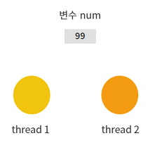
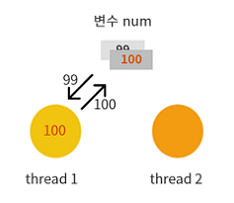
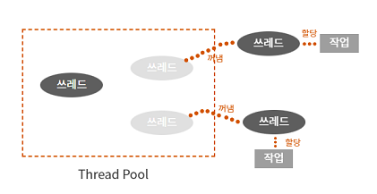

# 쓰레드 그리고 동기화

## 목차
1. [쓰레드의 이해와 쓰레드의 생성](#1-쓰레드의-이해와-쓰레드의-생성)  
   1.1 [쓰레드의 이해](#11-쓰레드의-이해)  
   1.2 [쓰레드를 생성하는 방법](#12-쓰레드를-생성하는-방법)   
   1.3 [둘 이상의 쓰레드를 생성한 예](#13-둘-이상의-쓰레드를-생성한-예)  
   1.4 [쓰레드를 생성하는 두 번째 방법](#14-쓰레드를-생성하는-두-번째-방법)
   
2. [쓰레드의 동기화](#2-쓰레드의-동기화)  
   2.1 [쓰레드의 메모리 접근 방식과 그에 따른 문제점](#21-쓰레드의-메모리-접근-방식과-그에-따른-문제점)  
   2.2 [동일한 메모리 공간에 접근하는 것이 왜 문제가 되는가?](#22-동일한-메모리-공간에-접근하는-것이-왜-문제가-되는가)  
   2.3 [동기화(Synchronization) 메소드](#23-동기화synchronization-메소드)  
   2.4 [동기화(Synchronization) 블록](#24-동기화synchronization-블록)  

3. [쓰레드를 생성하는 더 좋은 방법](#3-쓰레드를-생성하는-더-좋은-방법)  
   3.1 [쓰레드 풀 모델](#31-쓰레드-풀-모델)  
   3.2 [쓰레드 풀의 유형](#32-쓰레드-풀의-유형)  
   3.3 [쓰레드 풀 기반의 예제2](#33-쓰레드-풀-기반의-예제2)  
   3.4 [Callable & Future](#34-callable--future)  
   3.5 [synchronized를 대신하는 ReentrantLock](#35-synchronized를-대신하는-reentrantlock)  
   3.6 [컬렉션 인스턴스 동기화](#36-컬렉션-인스턴스-동기화)
<br>

# 1. 쓰레드의 이해와 쓰레드의 생성
## 1.1 쓰레드의 이해
- 실행 중인 프로그램을 가리켜 `프로세스` 라고 한다. 쓰레드는 프로세스 내에서 `또 다른 실행의 흐름을 형성하는 주체`를 의미한다.

- 하나의 프로세스 안에서 여러 실행 흐름을 가지게 할 수 있다.  
하나의 프로세스 안에 3개의 쓰레드가 있다면 3개의 쓰레드가 각각의 실행 흐름을 가지고 동시에 실행된다는 의미이다.

- 우리가 만든 쓰레드는 어떤 것이 있을까?  
우리는 만든 적이 없다. 메인 메소드의 호출과 실행을 담당하는 쓰레드가 사실은 자동적으로 생성이 되었던 것이다.

- 하나의 프로세스가 형성되고 그 안에 하나의 쓰레드가 만들어지고 이 쓰레드에 의해서 메인메소드가 실행되어져 왔다.  
(메인 메소드가 실행 된다 = 하나의 실행 흐름)

- 멀티 쓰레드?  
하나의 프로세스 안에 둘 이상의 쓰레드가 존재하는 것을 말한다. 멀티 쓰레드는 직접 쓰레드 생성을 명령 해야 한다. 
<br>
<br>

### 1.1.1 쓰레드 코드
```java
public class CurrentThreadName {

    public static void main(String[] args) {
        Thread ct = Thread.currentThread();
        String name = ct.getName();
        System.out.println(name);
    }
}
```
```java
main

Process finished with exit code 0
```
- main (main 메소드를 실행하기 때문): 우리는 쓰레드의 이름을 지정해 준 적이 없다.  
우리가 만든 게 아니라 자동으로 생성된 것이기 때문이다.

- main 메소드를 실행하는 쓰레드를 main 쓰레드라고 한다.
<br>
<br>

## 1.2 쓰레드를 생성하는 방법
- 1단계: Runnable을 구현한 인스턴스 생성  
  2단계: Thread 인스턴스 생성  
  3단계: start 메소드 호출  

```java
public static void main(String[] args) {
        Runnable task = () -> {
            int n1 = 10;
            int n2 = 20;
            String name = Thread.currentThread().getName();
            System.out.println(name + ": " + (n1 + n2));
        };

        Thread t = new Thread(task);
        // 쓰레드 생성 및 실행
        t.start();
        System.out.println("End = " + Thread.currentThread().getName());
    }
```
```java
End = main
Thread-0: 30

Process finished with exit code 0
```
- t.start();  
start() 메소드를 호출해야 `쓰레드가 생성` 되고 실행이 된다.
- 쓰레드가 동시에 실행되고 있지만 누가 먼저 끝날지는 모른다. (보장하지 못한다)

```text
쓰레드 흐름

main
├────────┐
│        │
v        v
```
<br>
<br>

## 1.3 둘 이상의 쓰레드를 생성한 예
```java
public static void main(String[] args) {
    Runnable task1 = () -> {
        try {
            for (int i = 0; i < 20; i++) {
                if (i % 2 == 0) {
                    System.out.print(i + " ");
                }
                Thread.sleep(100);
            }
        } catch (InterruptedException e) {
            e.printStackTrace();
        }
    };

    Runnable task2 = () -> {
        try {
            for (int i = 0; i < 20; i++) {
                if (i % 2 == 1) {
                    System.out.print(i + " ");
                }
            }
            Thread.sleep(100);
        } catch (InterruptedException e) {
            e.printStackTrace();
        }
    };

    Thread t1 = new Thread(task1);
    Thread t2 = new Thread(task2);

    t1.start();
    t2.start();
}
```
```java
1 3 5 7 9 0 11 13 15 17 19 2 4 6 8 10 12 14 16 18 
Process finished with exit code 0
```
```text
쓰레드 흐름

t1  main   t2
┌─────┼─────┐
│     │     │
v     v     v
```
- main 메소드가 끝나면 프로그램이 종료 되는 것이 아니라, 쓰레드가 각각의 흐름을 가지기 때문에 마지막 쓰레드가 종료가 되어야 전체 프로세가 종료 된다.

- t1이 먼저 실행되고 t2가 실행이 될 것이라 짐작할 수 있다. 정말 짐작한대로 실행 될 수 있지만 결과를 보면 예측이 안되는 걸 알 수 있다.
- (t2의 전력질주...)
<br>
<br>

## 1.4 쓰레드를 생성하는 두 번째 방법
- 1단계: Thread를 상속하는 클래스의 정의와 인스턴스 생성  
2단계: Start 메소드 호출

```java
public class Task extends Thread {

    @Override
    public void run() {
        int n1 = 10;
        int n2 = 20;
        String name = Thread.currentThread().getName();
        System.out.println(name + ": " + (n1 + n2));
    }

}
```
```java
public class MakeThreadDemo2 {

    public static void main(String[] args) {
        Task t1 = new Task();
        Task t2 = new Task();

        t1.start();
        t2.start();
        System.out.println("End " + Thread.currentThread().getName());
    }
}
```
```java
End main
Thread-1: 30
Thread-0: 30

Process finished with exit code 0
```
<br>
<br>

# 2. 쓰레드의 동기화
- 동기화가 왜 필요한 것인가?
- 쓰레드가 가지고 있는 문제점이 무엇인가?

## 2.1 쓰레드의 메모리 접근 방식과 그에 따른 문제점
```java
public class Counter {

    // 공유되는 변수
    int count = 0;

    public void increment() {
        count++;
    }

    public void decrement() {
        count--;
    }

    public int getCount() {
        return count;
    }
}

```
```java
public class MutualAccess {

    public static Counter counter = new Counter();

    public static void main(String[] args) throws InterruptedException {
        // count 값을 1 증가
        Runnable task1 = () -> {
            for (int i = 0; i < 1000; i++) {
                counter.increment();
            }
        };

        // count 값을 1 감소
        Runnable task2 = () -> {
            for (int i = 0; i < 1000; i++) {
                counter.decrement();
            }
        };

        Thread t1 = new Thread(task1);
        Thread t2 = new Thread(task2);

        t1.start();
        t2.start();

        t1.join();
        t2.join();
        System.out.println(counter.getCount());

    }
}
```
```java
-62

Process finished with exit code 0
```
- join():  
쓰레드의 종료를 기다리고 있다.   
마지막 출력문의 count 의 개수는 쓰레드 t1과 t2가 종료되고 난 후의 데이터이다.  
(이해가 가지 않으면 join() 메서드를 주석으로 처리하고 실행 결과를 보면 된다.)  

- 출력 결과는 실행할 때마다 다르다.

<br>
<br>

## 2.2 동일한 메모리 공간에 접근하는 것이 왜 문제가 되는가?
### 2.2.1 문제 상황 제시
- 변수에 저장된 값을 1씩 증가시키는 연산을 두 쓰레드가 동시에 진행한다고 가정하자.

 
<br>
<br>

### 2.2.2 thread1 이 num++ 을 하면 100이 된다.  
이런식이면 문제가 없어 보이지만 `값의 증가` 라는 작업임을 다시 생각해보자.  
값의 증가는 코어를 통한 연산 작업이 필요한 작업이다.   
연산 작업을 하면서 단계를 거치게 되는데 ⓐ쓰레드는 변수 num 에 저장된 99를 가져온다. ⓑ코어에서 num + 1 을 계산하고 값을 내놓는다. ⓒ결과 100을 변수 num 에 가져다 놓는다. 이 과정을 거치면 num = 100이 된다.
<br>
<br>

### 2.2.3 thread1 과 thread2가 num++ 을 한다면 값은 얼마가 될까?  
thread1도 thread2도 num +1을 연산하기 위해 위 작업을 거친다. 두 쓰레드에서 num 에 저장된 값 99를 가져갈 때 시차를 두고 가져갈 수도 있고 코어가 여러개라면 동시에 가져갈 수도 있다.   
두 쓰레드에서 각각 99 를 가져가고 각 연산 작업(num + 1)을 한 후 각각 num 에 100을 가져다 놓는다면 변수 num의 값은 101이 아닌 100이 된다.  
두 쓰레드 모두 99를 가져가서 99 + 1을 한 100을 가져다 놓았기 때문이다.
<br>
<br>

### 2.2.4 쓰레드의 동기화
- 둘 이상의 쓰레드가 동일한 변수에 동시에 접근해서 생긴 문제이므로 한순간에 한 쓰레드만 변수에 접근하도록 제한한다.

- thread1이 작업을 진행 하면 thread2는 thread1의 작업이 종료될 때까지 기다린다.   thread1이 작업을 종료하면 thread2가 작업을 시작한다.
<br>
<br>

## 2.3 동기화(Synchronization) 메소드
```java
public class Counter {

    // 공유되는 변수
    int count = 0;

    synchronized public void increment() {
        count++;
    }

    synchronized public void decrement() {
        count--;
    }

    public int getCount() {
        return count;
    }
}
```
- synchronized  
한순간에 한 쓰레드의 접근만을 허용하겠다. (메소드 전체에 적용)

- 동기화 되었다.  
t1 메소드가 메소드를 실행하면 메소드가 시작되고 종료될 때까지 다른 쓰레드인 t2 의 접근을 막겠다. 

- 두 쓰레드가 각기 다른 메소드에 접근한다면?  
t1은 increment() 메소드만 실행하고 t2는 decrement() 메소드만 실행 하는데 문제가 발생하는가?  
두 메소드 모두 동일한 변수 count 를 공유하고 있기 때문에 문제가 생긴다.

- t1이 increament() 를 호출했을 때 t2는 decrement()를 실행하지 못하고 t1의 작업이 끝날 때까지 기다려야한다.

- increment() 메소드 내용이 간단하지 않다면?  
코드가 count++; 앞에 10줄, 후에 30줄이 있다면 41개의 코드가 실행될 때까지 다른 쓰레드는 기다려야 한다. 이는 성능을 극단적으로 낮추는 결과로 이어질 수 있다.
<br>  
<br>  

## 2.4 동기화(Synchronization) 블록
```java
public void increment() {
        synchronized (this) {
            count++;
        }
    }
    
public void decrement() {
    synchronized (this) {
        count--;
    }
}
```
- 특정 블록을 지정해서 블록 안에 있는 코드에만 접근을 막는 것이다.
  
- 메소드보다 더 작은 단위인 문장 단위로 동기화를 시킬 수 있다.
  
- this 는 뭐지?  
이 인스턴스를 대상으로 동기화를 하겠다는 의미이다. 
  - [x] 무슨 말인지 이해가 안되므로 더 찾아보고 설명 추가 할 것
    - [3.6.1 컬렉션 인스턴스 동기화의 예](#361-컬렉션-인스턴스-동기화의-예) 부분에 `synchronized (list)` 이 메서드의 사용을 보면 어떻게 사용하는 건지 이해가 간다.

<br>
<br>

# 3. 쓰레드를 생성하는 더 좋은 방법
## 3.1 쓰레드 풀 모델 
  
- 쓰레드의 생성과 소멸은 리소스 소모가 많은 작업이다.

- 쓰레드 풀은 쓰레드의 재활용을 위한 모델이다.  
쓰레드 풀에 작업을 밀어 넣으면 쓰레드 풀에서 쓰레드를 할당해서 작업을 실행한다.  

- 작업이 종료되면 쓰레드를 소멸시키지 않는다.

- 자바에서는 쓰레드 풀을 제공해준다.   
하나의 메소드만 호출하면 쓰레드 풀과 쓰레드를 만들어준다.

- 왜 쓰레드 풀을 제공해줄까?  
처리해야 될 일들이 있을 때 이 일들을 처리하기 위해서 몇개의 쓰레드를 구동 시켜야 하는지 이슈가 된다.
    ```text  
    쓰레드 생성 --Run--> 소멸
    ```
    쓰레드가 생성되고 소멸될 때까지 걸리는 시간이 크기 때문에 이 시간만 아껴도 작업을 더 할 수 있다.  
    소멸시키지 말고 작업을 끝내면 잠깐 쉬게 하고 다음 작업에 할당시키자.
<br>
<br>

### 3.1.1 쓰레드 풀 코드
```java
public class ExecutorsDemo {

    public static void main(String[] args) {
        Runnable task = () -> {
            int n1 = 10;
            int n2 = 20;
            String name = Thread.currentThread().getName();
            System.out.println(name + ": " + (n1 + n2));
        };

        ExecutorService exr = Executors.newSingleThreadExecutor();
        exr.submit(task);

        System.out.println("End " + Thread.currentThread().getName());
        // 쓰레드 풀과 그 안에 있는 쓰레드의 소멸
        exr.shutdown();
    }
}
```
- shutdown();  
작업을 다 끝낸 쓰레드는 소멸 되는 게 아니라 쓰레드 풀로 돌아가기 때문에 쓰레드를 정말 소멸시키고 싶다면 shutdown() 메소드를 호출한다.  
하지만 메소드를 호출 한다고 바로 소멸 되는 것은 아니다. 만약 처리해야 할 작업이 남아 있다면 작업을 마치고 사라진다.
<br>
<br>


## 3.2 쓰레드 풀의 유형
- newSingleThreadExecutor  
풀 안에 하나의 쓰레드만 생성하고 유지한다.

- newFixedThreadPool  
풀 안에 인자로 전달된 수의 쓰레드를 생성하고 유지한다.

- newCachedThreadPool  
풀 안의 쓰레드의 수를 작업의 수에 맞게 유동적으로 관리한다.

## 3.3 쓰레드 풀 기반의 예제2
```java
public static void main(String[] args) {
    Runnable task1 = () -> {
        String name = Thread.currentThread().getName();
        System.out.println(name + ": " + (5 + 7));
    };

    Runnable task2 = () -> {
        String name = Thread.currentThread().getName();
        System.out.println(name + ": " + (7 - 5));
    };

    ExecutorService exr = Executors.newFixedThreadPool(2);
    exr.submit(task1);
    exr.submit(task2);
    exr.submit(() -> {
        String name = Thread.currentThread().getName();
        System.out.println(name + ": " + (5 * 7));
    });
    exr.shutdown();
}
```
```java
pool-1-thread-2: 2
pool-1-thread-1: 12
pool-1-thread-1: 35

Process finished with exit code 0
```
<br>
<br>

## 3.4 Callable & Future
```java
public interface Runnable {
    void run();
};
```

```java
@FunctionalInterface
public interface Callable<V> {
    /**
     * Computes a result, or throws an exception if unable to do so.
     *
     * @return computed result
     * @throws Exception if unable to compute a result
     */
    V call() throws Exception;
}
```
- run 은 반환형이 void 이고, call 은 반환형을 결정할 수 있다.

```java
public static void main(String[] args) throws InterruptedException, ExecutionException {
        Callable<Integer> task = () -> {
            int sum = 0;
            for (int i = 0; i < 10; i++) {
                sum += i;
            }
            return sum;
        };

        ExecutorService exr = Executors.newSingleThreadExecutor();
        Future<Integer> fur = exr.submit(task);


        Integer r = fur.get();  // 쓰레드의 반환 값 획득
        System.out.println("result: " + r);
        exr.shutdown();
}
```

```java
result: 45

Process finished with exit code 0
```
<br>
<br>

## 3.5 synchronized를 대신하는 ReentrantLock
```java
public class MyClass {
    
    ReentrantLock criticObj = new ReentrantLock();

    void myMethod(int arg) {
        criticObj.lock();       // 문을 잠근다.
        try {
            // 한 쓰레드에 의해서만 실행되는 영역 //
        } finally {
            criticObj.unlock();     // 문을 연다.
        }
    }
}
```
- unlock() 메소드 호출이 생략되는 것을 막기 위해 try-finally 문을 사용하는 것을 권고한다.
<br>
<br>

## 3.6 컬렉션 인스턴스 동기화
- 동기화는 특성상 어쩔 수 없이 성능의 저하를 수반하므로 불필요하게 동기화를 진행하지 않도록 주의해야 한다.  
이런 이유로 컬렉션 프레임워크의 클래스 대부분도 동기화 처리가 되어 있지 않다. 

- 대신 Collections는 다음 메소드들을 통해 동기화 하는 방법을 제공하고 있다.

```java
public static <T> Set<T> synchronizedSet(Set<T> s)

public static <T> List<T> synchronizedList(List<T> list)

public static <K, V> Map<K, V> synchronizedMap(Map<K, V> m)

public static <T> Collection<T> synchronizedCollection(Colection<T> c)

```
```java
List<String> list = Collections.synchronizedList(new ArrayList<>());
```
- 이렇게 사용하면 쓰레드의 동시 접근에 안전한 상태가 된다. (과연 그럴까?)
<br>
<br>

### 3.6.1 컬렉션 인스턴스 동기화의 예
```java
public class SyncArrayList {

    public static List<Integer> list = Collections.synchronizedList(new ArrayList<>());

    public static void main(String[] args) throws InterruptedException {

        for (int i = 0; i < 16; i++) {
            list.add(i);
        }
        System.out.println(list);   // [0 ~ 15]

        Runnable task = () -> {
            ListIterator<Integer> itr = list.listIterator();
            while (itr.hasNext()) {
                itr.set(itr.next() + 1);    // [1 ~ 16] 한 쓰레드씩 작업하는 게 보장 된다면
            }
        };

        ExecutorService exr = Executors.newFixedThreadPool(3);
        exr.submit(task);
        exr.submit(task);
        exr.submit(task);

        exr.shutdown();
        exr.awaitTermination(100, TimeUnit.SECONDS);
        System.out.println(list);

    }
}
```
```java
[0, 1, 2, 3, 4, 5, 6, 7, 8, 9, 10, 11, 12, 13, 14, 15]
[2, 3, 5, 6, 7, 8, 9, 10, 11, 12, 13, 14, 15, 16, 17, 18]

Process finished with exit code 0
```
- list는 Collections.synchronizedList 를 사용해서 동기화를 했는데 왜 이런 결과가 나온 걸까?  
`list를 통한 접근`이 동기화 되어있다는 의미이다.  
위 코드에서는 반복자 Iterator 를 만들었는데 반복자를 통해서 접근을 할 때는 동기화가 안된다. 이 경우에는 보장을 못해준다.   
반복자의 사용 자체를 또 동기화 시켜줘야 한다.

- awaitTermination()  
타이머를 걸어두는 것이다. 
  - 파라미터1: @param timeout the maximum time to wait
  - 파라미터2: @param unit the time unit of the timeout argument


```java
Runnable task = () -> {
    synchronized (list) {
        ListIterator<Integer> itr = list.listIterator();
        while (itr.hasNext()) {
            itr.set(itr.next() + 1);
        }
    }
};
```
- synchronized 블록으로 iterator를 얻어서 진행하는 코드 부분에 동기화를 해줬다. 결과를 보자.

- synchronized (list)  
이 예시에서 synchronized(`here`)  이 부분에 this 가 아닌 list 를 보니까 어떻게 쓰는 건지 이해가 간다.

```java
[0, 1, 2, 3, 4, 5, 6, 7, 8, 9, 10, 11, 12, 13, 14, 15]
[3, 4, 5, 6, 7, 8, 9, 10, 11, 12, 13, 14, 15, 16, 17, 18]

Process finished with exit code 0
```
- 마지막 쓰레드가 작업을 마치고 나면 동기화가 보장된 결과 [3 ~ 18] 가 나온다.