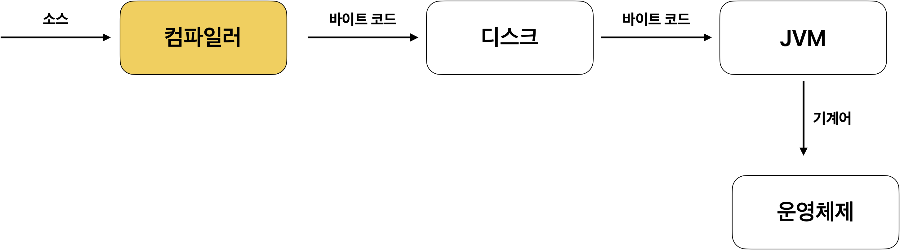
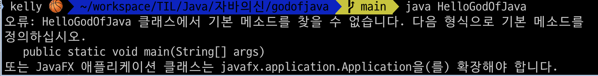

# 컴파일
자바 파일을 하나 만들고 이 파일을 컴파일해서 실행하려고 합니다.

# 컴파일이 무엇이고 왜 컴파일을 하나요?
우리는 텍스트 파일을 하나 만들었습니다. 그런데 대부분의 프로그래밍 언어는 텍스트로 된 파일을 실행할 수가 없습니다. 우리가 만든 텍스트 파일을 프로그래밍 언어가 이해할 수 있는 파일로 변환해줘야 해요.
이 작업을 컴파일 이라고 해요. 내가 만든 프로그램 코드를 컴퓨터가 이해할 수 있도록 엮어주는 작업을 **컴파일** 이라고 합니다.

# 컴파일 및 실행 절차


# 바이트 코드가 뭐야? 기계어랑 무슨 차이가 있는 거야
일단 바이너리 코드에 대해서 먼저 이해를 해야 합니다. 바이너리 코드, 바이트 코드, 기계어 이 세가지의 개념이 헷갈리지 않도록 정리를 하고 넘어가겠습니다.

## 바이너리 코드
- 바이너리는 우리나라말로 0과 1로 구성되어 있는 2진법을 의미합니다. 따라서 바이너리 파일은 2진수로 채워져 있는 파일을 의미합니다. 컴퓨터가 읽기 위한 파일들은 대부분 바이너리로 되어 있습니다.
- 컴퓨터가 인식할 수 있는 0과 1로 구성된 코드를 바이너리 코드 라고 합니다.

## 기계어
- 컴퓨터가 직접 이해하고 실행할 수 있는 가장 낮은 수준의 언어입니다. 
- 2진수(0과 1)로 구성된 명령어 코드로 표현됩니다. 즉 기계어는 바이너리 코드로 이루어져있습니다.
- 기계어는 CPU의 아키텍처에 따라 다르게 설계됩니다. 예를 들어 ARM 프로세서와 x86 프로세서는 서로 다른 기계어 명령어 세트를 갖고 있기 때문에, 한 CPU용으로 작성된 기계어 프로그램은 다른 CPU 에 실행되지 않습니다.
- 기계어는 효율과 성능이 중요한 운영체제의 커널, 임베디드 시스템 같은 낮은 수준의 시스템 프로그래밍에서 많이 사용됩니다.

## 바이트 코드
- 바이트 코드는 컴퓨터가 이해하는 기계어와 고수준의 프로그래밍 언어의 중간 단계에 해당하는 코드 입니다.
- 기계어와는 다르게 특정 하드웨어에 종속되지 않고 가상 머신에서 실행되는 것을 전제로 작성됩니다. 즉, 가상머신이 이해할 수 있는 언어입니다.
- 자바 소스 코드(.java)는 컴파일러에 의해 바이트 코드(.class)로 변환되고, 이 바이트코드는 하드웨어가 아닌 자바 가상 머신(JVM) 위에서 실행됩니다.

## 바이트 코드와 기계어의 관계성
- 자바 소스 파일을 자바 컴파일러가 컴파일해 바이트 코드로 변환합니다.
- 바이트 코드 파일을 JVM이 읽고, JIT 컴파일러가 바이트코드를 기계어로 변환하여 실행합니다.

## 바이트 코드는 실제로 어떻게 생겼을까?
컴파일러가 소스 코드를 바이트 코드로 변환해준다고 했습니다. 그럼 바이트 코드는 실제로 어떻게 생겼을까요?

간단한 add 연산 코드를 바이트 코드로 변환하면 이렇게 생겼습니다!
```java
public int add(int a, int b) {
    return a + b;
}
```

```text
0: iload_1
1: iload_2
2: iadd
3: ireturn
```

# 이제 컴파일 하고 실행해보자
- javac 라는 명령어를 사용하면 텍스트로 만든 자바 파일을 컴파일러가 읽어서 바이트 코드로 만듭니다.
```bash
javac HelloGodOfJava.java
```
- java 라는 명령어로 파일을 실행합니다.
```bash
java HelloGodOfJava
```

## 근데 왜 실행할 때는 class 파일로 지정을 안하지?
java 라는 실행 프로그램은 알아서 .class 파일들을 찾아서 동일한 이름의 클래스를 찾아서 실행시켜주기 때문입니다.

## main 메서드가 왜 있어야 해?
HelloGodOfJava 파일을 이렇게 정의했어요.
```java
public class HelloGodOfJava {
       
}
```
그리고 파일을 실행하면 아래와 같은 에러메세지가 뜹니다.

main() 메드를 정의하라고 하네요. 왜죠? 왜 정의해야 할까요?

'실행을 목적으로 하는' 모든 자바 클래스는 main() 메서드가 반드시 있어야 합니다. java 명령으로 실행하는 자바 프로그램의 진입점은 main() 메드이기 때문에 반드시 있어야 합니다. 