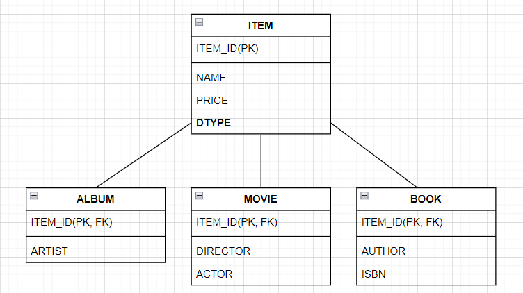

# 고급 매핑

## 목차

1. 
2. 
3. 
 
 

## 학습목표
- 객체의 상속 관계는 데이터베이스에 어떻게 매핑하는가?
- @MappedSuperclass ?
- 복합 키와 식별 관계 매핑하기
- 조인 테이블 매핑
- 엔티티 하나에 여러 테이블 매핑하는 방법
 
 

# 1. 상속 관계 매핑

- 관계형 데이터베이스에는 상속이라는 개념이 없다.  
대신 슈퍼타입-서브타입 관계라는 모델링 기법이 객체의 상속 개념과 가장 유사하다.

- ORM에서 상속 관계를 매핑한다는 의미는 객체의 상속 구조와 관계형 데이터베이스의 슈퍼타입-서브타입 관계를 매핑한다는 것이다.
 
 

## 1.1 조인 전략

- 각각 모두 테이블로 만들고 자식 테이블이 부모 테이블의 기본 키를 받아서 `기본키 + 외래키`로 사용한다.

