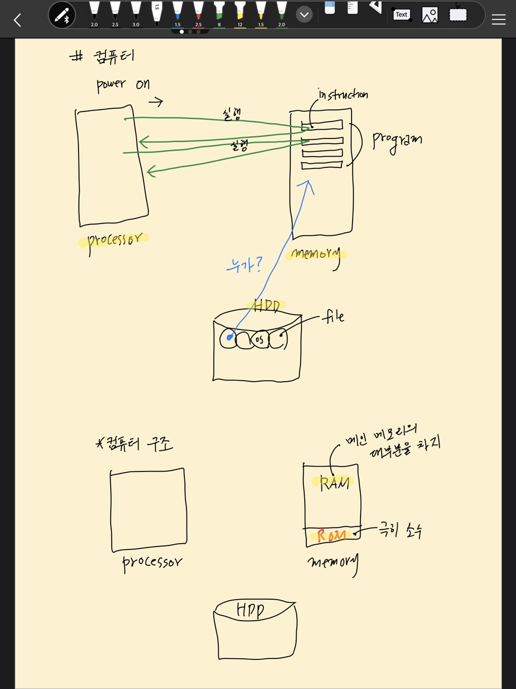
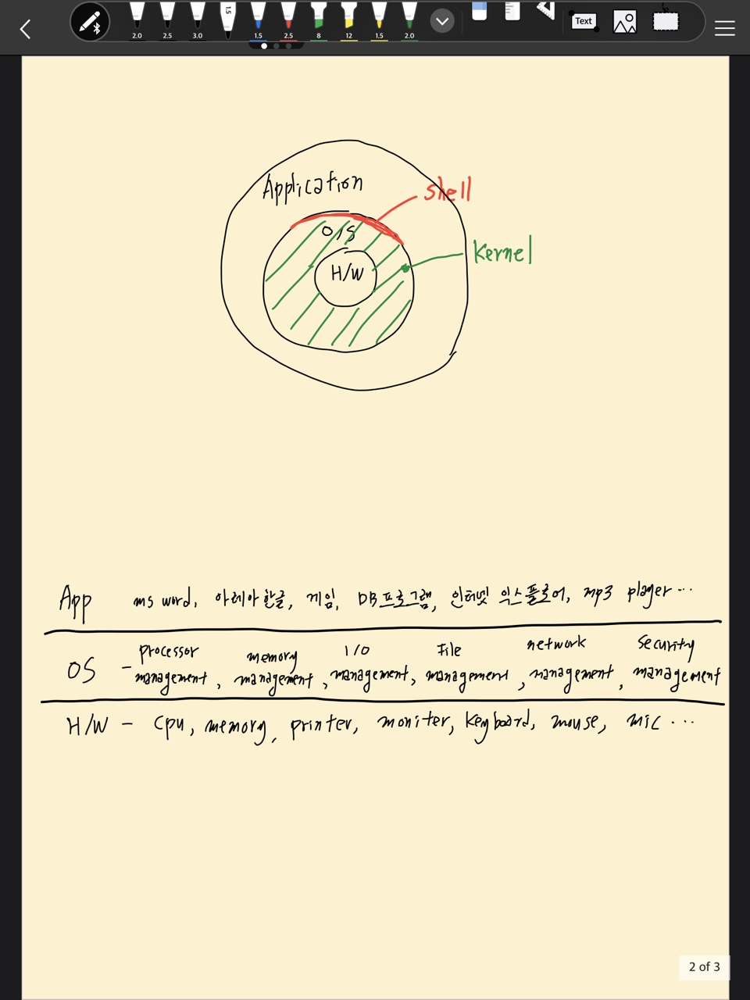

# 개요

## 목차
1. [운영체제가 하는 일은?](#1-운영체제가-하는-일은)
2. [운영체제는 무엇인가?](#2-운영체제는-무엇인가)
3. [부팅(Booting)](#3-부팅booting)
4. [운영체제 구조](#4-운영체제-구조)
5. [운영체제의 위치](#5-운영체제의-위치)
6. [요약](#6-요약)

<br>
<br>

# 1. 운영체제가 하는 일은?
- 운영체제가 없는 컴퓨터는?    
야생마와 같다.  
제멋대로 폭주하는, 전혀 제어되지 않는 말.  
우리는 os가 없으면 컴퓨터를 사용할 수 없다.

- 프로그램을 실행하려면?    
? 가 HDD를 뒤져서 우리가 실행하려하는 program을 찾아서 memory에 띄워놓아야 한다.

- processor는 하나인데, 어떻게 동시에 여러개의 프로그램이 실행될 수 있을까?  
인터넷 브라우저, 음악 재생기, 등등...

- 프린터로 인쇄를 하려면?

- 문서를 편집해서 hdd에 저장은 누가?

이 모든 걸 **`운영체제`** 가 한다.  
운영체제가 있기 때문에 컴퓨터를 온전히 쓸 수 있다.
<br>
<br>


# 2. 운영체제는 무엇인가?
- 컴퓨터 `하드웨어`를 잘 관리하여 `성능을 높이고` 사용자에게 `편의성`을 제공하는 것

- 하드웨어란?   
프로세서 + 메모리 + 하드디스크 + 프린트, 키보드, 마우스 등등...

- 성능을 높인다 (최고 목적)  
좋은 os를 쓰면 컴퓨터 성능이 높아진다.

- 사용자에게 편의성을 제공 (다음 목적)  
컴퓨터는 아이도 몇 번 해보면 사용 가능하다.  
스마트폰도 하나의 컴퓨턴데 이 안에도 운영체제가 있어서 꼬마 아이도 몇번 해보면 사용법을 안다. 
왜그럴까? os가 있기 때문이다.  
옛날에는 os가 이렇게 잘 만들어지지 않아서 컴퓨터 사용이 너무 어려웠다.   일반인은 컴퓨터를 사용하지 못했고, 컴퓨터를 사용하는 전문 직업이 있었다.(operator라고 부름, 지금은 없어짐)  
오늘날 컴퓨터는 누구나 다 사용 할 수 있는 것이기 때문에.

- os는 컴퓨터 하드웨어를 관리하는 프로그램이다.  
(control program for computer)
<br>
<br>


# 3. 부팅(Booting)
- 컴퓨터 구조
    - 프로세서, 메모리(ROM, RAM), 디스크
    - POST(Power-On Self-Test)
    - 부트로더(Boot loader)

- 운영체제
    - 관리(Management) 프로그램
    - 프로세서, 메모리, 디스크, 입출력장치 드라이브
    - 커널(kernel) vs 명령 해석기(shell, command interpreter)


<br>
<br>


## 3.1 ROM? RAM?
RAM - 휘발성  
ROM - flash memory. 전원과 관계없이 유지 되는 것.  

- 파워를 껐다가 켜면 프로세서는 제일 먼저 램 부분을 읽는 게 아니라 롬 부분의 코드를 읽어온다. (ROM 안의 instruction을 읽음)

- 프로세서가 인스트럭션을 읽어와서 실행한다.  
그럼 롬안에 어떤 프로그램을 넣어놔야 할까?  
<br>
<br>


## 3.2 POST
- post program   
전원을 켜면 프린트가 연결 돼있는지, 전원이 잘 꽂혀있는지 셀프 테스트를 한다.

- post를 읽어와서 컴퓨터의 용량이 얼마이고, 램은 얼마이고 기타 등등은  얼마이고 전부 다 알 수 있다. 
<br>
<br>

## 3.3 Boot loader
- post가 실행되고 그 다음에 boot loader가 실행된다.    

- 부팅이란 무엇인가? 어떤 역할을 하는가?   
보통 하드디스크 안에 os를 설치한다.   부트 로드가 하는 일은 하드디스크를 뒤져서 os를 메인 메모리의 RAM 영역으로 가져온다.  

- 하드디스크에 있었던 os가 메인메모리로 올라온다.   
이를 부팅 이라고 한다.  
부트 - 끌어당기다 ->끌어당겨서 메인메모리로 갖고 온다.

- ROM 안에 bootstrap Loader가 있고, boot loader가 hdd에 있는 os를 찾아서 메인 메모리의 RAM으로 올린다.
<br>
<br>


## 3.4 그 다음엔??
- 이제 더 이상 ROM 프로그램엔 실행 될 게 없다.  
롬의 역할은 끝났다. 롬은 파워를 켰을 적에만 필요하다.  

- 일단 os가 메인 메모리로 올라오면 어떻게 되나?  
윈도우라면 바탕화면이 나타나고 아이콘이  보인다.  
리눅스면 login 프롬프트가 떠서 사용자 이름을 입력할 수 있다.

- 이 말은 무슨 말이냐?   
os가 메모리에 상주해서 "지금부터 모든 명령을 받아들일 준비가 되었습니다. 일을 시켜주세요!"라는 의미이다.  

- os가 올라감으로인해 이제 이 컴퓨터는 사용자가 마음대로 제어할 수 있는 단계가 되었다.  
모든 제어를 os가 해주기 때문에 우리는 컴퓨를 쉽게 사용할 수 있다. 컴공 학생만 사용할 수 있는 게 아니라 꼬마도 가능하다.
os는 컴퓨터의 성능을 높여준다고 했는데 어떻게 성능을 높이는지 추후에 알아보자.
<br>
<br>

## 3.5. os가 사라지는 시기
- 그렇다면 os는 언제 사라질까?  
전기를 끄면 사라진다. 전기를 끄지 않는 이상 os는 항상 메인 메모리에 상주한다.  

- 다른 프로그램은?   
메모리에 올라왔다가 사라지고 올라왔다가 사라진다.  
하드디스크에서 hwp 문서를 끄집어와서 작업하다가 hwp 문서를 종료하면 메모리에서 사라지고, 크롬을 실행하다가 크롬을 종료하면 사라진다.  
게임 하고싶은데? -> 하드디스크에 있는 게임 실행 -> 게임 지루함. 안할래 -> 게임도 사라진다.

- os는? 계속 있다. = Resident  
항상 상주한다.   
언제까지? 컴퓨터 끌 때까지.
<br>
<br>


# 4. 운영체제 구조
os는 크게 보면 두가지로 나뉜다.
컴퓨터를 프로세서 + 메모리로 그릴 수 있지만, 다른 방법으로 그릴 수도 있다.  
하드웨어를 그려보자.



```text
os를 관리해주는 애 = kernel (제일 중요)    
os 껍데기 = shell
```

## 4.1 shell
- 바탕화면에 여러개의 아이콘이 모여있고,
특정 프로그램을 실행하고 싶다면 마우스 가져가서 더블클릭 하면 실행된다.

- 마우스 갖다대고 더블클릭 한 것 = 명령을 하기 위해 한 행동.  
이는 운영체제의 껍데기 부분이다. = 커맨드 인터프리터

- 예를들어 리눅스의 명령 방법을 보자.
    ```text
    $ls
    -> list: 현재 디렉터리에 들어있는 파일 리스트가 보여짐.

    $who 
    -> 컴퓨터를 현재 사용하고 있는 사용자의 이름이 나옴

    $df 
    -> disk free: hdd 전체 용량은 얼마고 얼마나 사용했는가? 
    ```

- 리눅스를 사용할 것이라면 명령어를 알아야한다.

- shell이 하는 역할?   
    ```
    $who 가 뭐하는 명령이지? 아 사용자 목록 보여달라는 거구나? -> 보여줌

    $df -> 아 하드디스크 뒤져서 hdd 얼마 남았나 보여달라는 거구나? -> 보여줌

    ```

- os 바깥 부분에 위치하고 사용자로부터 명령을 받아들여서 그 명령을 인터프리터(해석)한 다음에 해당되는 명령을 실행해 주는 것.  
= shell, command interpreter

- os = kernel + shell  
커널은 실제로 관리하는 프로그램.  
cpu를 관리하고, memory, disk를 관리하는 데 비해서 shell은 사용자가 명령을 내리면 그 명령을 해석해서 결과를 화면에 보여주는 역할. (껍질 부분)

- 우리 눈에는 커널은 안보이고 껍질 부분만 보인다.   
당연하다. 커널은 안에 있는 거라서 안보인다.
<br>
<br>


## 4.2 shell? kernel? 
```text
너, 윈도우 잘 아니?   
응. 당연히 잘 알아.  
-> 윈도우 사용법을 안다는 것   
= 껍질(shell)을 잘 안다는 의미

맥킨토시, 리눅스 잘 아니?   
응 나 좀 아는데.
사실 걔가 알고 있다는 건 사용법을 알고있다는 것   
= 명령어를 알고 있다. 껍질을 알고 있다.
```

- 상대가 알고 있는 건 커널이 아니라 shell.

- 우리가 배울 건 shell일까? kernel 일까?  
kernel.  
<br>
<br>


# 5. 운영체제의 위치
- 하드웨어 > 운영체제> 애플리케이션  
os 바깥부분에 일반적인 애플리케이션이 있다.   
애플리케이션 = 응용 프로그램. 휴대폰의 앱 같은 것.  
앱들은 어디에서 실행되나? 그림을 보자. os 위에서 실행된다.  

- os가 달라지면 저 프로그램이 실행될까?   
안된다.   

- 윈도우 한글2010을 가져가서 맥신토키에서 실행하면 될까?  
os가 다르기 때문에당연히 안된다.

* 2학년 1학기 - 컴퓨터 구조
* 2학년 2학기 - 운영체제
<br>
<br>

# 6. 요약
- 하드웨어는 야생마와 같고 이 야생마를 통제해주는 프로그램이 있는데 이것이 os이다.

    ```text
    App - ms word, 한글, 게임, 인터넷 익스플로어
    ────────────────────────────────────────────────────────────
    OS - processor, memory, i/o, network, security management
    ────────────────────────────────────────────────────────────
    H/W - cpu, memory, printer, moniter ...
    ```  

-  운영체제 vs 정부(Goverment)
    ```text
    자원 관리자
    자원 할당자
    주어진 자원을 어떻게 가장 잘 활용할까? 국토, 인력, 예산
    정부가 직접 일하지는 앟는다.
    업무별 부서: 행정부, 교육부, 국방부, 건설교통부...
    프로세스, 메모리, 입출력장치, 파일시스템...
    ```

- os는 정부와 비슷하다. 왜?  
정부가 하는 일을 살펴보자. 정부는 땅을 잘 관리해야 한다.   
저 지역은 그린벨트, 이 지역은 산업단지, 임야, 주거지... 이런 걸 잘해서 물류, 농업 면에서 잘 제어될 수 있도록 하는 게 정부가 하는 일이다.  
인력 관리, 관련 정책, 돈 관리 등등...   
정부는 이런 자원들을 갖고 있지만 정부가 직접 일하지는 않고 관리만 할 뿐이다.  
기업이 직접 일 하고 계획 세우고 관리하는 건 국가
 
- os에서 제일 중요한 부서는?  
컴퓨터에서 제일 중요한 것 == cpu  
그래서 processor management가 제일 중요하고 그 다음은 memory management

- 하드웨어 = 자원, resource  
이 자원들을 누가 관리하나? os가  
그래서 os의 다른 이름은 resource manager, resource allocater