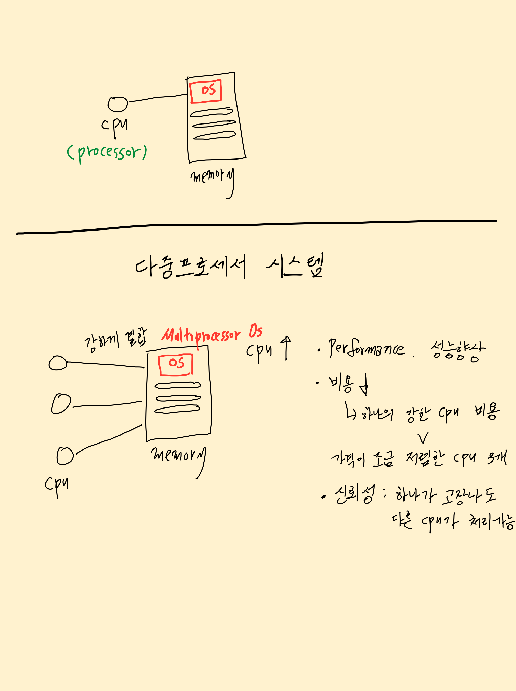
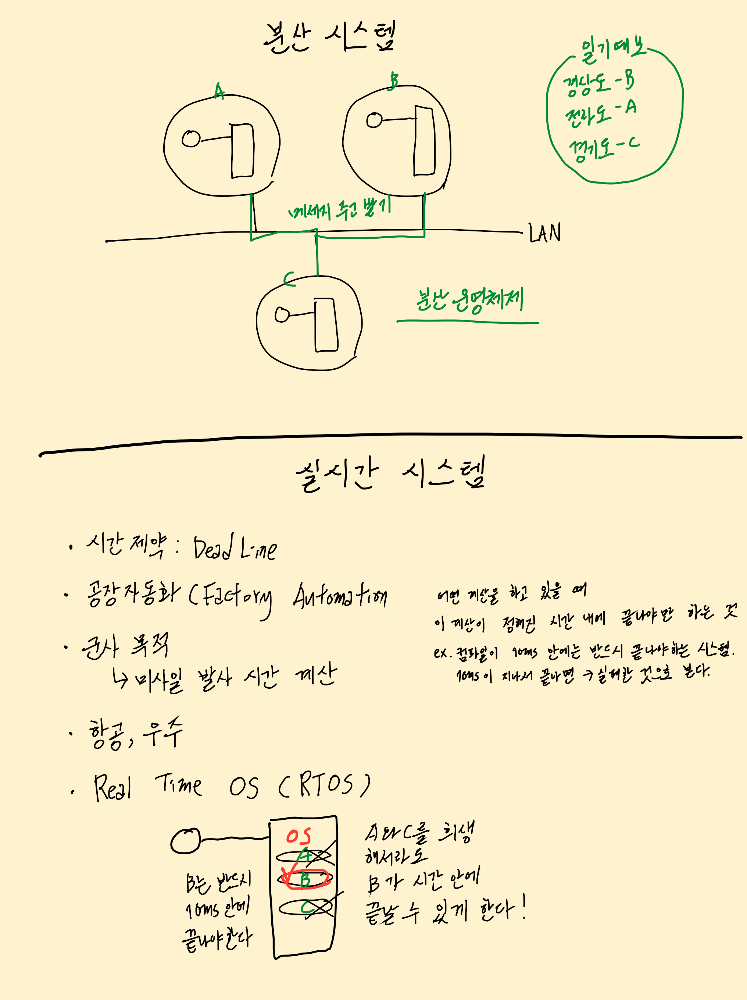
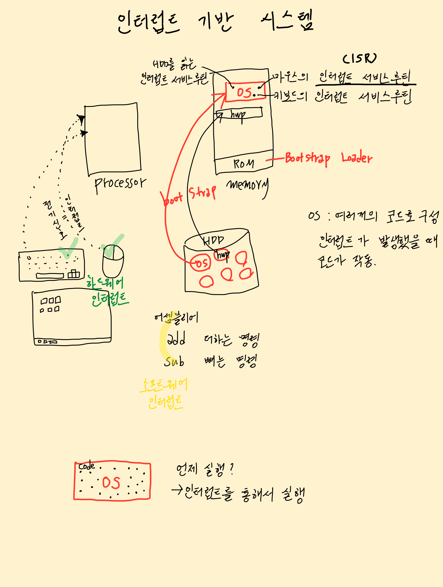
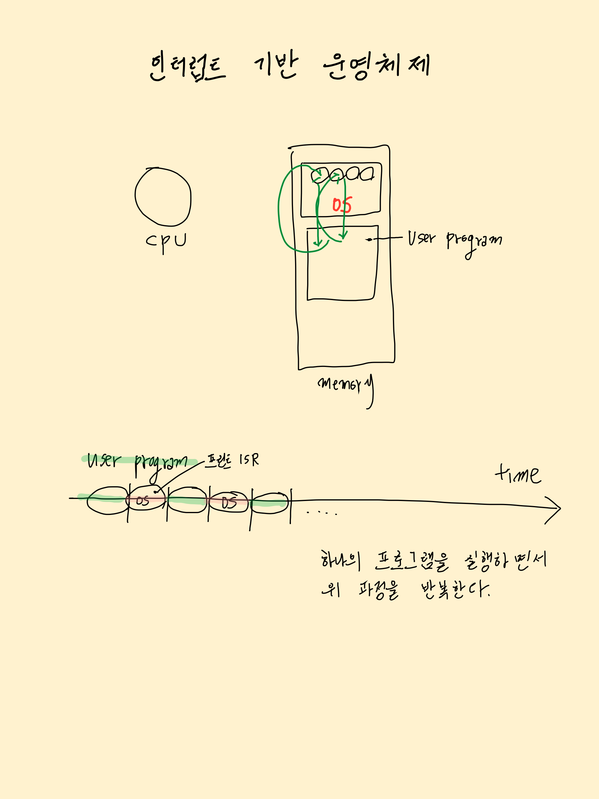

# 고등 운영체제, 인터럽트 기반 시스템

## 목차
1. [고등 운영체제](#1-고등-운영체제)
2. [인터럽트](#2-인터럽트)
3. [인터럽트 기반 운영체제](#3-인터럽트-기반-운영체제)

 

# 1. 고등 운영체제
- 다중 프로세서 시스템(Multiprocessor system)
  - 병렬 시스템(parallel system)
  - 강결합 시스템(tighthly-coupled systme)
  - 3가지 장점: performance, cost, reliability
  - **`다중 프로세서 운영체제(Multiprocessor OS)`**

- 분산 시스템(Distributed system)
  - 다중 컴퓨터 시스템(multi-computer system)
  - 소결합 시스템(loosely-coupled system)
  - **`분산 운영체제(Distributed OS)`**

- 실시간 시스템(Real-time system)
- 시간 제약: Deadline
- 공장 자동화(FA), 군사, 항공, 우주
- **`실시간 운영체제(Real-time OS = RTOS)`**
 
 

 
 

# 2. 인터럽트
- 현대 운영체제는 인터럽트 기반 시스템
- 부팅이 끝나면?
  - 운영체제는 메모리에 상주(resident)
  - 사건(event)을 기다리며 대기: 키보드, 마우스 ...
- 하드웨어 인터럽트(Hardware interrupt)
  - 인터럽트 결과 운영체제 내의 특정 코드 실행(ISR)
  - Interrupt Service Routine 종료 후 다시 대기
- 소프트웨어 인터럽트(Software interrupt)
  - 사용자 프로그램이 실행되면서 소프트웨어 인터럽트 (운영체제 서비스 이용 위해)
  - 인터럽트 결과 운영체제 내의 특정 코드 실행(ISR)
  - ISR 종료 후 다시 사용자 프로그램으로 돌아감

 
 

# 3. 인터럽트 기반 운영체제
- 운영체제는 평소에는 대기 상태
  - 하드웨어 인터럽트에 의해 운영체제 코드(ISR) 실행
  - 소프트웨어 인터럽트에 의해 운영체제 코드(ISR) 실행
  - 내부 인터럽트(Internal interrupt)에 의해 운영체제 코드(ISR) 실행

- ISR 종료되면
  - 원래의 대기상태 또는 사용자 프로그램으로 복귀

- 인터럽트 기반 운영체제
