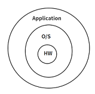
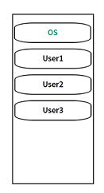

# 이중모드, 하드웨어 보호

## 목차
1. [이중모드](#1-이중-모드)
2. [하드웨어 보호](#2-하드웨어-보호)
<br>
<br>

# 1. 이중 모드
- 한 컴퓨터를 여러 사람이 동시에 사용하는 환경
  - 한 사람이 고의나 실수로 특정 명령을 내렸을 때 프로그램 전체가 영향을 받는다. (STOP, RESET 등)
- CPU가 구동될 때의 모드
  - 관리자 모드(System mode)
    - 특권 명령(STOP, HALT, RESET)은 관리자만 사용할 수 있게 한다.
  - 사용자 모드(User mode)

## 1.1 관리자 모드
- Supervisor, System, Monitor Privileged Mode
- 운영체제 서비스가 실행될 때
  - OS 가 동작할 때는 시스템 모드에서 동작한다. 
  - 하드웨어/소프트웨어 인터럽트가 발생하면 관리자 모드

## 1.2 사용자 모드
- 사용자 프로그램이 실행될 때는 사용자 모드
  - 예를들어, 게임 프로그램이 실행될 때에는 유저모드에서 동작한다.
- 운영체제 서비스가 끝나면 다시 사용자 모드

## 1.3 사용자 프로그램은 특권 명령 사용 불가
- 게임 프로그램이 실행 중이라고 가정하자.  
게임 스코어를 하드디스크에 저장할 때는 누가 할까?  
  - CPU가 한다.  
    CPU는 소프트웨어 인터럽트를 읽어서 비트를 시스템 모드 1로 바꾼 뒤 인터럽트 서비스 루틴으로 점프해서 저 명령을 실행한다.
- 게임 프로그램에서 하드디스크에 바로 접근하면 안될까?  
  - 프로그램은 유저 모드인데 유저 모드가 하드디스크에 접근하면 다른 사람 파일도 읽을 수 있기에 보안에 심각한 문제가 생긴다.

## 1.4 특권명령
- STOP, HALT, RESET, SET_TIMER, SET_HW 등...
- 일반 유저가 특권 명령을 내리면?   
 CPU는 모드 번호를 본다. 유저 모드(0)인데 특권명령을 내린다면 CPU는 이를 잘못된 명령으로 보고 이 명령을 실행 하는 대신에 잘못된 명령을 내렸을 때 시행하는 프로그램을 강제 종료 시키는 서비스 루틴을 실행 시킨다.   
 잘못된 명령을 내린 프로그램은 메인 메모리에서 강제로 종료된다.  
 - 이중 모드는 보호와 관련 되어있다.
<br>
<br>

# 2. 하드웨어 보호
## 2.1. 입출력 장치 보호
### 2.1.1 사용자의 잘못된 입출력 명령
  - 서버 컴퓨터에 프린터가 연결 되어있다고 가정하자.     
  사용자 A가 사용 중인데 B가 이를 알면서도 방해하기 위해 RESET 등 특권 명령을 내린다면 이는 잘못된 접근이다.  
이처럼 하드디스크, 프린트, 입출력 장치는 아무나 접근할 수 없도록 보호를 받아야 한다.  
<br>
<br>

### 2.1.2 해결법  
  - 일반 유저나 입출력 장치가 함부로 접근할 수 없도록 입출력 명령을 `특권명령`으로 설정 한다. 
<br>
<br>

### 2.1.3 사용자가 입출력 명령을 직접 내린다면?  
CPU는 모드를 확인한 뒤 잘못된 명령이라면 서비스 루틴 을 실행하고 잘못된 명령을 내린 프로그램을 강제 종료 시킨다. (Priviliged instruction violation)
<br>
<br>

### 2.1.4 입출력을 하려면 어떻게 해야 하는가?  
프린트가 하고 싶다면 직접 프린트 명령을 내리는 것이 아니라 OS에 소프트웨어 인터럽트(부탁)를 해서 운영체제가 입출력을 대행하게 한다.    
OS에 In이나 Out 명령을 내리는대신 Int(인터럽트) 명령을 내린다. 운영체제는 입출력을 실행한 후 다시 user mode로 복귀한다. 
<br>
<br>

### 2.1.5 올바른 요청이 아니라면 운영체제는 어떤 일을 하는가?  
사용자 B가 사용자 A의 정보를 보려고 소프트웨어 인터럽트를 하면 OS는 이를 확인하고 올바른 요청이 아니면 B가 다른 사람의 파일을 읽지 못하도록 거부한다. (너는 B잖아? 거절)   
OS가 이런 역할을 해주기 때문에 네이버나 다음에서 제공하는 N드라이브 같은 것들을 믿고 쓸 수 있다.
<br>
<br>

### 2.1.6 컴퓨터 구조  
  
그림을 보면, OS가 하드웨어와 일반 프로그램 사이에 위치하고 있다.  
일반 프로그램이 하드디스크에 접근하려면 OS에게 요청을 하여야한다.  
(OS- 요청이 정당한가? YES: 디스크 구동 / NO:거부)
<br>
<br>

### 2.1.7 요약  
입출력 명령은 특권명령으로 설정하고, 이 명령은 오에스만 내릴 수 있다.
<br>
<br>

## 2.2 메모리 보호
### 2.2.1 다른 사용자의 메모리 또는 운영체제 영역 메모리에 접근
- 메인메모리  
  
User1 프로그램이 실행 중인데 자기한테 주어진 영역이 아닌 다른 영역, 다른 유저의 메모리를 기웃거리거나 OS 영역에 있는 정보를 보거나 내용을 바꾸려고 한다면 당연히 보호해야 한다.
<br>
<br>

### 2.2.2 해결법
```text
cpu ────address bus───> main memory
    <────data bus──────
```

```text
User1 = 500 ~ 1000번지
User2 = 1001 ~ 2000번지
```
- address bus 에 문지기를 둔다.  
cpu가 User1 을 돌 때에는 User1 영역의 주소만 돌도록 문지기를 세운다. 이 문지기는 어떻게 만드는가?

- 레지스터를 둔다.  
500(base) ~ 1000(limit)  
자기 범위를 넘어서는 번지를 읽으려고 하면 문지기가 CPU한테 인터럽트 신호를 보내준다.   
인터럽트 신호를 받으면 CPU는 하던 일을 중지하고 OS의 서비스 루틴으로 점프해서 잘못된 번지를 읽으려고 한 프로그램을 강제 종료한다. (Segment violation)

- MMU (Memory Management Unit)  
이 문지기를 컴퓨터 용어에서는 MMU 라고 한다.  
<br>
<br>

### 2.2.3 설정은 어떻게 하나?
- base, limit 값은 OS가 설정한다.   
이 값을 바꿀 수 있는 명령 역시 특권명령이 되어야한다.
- MMU 설정은 특권명령이다. 운영체제만 바꿀 수 있다.
<br>
<br>

### 2.2.4 요약
- 일반유저는 하드디스크, os 영역에 절대 접근할 수 없다.