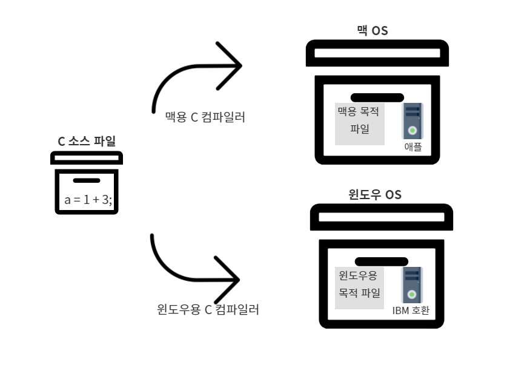

# 사람을 사랑한 기술

# 1. 신기술은 이전 기술의 어깨를 딛고
- 스프링을 비롯한 모든 신기술은 이전 기술의 어깨를 디딤돌 삼아 새로운 철학과 기법을 더해 나타나는 것이다.

- 스프링을 학습하기 위해서 스프링 이전 기술들의 의미를 빠르게 돌아보자.
 
 

# 2. 기계어에서 객체 지향 프로그래밍 언어로
## 2.1 기계어 - 0과 1의 행진 (너무나 비인간적인 언어)

- 0과 1의 이야기  
기계어는 기계가 이해하는 유일한 언어로, 2진 숫자인 0과 1로만 표현된다. 기계어 코드는 CPU에 따라 다르다.
 
 

## 2.2 어셈블리어 - 0과 1의 행진을 벗어나 인간 지향으로 (기계어 니모닉)

- 기계어의 명령들을 일상 용어로 표현하고 이걸 기계가 알 수 있는 기계어로 번역하게 하자.

- 같은 일을 하는 프로그램의 소스파일을 각 기계의 종류만큼 만들어야 한다.
 
 

## 2.3 C 언어 - 강력한 이식성 (One Source Multi Object User Anywhere)

- 소스파일을 하나만 만들면 된다. (싱글 소스)
 
 

## 2.4 C++ 언어 - 정말 인간적인 프로그래밍 방법론, 객체 지향
- C에 객체 지향 개념을 도입하였다.
 
 

## 2.5 자바 - 진정한 객체 지향 언어

- 자바 가상 머신 도입
- Wrtie Once User Anywhere
 
 

# 3. 비교
||기계어|어셈블리어|C 언어|자바|
|-|-|-|-|-|
|기호|0과 1의 나열|일상 단어 사용|수학적 기호 사용|수학적 기호 사용|
|소스 파일|기종마다 하나씩|기종마다 하나씩|기종이 몇 개든 하나|기종이 몇 개든 하나|
|목적 파일(기계어)|소스 그 자체|어셈블러로 소스를 번역해 기계어 생성|컴파일러로 소스를 번역해 해당 운영체제용 기계어 생성|기종이 몇 개든 하나의 JVM용 기계어 생성|
|기계어 비교||기계어와 1:1 대응하는 니모닉|기계어와 m:n 대응하는 수학적 기호|기계어와 m:n 대응하는 수학적 기호|
|비고||기종별 어셈블러 필요|기종별 컴파일러 필요|단 하나의 컴파일러만 필요. 기종별 JRE 세팅 필요|