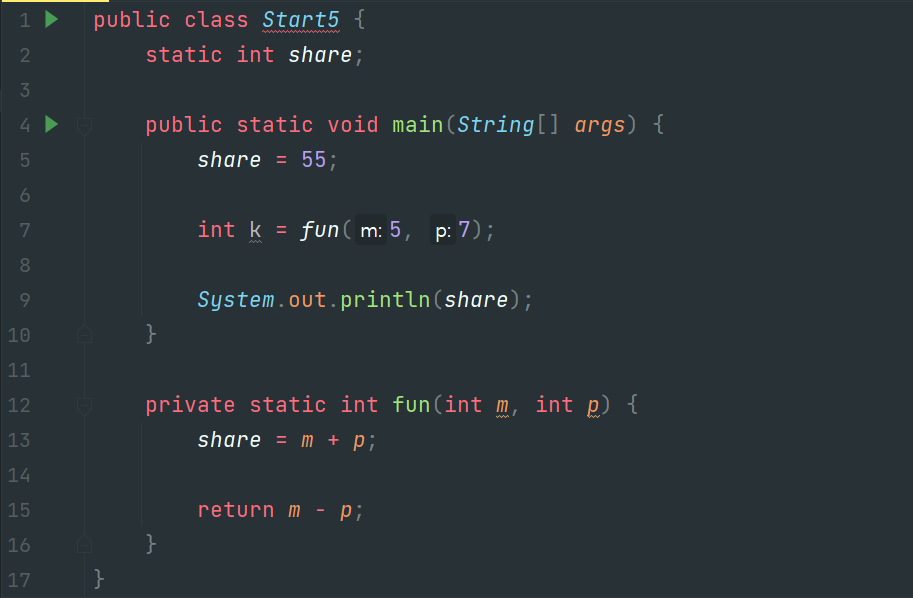
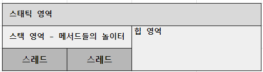
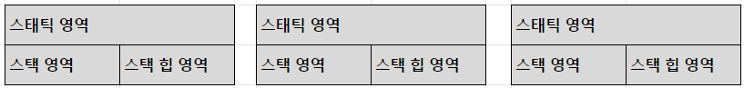

# 자바와 절차적 / 구조적 프로그래밍

### 👀 살펴볼 것
- 변수가 메모리에 어떻게 저장되고 사용될까?
- 메서드가 어떻게 호출되고 메모리에 어떤 변화를 일으킬까?
<br>  

## 목차
1. [자바 프로그램의 개발과 구동](#1-자바-프로그램의-개발과-구동)  
2. [자바에 존재하는 절차적/구조적 프로그래밍의 유산](#2-자바에-존재하는-절차적구조적-프로그래밍의-유산)  
3. [다시보는 main() 메서드: 메서드 스택 프레임](#3-다시보는-main-메서드-메서드-스택-프레임)
4. [변수와 메모리: 변수! 너 어디 있니?](#4-변수와-메모리-변수-너-어디-있니)
5. [블록 구문과 메모리: 블록 스택 프레임](#5-블록-구문과-메모리-블록-스택-프레임)
6. [지역 변수와 메모리: 스택 프레임에 갇혔어요!](#6-지역-변수와-메모리-스택-프레임에-갇혔어요)
7. [메서드 호출과 메모리: 메서드 스택 프레임](#7-메서드-호출과-메모리-메서드-스택-프레임)
8. [전역 변수와 메모리: 전역 변수 쓰지 말라니까요!](#8-전역-변수와-메모리-전역-변수-쓰지-말라니까요)
9. [멀티 스레드 / 멀티 프로세스의 이해](#9-멀티-스레드--멀티-프로세스의-이해)

<br>


# 1. 자바 프로그램의 개발과 구동
- JVM의 존재와 역할을 아는 것은 자바 개발 환경을 이해하는 데 필수적이다.
  - JVM,JDK,JRE 란 무엇인가?

<br>

- 현실 세계
  - 컴퓨터를 구동하려면 `하드웨어, 운영체제, 소프트웨어`가 필요하다.   
  그리고 소프트웨어를 개발할 수 있는 개발 도구도 필요하다.
  - `소프트웨어 개발 도구`로 `소프트웨어`를 개발하고, 이 소프트웨어는 `운영체제`를 통해 `하드웨어` 상에서 구동된다.

<br>

- 자바의 세계
  - `자바 개발도구`로 `자바 프로그램`을 만들고, `자바 실행 환경`을 통해 `자바 가상 머신` 상에서 구동된다.
  - 자바 개발 도구: JDK (Java Development Kit)
  - 자바 실행 환경: JRE (Java Runtime Environment)
  - 자바 가상 머신: JVM (Java Virtual Machine)

<br>

- JDK, JRE, JVM의 관계
    ```
    ┌──────────────────── JDK ────────────────────┐  
    │                                             │
    │                  ┌─────────JRE──────────┐   │
    │                  │                      │   │
    │   ·javac.exe     │ ·java.exe     ·JVM   │   │
    │                  │                      │   │
    │                  └──────────────────────┘   │ 
    └─────────────────────────────────────────────┘ 
    ``` 
    - JDK는 자바 소스컴파일러를 포함하고 있고, JRE는 자바 프로그램 실행기를 포함하고 있다.
    - 개발자가 자바 소스파일(Computer.java)을 작성하면 JDK의 자바 소스컴파일러가 번역해서 클래스 파일(Computer.class)로 만들고 JRE의 자바 실행기로 클래스 파일을 실행시킨다.

<br>

- 프로그램이 메모리를 사용하는 방식
  - 모든 프로그래밍 언어의 메모리 사용 방식  
    

  - 객체 지향 프로그램에서 메모리를 사용하는 방식
    

<br>
<br>

# 2. 자바에 존재하는 절차적/구조적 프로그래밍의 유산
## 2.1 절차적 프로그래밍
- 절차적 프로그래밍을 한마디로 표현하자면 goto를 쓰지 말라는 것이다.
  - goto?  
    goto 문은 레이블에 제어를 전송한다.   
    지정된 레이블은 동일한 함수에 있어야 하며 동일한 함수에서 하나의 문 앞에만 나타날 수 있다.
    ```c
    // goto.c
    #include <stdio.h>

    int main()
    {
        int i, j;

        for ( i = 0; i < 10; i++ )
        {
            printf_s( "Outer loop executing. i = %d\n", i );
            for ( j = 0; j < 3; j++ )
            {
                printf_s( " Inner loop executing. j = %d\n", j );
                if ( i == 5 )
                    goto stop;
            }
        }

        /* This message does not print: */
        printf_s( "Loop exited. i = %d\n", i );

        stop: printf_s( "Jumped to stop. i = %d\n", i );
    }
    ```

- 자바에는 goto를 예약어로 등록해 놓았다.  
사용하기 위해 등록한 것이 아니라 사용하지 못하게하기 위해서 등록해 놓은 것이다.
<br>
<br>

## 2.2 구조적 프로그래밍
- *구조적 프로그래밍은 구조화 프로그래밍으로도 불리며 프로그래밍 패러다임의 일종인 절차적 프로그래밍의 하위 개념으로 볼 수 있다.   
GOTO문을 없애거나 GOTO문에 대한 의존성을 줄여주는 것으로 가장 유명하다.   
(위키백과)*

- 함수를 쓰라는 것이다.  
  - 함수 사용의 장점:  
    - 하나의 큰 프로그램을 여러 부분으로 분리함으로써 구조적 프로그래밍이 가능하다.  
    - 같은 코드를 계속 쓰지 않음으로써 프로그램의 용량을 줄일 수 있고, 다른 부분이나 다른 프로그램에서 같은 코드를 사용할 수 있다.

<br>
<br>

## 2.3 자바와 절차적/구조적 프로그래밍
- goto문은 제어 흐름을 이동시키는 용도이고, 함수는 중복 코드 제거와 논리를 분할하기 위한 용도이다.

- 이 각각은 자바 언어에서 순서도와 제어문, 메서드와 같은데 객체 지향 프로그래밍에서 제어문이 존재할 수 있는 곳은 메서드 내부이므로 결국 절차적/구조적 프로그래밍의 유산은 자바의 메서드 내부에서 확인할 수 있다.
<br>
<br>

# 3. 다시보는 main() 메서드: 메서드 스택 프레임
- main() 메서드는 프로그램이 실행되는 시작점이다.  
main() 메서드가 시작될 때 메모리에는 어떤 일이 일어나는지 알아보자.

- 
<br>

## 3.1 Start.java를 실행시켜보자
- ```java
  public class Start {

    public static void main(String[] args) {
        System.out.println("Hello OOP!!!");
    }

  }
  ```
- 
<br>

- [ ] A4 용지에 코드 실행 순서에 따른 메모리 구조 그려보기
  1. JRE가 하는 일  
  2. JVM에서 수행하는 전처리 작업
  3. main() 메서드 실행을 위한 작업
  4. 코드 실행
  5. 실행 후 메모리의 상태
  6. JRE가 하는 일
<br>

## 3.2 메모리 구조의 변화 핵심 내용 정리
- T 메모리 구조
- java.lang 패키지
- import 패키지와 클래스들
- 메서드 스택 프레임
- JVM
- JRE
<br>
<br>


# 4. 변수와 메모리: 변수! 너 어디 있니?

```java
1   public class Start2 {
2     public static void main(String[] args) {
3       int i;
4       i = 10;
5
6       double d = 20.0;
7     }
8   }
```
- 실습 내용
  - Start.java를 실행 했을 때 메모리 구조와 Start2.java를 실행 했을 때 메모리 구조 비교하기.

- 변수! 너 어디 있니? 에 대한 답은 [6. 지역 변수와 메모리](#6-지역-변수와-메모리-스택-프레임에-갇혔어요)에서 확인할 수 있다.
<br>
<br>

# 5. 블록 구문과 메모리: 블록 스택 프레임
```java
1   public class Start3 {
2       public static void main(String[] args) {
3         int i = 10;
4         int k = 20;
5
6         if (i = 10) {
7             int m = k + 5;
8             k = m;
9         } else {
10            int p = k + 10;
11            k = p;
12        }
13
14        // k = m + p;
15      }
16  }
```
- 5번째 줄이 끝났을 때 T 메모리의 스냅샷
  
- 6번째 줄의 if 블록을 만났을 때, T 메모리의 스냅샷

- 7번째 줄의 `int m = k + 5;`  
  두 개의 명령문으로 분할하고 `int m`을 실행한 후, `m = k + 5`를 실행한 후의 T 메모리

- 8번째 줄 `k = m;`을 실행한 후 T 메모리

- 9번째 줄에서 12번째 줄 사이의 else 문 블록은 어떻게 될까?

- 14번째 줄의 주석을 해제하면 어떤 일이 발생할까?

- 15번째 줄의 닫는 중괄호를 만나면 T 메모리 소멸, JVM 기동 중지, JRE가 사용했던 시스템 자원을 운영체제에 반납하게 된다.
<br>
<br>

# 6. 지역 변수와 메모리: 스택 프레임에 갇혔어요!
## 6.1 *`변수! 너 어디 있니?` 에 대한 답*

- 변수는 어디에 있을까?  
T 메모리에는 세 개의 영역이 있는데 변수는 이 세 군데 모두에 있다.

- 각각의 변수는 각기 다른 목적을 가진다.   
  - 지역 변수:  
    스택 영역에서 일생을 보낸다. 그것도 스택 영역의 스택 프레임 안에서 일생을 보내기 때문에 스택 프레임이 사라지면 지역 변수도 함께 사라진다. 
  
  - 클래스 멤버 변수:  
    스태틱 영역에서 일생을 보낸다.  
    스태틱 영역에 한번 자리 잡으면 JVM이 종료될 때까지 고정된 상태로 그 자리를 지킨다.

  - 객체 멤버 변수:  
    힙에서 일생을 보낸다.  
    객체 멤버 변수들은 객체와 함께 가비지 컬렉터라고 하는 힙 메모리 회수기에 의해 일생을 마치게 된다. 
<br>

## 6.2 지역 변수 살펴보기
- 나머지 변수는 Chapter03에서 살펴보기로 하고 여기서는 지역 변수만 살펴보자.

- ```java
  1   public class Start3 {
  2       public static void main(String[] args) {
  3         int i = 10;
  4         int k = 20;
  5
  6         if (i = 10) {
  7             int m = k + 5;
  8             k = m;
  9         } else {
  10            int p = k + 10;
  11            k = p;
  12        }
  13
  14        // k = m + p;
  15      }
  16  }
  ```
- 4번째 줄을 실행한 후 T 메모리

- 5번째 줄이 `System.out.println(m);`일 경우 일어나는 일

- 13번재 줄이 `System.out.println(m);`일 경우 일어나는 일

- 원본 코드에서 7번째 줄을 수행하고 난 후의 T 메모리
  - "외부 스택 프레임에서 내부 스택 프레임의 변수에 접근하는 것은 불가능하나 그 역은 가능하다" - 제임스 고슬링
  - 제임스 고슬링이 이런 말을 한 이유는 코드 진행에 따른 T 메모리의 변화를 그려보면 당연히 그럴 수밖에 없다는 결론이 나온다.
<br>
<br>

# 7. 메서드 호출과 메모리: 메서드 스택 프레임
```java
1 public class Start4 {
2     public static void main(String[] args) {
3         int k = 5;
4         int m;
5 
6         m = square(k);
7     }
8 
9     private static int square(int k) {
10         int result;
11         
12         k = 25;
13
14         result = k;
15 
16        return result;
17    }
18 }
```
- 5번째 줄을 실행한 후 T 메모리

- 6번째 줄을 실행한 후 T 메모리

- 11번째 줄을 실행한 후 T 메모리

- 12 번째 줄을 실행한 후 T 메모리

- 16번째 줄을 실행한 후 T 메모리

- 6번째 줄을 실행한 후 T 메모리

- 메서드 스택 프레임에서 다른 메서드 스택 프레임의 내부 변수는 절대 접근할 수 없다.

- 메서드 사이에 값을 전달하거나 반환하는 방법은 메서드의 인자와 반환값으로만 가능하다.
<br>
<br>

# 8. 전역 변수와 메모리: 전역 변수 쓰지 말라니까요!
- 사실 메서드 사이에 값을 공유하는 방법이 하나 더 있다. 바로 `전역 변수`를 사용하는 것이다.


- 4번째 줄을 실행하기 전 T 메모리를 그려보자.  
shart 변수는 전역 변수이기 때문에 스태틱 영역에 변수 공간이 할당된다.

- 5, 12, 13, 15, 7번째 줄을 실행한 후 T 메모리  

- 지역변수와 전역 변수의 특징
  - 스택 프레임에 종속적인 지역 변수
  - 스택 프레임에 독립적인 지역 변수

- 수천, 수만 줄이 되는 실무 코드에서 전역 변수의 값과 그 값이 변한 이유를 추적하고 파악하는 것은 어렵고 복잡하다.  
읽기 전용으로 값을 공유해서 전역 상수로 쓰는 경우를 제외하고 전역 변수 사용은 피하자.
<br>
<br>

# 9. 멀티 스레드 / 멀티 프로세스의 이해
- 멀티 스레드

  
  - 멀티 스레드는 스택 영역을 스레드 개수만큼 분할해서 사용한다.

- 멀티 프로세스
  
  - 멀티 프로세스는 다수의 데이터 저장 영역 (다수의 T 메모리)을 갖는 구조이다.

- 예제 코드
  ```java
  public class Start6 extends Thread {
      static int share;

      public static void main(String[] args) {
          Start6 t1 = new Start6();
          Start6 t2 = new Start6();

          t1.start();
          t2.start();
      }

      public void run() {
          for (int count = 0; count < 10; count++) {
              System.out.println(share++);

              try {sleep(1000);}
              catch (InterruptedException e) { }
          }
      }
  }
  ``` 
<br>
<br>