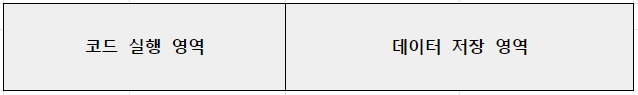
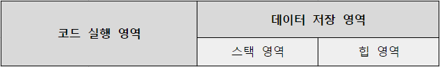
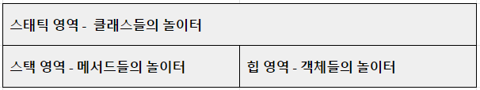

# 자바와 절차적 / 구조적 프로그래밍

### 👀 살펴볼 것
- 변수가 메모리에 어떻게 저장되고 사용될까?
- 메서드가 어떻게 호출되고 메모리에 어떤 변화를 일으킬까?
<br>  

## 목차
1. [자바 프로그램의 개발과 구동](#1-자바-프로그램의-개발과-구동)  
2. [자바에 존재하는 절차적/구조적 프로그래밍의 유산](#2-자바에-존재하는-절차적구조적-프로그래밍의-유산)  
3. [다시보는 main() 메서드: 메서드 스택 프레임](#3-다시보는-main-메서드-메서드-스택-프레임)  

<br>


# 1. 자바 프로그램의 개발과 구동
- JVM의 존재와 역할을 아는 것은 자바 개발 환경을 이해하는 데 필수적이다.
  - JVM,JDK,JRE 란 무엇인가?

<br>

- 현실 세계
  - 컴퓨터를 구동하려면 `하드웨어, 운영체제, 소프트웨어`가 필요하다.   
  그리고 소프트웨어를 개발할 수 있는 개발 도구도 필요하다.
  - `소프트웨어 개발 도구`로 `소프트웨어`를 개발하고, 이 소프트웨어는 `운영체제`를 통해 `하드웨어` 상에서 구동된다.

<br>

- 자바의 세계
  - `자바 개발도구`로 `자바 프로그램`을 만들고, `자바 실행 환경`을 통해 `자바 가상 머신` 상에서 구동된다.
  - 자바 개발 도구: JDK (Java Development Kit)
  - 자바 실행 환경: JRE (Java Runtime Environment)
  - 자바 가상 머신: JVM (Java Virtual Machine)

<br>

- JDK, JRE, JVM의 관계
    ```
    ┌──────────────────── JDK ────────────────────┐  
    │                                             │
    │                  ┌─────────JRE──────────┐   │
    │                  │                      │   │
    │   ·javac.exe     │ ·java.exe     ·JVM   │   │
    │                  │                      │   │
    │                  └──────────────────────┘   │ 
    └─────────────────────────────────────────────┘ 
    ``` 
    - JDK는 자바 소스컴파일러를 포함하고 있고, JRE는 자바 프로그램 실행기를 포함하고 있다.
    - 개발자가 자바 소스파일(Computer.java)을 작성하면 JDK의 자바 소스컴파일러가 번역해서 클래스 파일(Computer.class)로 만들고 JRE의 자바 실행기로 클래스 파일을 실행시킨다.

<br>

- 프로그램이 메모리를 사용하는 방식
  - 모든 프로그래밍 언어의 메모리 사용 방식  
    

  - 객체 지향 프로그램에서 메모리를 사용하는 방식
    

<br>
<br>

# 2. 자바에 존재하는 절차적/구조적 프로그래밍의 유산
## 2.1 절차적 프로그래밍
- 절차적 프로그래밍을 한마디로 표현하자면 goto를 쓰지 말라는 것이다.
  - goto?  
    goto 문은 레이블에 제어를 전송한다.   
    지정된 레이블은 동일한 함수에 있어야 하며 동일한 함수에서 하나의 문 앞에만 나타날 수 있다.
    ```c
    // goto.c
    #include <stdio.h>

    int main()
    {
        int i, j;

        for ( i = 0; i < 10; i++ )
        {
            printf_s( "Outer loop executing. i = %d\n", i );
            for ( j = 0; j < 3; j++ )
            {
                printf_s( " Inner loop executing. j = %d\n", j );
                if ( i == 5 )
                    goto stop;
            }
        }

        /* This message does not print: */
        printf_s( "Loop exited. i = %d\n", i );

        stop: printf_s( "Jumped to stop. i = %d\n", i );
    }
    ```

- 자바에는 goto를 예약어로 등록해 놓았다.  
사용하기 위해 등록한 것이 아니라 사용하지 못하게하기 위해서 등록해 놓은 것이다.
<br>
<br>

## 2.2 구조적 프로그래밍
- *구조적 프로그래밍은 구조화 프로그래밍으로도 불리며 프로그래밍 패러다임의 일종인 절차적 프로그래밍의 하위 개념으로 볼 수 있다.   
GOTO문을 없애거나 GOTO문에 대한 의존성을 줄여주는 것으로 가장 유명하다.   
(위키백과)*

- 함수를 쓰라는 것이다.  
  - 함수 사용의 장점:  
    - 하나의 큰 프로그램을 여러 부분으로 분리함으로써 구조적 프로그래밍이 가능하다.  
    - 같은 코드를 계속 쓰지 않음으로써 프로그램의 용량을 줄일 수 있고, 다른 부분이나 다른 프로그램에서 같은 코드를 사용할 수 있다.

<br>
<br>

## 2.3 자바와 절차적/구조적 프로그래밍
- goto문은 제어 흐름을 이동시키는 용도이고, 함수는 중복 코드 제거와 논리를 분할하기 위한 용도이다.

- 이 각각은 자바 언어에서 순서도와 제어문, 메서드와 같은데 객체 지향 프로그래밍에서 제어문이 존재할 수 있는 곳은 메서드 내부이므로 결국 절차적/구조적 프로그래밍의 유산은 자바의 메서드 내부에서 확인할 수 있다.
<br>
<br>

# 3. 다시보는 main() 메서드: 메서드 스택 프레임
- main() 메서드는 프로그램이 실행되는 시작점이다.  
main() 메서드가 시작될 때 메모리에는 어떤 일이 일어나는지 알아보자.

- 
<br>

## 3.1 Start.java를 실행시켜보자
- ```java
  public class Start {

    public static void main(String[] args) {
        System.out.println("Hello OOP!!!");
    }

  }
  ```
- 
<br>

- [ ] A4 용지에 코드 실행 순서에 따른 메모리 구조 그려보기
  1. JRE가 하는 일  
  2. JVM에서 수행하는 전처리 작업
  3. main() 메서드 실행을 위한 작업
  4. 코드 실행
  5. 실행 후 메모리의 상태
  6. JRE가 하는 일
<br>

## 3.2 메모리 구조의 변화 핵심 내용 정리
- T 메모리 구조
- java.lang 패키지
- import 패키지와 클래스들
- 메서드 스택 프레임
- JVM
- JRE