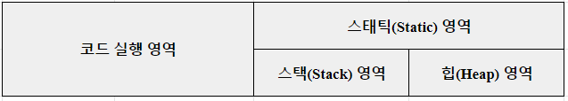

# 자바와 절차적 / 구조적 프로그래밍

## 목차
1. [자바 프로그램의 개발과 구동](#1-자바-프로그램의-개발과-구동)

<br>

# 👀 살펴볼 것
- 변수가 메모리에 어떻게 저장되고 사용될까?
- 메서드가 어떻게 호출되고 메모리에 어떤 변화를 일으킬까?

<br>  


# 1. 자바 프로그램의 개발과 구동
- JVM의 존재와 역할을 아는 것은 자바 개발 환경을 이해하는 데 필수적이다.
  - JVM,JDK,JRE 란 무엇인가?

<br>

- 현실 세계
  - 컴퓨터를 구동하려면 `하드웨어, 운영체제, 소프트웨어`가 필요하다.   
  그리고 소프트웨어를 개발할 수 있는 개발 도구도 필요하다.
  - `소프트웨어 개발 도구`로 `소프트웨어`를 개발하고, 이 소프트웨어는 `운영체제`를 통해 `하드웨어` 상에서 구동된다.

<br>

- 자바의 세계
  - `자바 개발도구`로 `자바 프로그램`을 만들고, `자바 실행 환경`을 통해 `자바 가상 머신` 상에서 구동된다.
  - 자바 개발 도구: JDK (Java Development Kit)
  - 자바 실행 환경: JRE (Java Runtime Environment)
  - 자바 가상 머신: JVM (Java Virtual Machine)

<br>

- JDK, JRE, JVM의 관계
    ```
    ┌──────────────────── JDK ────────────────────┐  
    │                                             │
    │                  ┌─────────JRE──────────┐   │
    │                  │                      │   │
    │   ·javac.exe     │ ·java.exe     ·JVM   │   │
    │                  │                      │   │
    │                  └──────────────────────┘   │ 
    └─────────────────────────────────────────────┘ 
    ``` 
    - JDK는 자바 소스컴파일러를 포함하고 있고, JRE는 자바 프로그램 실행기를 포함하고 있다.
    - 개발자가 자바 소스파일(Computer.java)을 작성하면 JDK의 자바 소스컴파일러가 번역해서 클래스 파일(Computer.class)로 만들고 JRE의 자바 실행기로 클래스 파일을 실행시킨다.

<br>

- 프로그램이 메모리를 사용하는 방식
  - 모든 프로그래밍 언어의 메모리 사용 방식  
    

  - 객체 지향 프로그램에서 메모리를 사용하는 방식
    
