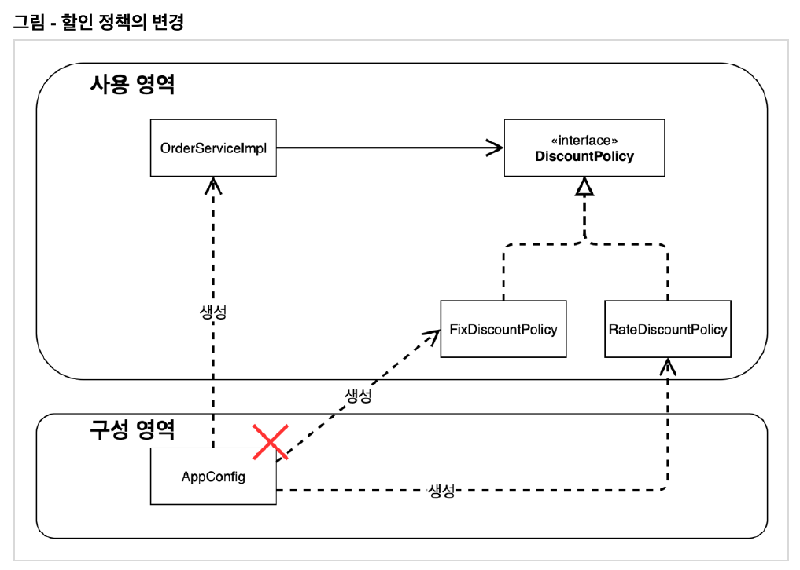

# AppConfig - 관심사의 분리

# 1. 서비스 구현체
## 1.1 MemberServiceImpl
```java
public class MemberServiceImpl implements MemberService {

    private final MemberRepository memberRepository = new MemoryMemberRepository();

...
}

```
- 클라이언트인 MemberServiceImpl가 인터페이스 뿐만 아니라 구현체도 같이 의존하고 있다.
<br>
<br>

## 1.2 OrderServiceImpl
```java
public class OrderServiceImpl implements OrderService {

    private final MemberRepository memberRepository = new MemoryMemberRepository();

    private final DiscountPolicy discountPolicy = new FixDiscountPolicy();

...
}
```
- 역할과 구현을 충실하게 분리했다.  
다형성을 활용해서 인터페이스와 구현 객체를 분리하였다.

- OCP와 DIP는 어떤가?  
주문서비스 클라이언트인 OrderServiceImpl는 인터페이스 쭌만 아니라 구현 클래스에도 의존하고 있다.  
할인 정책을 RateDiscountPolicy로 변경한다면 클라이언트 코드도 같이 변경을 해야 하므로 OCP를 위반한다.
<br>
<br>

# 2. 인터페이스에만 의존하도록
```java
public class OrderServiceImpl implements OrderService {
    //private final DiscountPolicy discountPolicy = new RateDiscountPolicy();
    private DiscountPolicy discountPolicy;
}
```
- 클라이언트 코드가 인터페이스 뿐만 아니라 구체 클래스도 함께 의존하고 있으므로 구체 클래스를 변경할 때 클라이언트도 함께 변경해야하는 문제가 생긴다.

- DIP를 위반하지 않도록 인터페이스에만 의존하도록 코드를 변경하고, 코드를 실행하면 null pointer exception이 발생한다.  
인터페이스만 있고 이를 구현한 구현체가 없으니 당연한 결과이다.

- DIP를 위반하지 않게하려면 인터페이스만 의존하도록 해야하고, 인터페이스만 의존하게 두면 구현체가 없으니 실행이 안되고 이를 해결하려면 누군가가 클라이언트인 OrderServiceImp에 DiscountPolicy를 구현한 객체를 대신 생성하고 주입해주어야 한다.
<br>
<br>


# 2. 관심사의 분리
```java
public class MemberServiceImpl implements MemberService {

    private final MemberRepository memberRepository = new MemoryMemberRepository();

...
}

```
- 클라이언트인 MemberServiceImpl은 MemberRepository라는 역할을 알고 있고 MemberRepository의 구현체인 MemoryMemberRepository까지 알고 있다.

- MemberServiceImpl에 필요한 역할과 기능만 책임을 지면 되는데 어떤 구현 객체를 사용할 것인지까지 책임을 지고 있다.

- MemberServiceImpl과 OrderServiceImpl은 인터페이스에만 의존하면서 필요한만큼만 책임을 져야하고, 역할에 맞는 구현체를 지정하는 책임을 담당하는 별도의 무엇인가를 만들어야한다.
<br>
<br>

# 3. AppConfig
- 애플리케이션의 전체 동작 방식을 구성하기 위해, 구현 객체를 생성하고 연결하는 책임을 가지는 별도의 설정 클래스를 만들자.

```java
public class AppConfig {

    public MemberService memberService() {
        return new MemberServiceImpl(new MemoryMemberRepository());
    }

    public OrderService orderService() {
        return new OrderServiceImpl( new MemoryMemberRepository(), new FixDiscountPolicy());
    }
}
```
- 객체의 생성과 연결은 AppConfig가 담당한다.

- application 운영의 전반적인 책임을 지고 있는 역할 (공연 기획자)  
내 어플리케이션 전체를 설정하고 구성한다.

- 객체를 생성하고 연결하는 역할과 실행하는 역할이 명확히 분리되었다.
<br>

```java
public class MemberServiceImpl implements MemberService {

    private final MemberRepository memberRepository;

    public MemberServiceImpl(MemberRepository memberRepository) {
        this.memberRepository = memberRepository;
    }
    ...
}
```
- MemberServiceImpl은 이전 코드처럼 MemoryMemberRepository를 의존하지 않고, MemberRepository 인터페이스에만 의존하고 있다.  
구체 클래스는 몰라도 된다. (DIP 완성)

- MemberServiceImpl의 입장에서는 생성자를 통해 어떤 구현 객체가 들어올지 알 수 없다.  
MemberServiceImpl의 생성자를 통해서 어떤 구현 객체를 주입할지는 오직 외부 AppConfig에서 결정된다.

- MemberServiceImpl은 의존관계에 대한 고민은 외부에 맡기고 실행에만 집중하면 된다.
<br>
<br>

# 4. AppConfig 리팩토링
- 설정 구성 정보는 역할과 구현이 한 눈에 잘 보여야 한다.  
하지만 현재 AppConfig는 중복이 있고, 역할에 따른 구현이 잘 보이지 않는다.
<br>

## 4.1 리팩토링 전
```java
public class AppConfig {

    public MemberService memberService() {
        return new MemberServiceImpl(new MemoryMemberRepository());
    }

    public OrderService orderService() {
        return new OrderServiceImpl(new MemoryMemberRepository(), new FixDiscountPolicy());
    }
}
```
- `new MemoryMemberRepository()` 부분이 중복 제거되었다.  
MemoryMemberRepository를 다른 구현체로 변경한다면 한 부분만 변경하면 된다.
<br>
<br>

## 4.2 리팩토링 후

```java
public class AppConfig {

    public MemberService memberService() {
        return new MemberServiceImpl(memberRepository());
    }

    public MemberRepository memberRepository() {
        return new MemoryMemberRepository();
    }

    public OrderService orderService() {
        return new OrderServiceImpl(memberRepository(), discountPolicy());
    }


    public DiscountPolicy discountPolicy() {
        return new RateDiscountPolicy();
    }
}
```

- 메서드 명만 봐도 무슨 역할을 하고 있는지 한눈에 보인다.

- 역할과 구현 클래스가 한눈에 들어오므로 애플리케이션 전체 구성이 어떻게 되어있는지 빠르게 파악할 수 있다.
<br>
<br>

# 5. 사용 영역과 구성 영역

<br>

- AppConfig의 등장으로 애플리케이션이 크게 사용 영역과, 객체를 구성하고 구성하는 영역으로 분리되었다.

- 할인 정책이 정액 할인 -> 정률 할인으로 변경된다고 해도 사용 영역에는 영향이 가지 않고, 구성 영역만 변경해주면 된다.

```java
public class AppConfig {
    ...
    public DiscountPolicy discountPolicy() {
        // return new FixDiscountPolicy();
        return new RateDiscountPolicy();
    }
}
```