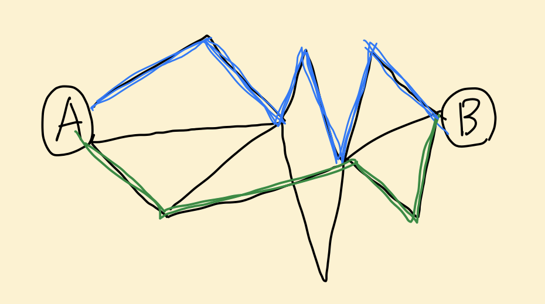

# MIME 타입

## 1. HTTP 헤더와 HTTP 바디

```   
클라이언트                      서버
┌────┐                       ┌────┐
│ A  │ ────────post────────> │  B │
└────┘                       └────┘
```
- 클라이언트는 서버에 post 요청(데이터 추가) 시 데이터를 전달 해야하는데, 이 때 http 헤더와 바디에 데이터를 담아 전달을 한다.


```
헤더 - Image/JPEG
바디 - my.jpeg 
```
- 클라이언트가 'my.jpeg'라는 파일을 보내려고 한다면, 이렇게 http 헤더와 바디를 전달할 것이다.
  - 헤더: data 설명
  - 바디: data
<br>

## 2. http 통신 - 패킷 스위칭, 서킷 스위칭

### 2.1 서킷 스위칭
```                   
┌────┐        a b c d        ┌────┐
│ A  │ ────────────────────> │  B │
└────┘                       └────┘
                              ^  
┌────┐         e f g          │  
│ C  │ ───────────────────────┘  
└────┘                           
```
- A: a, b, c, d 데이터들을 한번에 B한테 보낸다.
- C: e, f, g 데이터들을 한번에 B한테 보낸다.
- 속도는 빠르지만 선을 연결해야 한다.

### 2.2 패킷 스위칭                     
```                   
┌────┐        a|b|c|d         ┌────┐
│ A  │ ────┬─────────────────>│  B │
└────┘     │                  └────┘
           │                  
┌────┐     │ e|f|g           
│ C  │ ────┘ 
└────┘                           
```
- A: a|b|c|d 데이터를 쪼개서 B한테 전달하는데 이 쪼개진 데이터를 **`패킷`** 이라고 한다.
- C: 따로 C -> B의 선이 연결 되지 않고, A ->B 이 선에 달라붙어서 데이터를 보낸다.


```                   
┌────┐  
│ A  │ \
└────┘  \                     ┌────┐  
         \___g|d|f|c|b|e|a___>│ B  │ 
         /                    └────┘                 
┌────┐  /           
│ C  │ / 
└────┘                           
```
    
   
- A와 C가 선을 공유해서 쓰면 g|d|f|c|b|e|a 데이터가 섞이게 되는데, B는 이 데이터를 조립 해야 한다.

- B 입장에서는 이 데이터들을 조립을 해야 한다.  
    - A의 데이터는 A끼리, C의 데이터는 C끼리
    - 조립 - A: abcd / C: efg
<br>


## 3. HTTP 헤더와 MIME 타입


- 통신이라는 것은 하나의 선이 아니라 굉장히 복잡한 선으로 이루어진다. 이 많은 경로 중에 트래픽(교통)의 혼잡이 가장 적은 쪽을 선택해서 데이터를 전송하게 된다.  

- 데이터가 전송이 될 때 데이터마다 경로가 다를 수 있다.  
예를들어 출발은 a가 먼저했는데, d가 먼저 도착할 수도 있는데 이런 경우 조립 시에 문제가 생긴다. abcd를 조립해야 하는데 dbca가 되는 상황이 생긴다.  
그래서 모든 패킷에는 헤더가 붙어서 순서가 매겨지는데, http 헤더에는 순서 뿐만 아니라 'A가 보낸 데이터'라는 정보도 담을 수 있다.  
B는 이 헤더를 보고 데이터를 조립하게 된다.

- 내가 전송하게 되는 파일에는 jpeg뿐 아니라 text, img, avi, json등 http body에 실어보내는 데이터의 종류는 많이 있는데 이를 헤더에 작성할 때에는 작성 방식이 있다.  
이를 MIME 타입이라 부른다.

- 예를들어 MIME 타입 중에 text/plain, text/html이 있는데, MIME 타입의 종류를 알고 있어야 데이터를 전송할 때 MIME 타입 설정을 할 수 있다.
   - text/plain: text 인데 평문.
   - text/html: text이지만 평문이 아닌 html 문서.
<br>

## REFERENCE
> [MIME 타입](https://developer.mozilla.org/ko/docs/Web/HTTP/Basics_of_HTTP/MIME_types)
