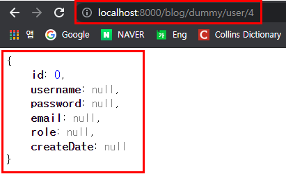
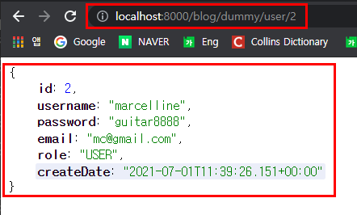
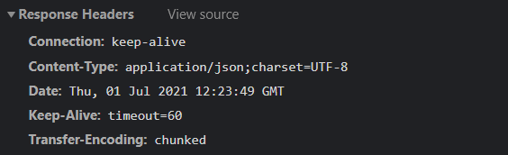

# Optional 과 MessageConverter

## 목차
1. [Optional 처리](#1-optional-처리)
   1.1 [Optional 처리 종류](#11-optional-처리-종류)

2. [전체코드 해석](#2-전체-코드-해석)
3. [MessageConverter](#3-messageconverter)  
   3.1 [MessageConverter가 하는 일](#31-messageconvert가-하는-일)  
   3.1 [Json 형태의 데이터 보여주기](#32-json-형태의-데이터-보여주기)  
   3.2 [Content Type](#33-content-type) 
<br>

## 1. Optional 처리
```java
@RestController
public class DummyControllerTest {

    @Autowired 
    private UserRepository userRepository;


    @GetMapping("/dummy/user/{id}")
    public User detail(@PathVariable int id) {
    
        User user = userRepository.findById(id).orElseThrow(new Supplier<IllegalArgumentException>() {
            @Override
            public IllegalArgumentException get() {
                return new IllegalArgumentException("해당 유저는 없습니다. id: " + id);
            }
        });
        return user;
    }
}
```
- userRepository.findById(id)의 반환형이 왜 Optional로 되어있을까? 

- 현재 DB에는 3명의 회원이 가입한 상태라고 가정해보자.
'http://localhost:8000/blog/dummy/user/4' 를 request 했을 때 userId가 4인 회원은 없을 것이다.  
그렇다면 데이터베이스에서 못찾아와서 user가 null이 될 것이고 null을 return 한다.   

- '이렇게 되면 프로그램에 문제가 있다는 것인데, Optional로 User 객체를 감싸서 가져올테니 null인지 아닌지 판단해서 return하라' 라는 의미이다.
<br>

## 1.1 Optional 처리 종류
### 1.1.1 orElseThrow()
```java
@GetMapping("/dummy/user/{id}")
    public User detail(@PathVariable int id) {
    
        User user = userRepository.findById(id).orElseThrow(new Supplier<IllegalArgumentException>() {
            @Override
            public IllegalArgumentException get() {
                return new IllegalArgumentException("해당 유저는 없습니다. id: " + id);
            }
        });
        return user;
    }
```
- findById() 메소드를 들어가 확인해보면 orElseThrow를 사용하고, IllegalArgumentException 예외를 발생시키라고 권장하고 있다.
 
-  @throws IllegalArgumentException if {@literal id} is {@literal null}.
<br>

### 1.1.2 get()
```java
@GetMapping("/dummy/user/{id}")
    public User detail(@PathVariable int id) {
    
        User user = userRepository.findById(id).get();
        return user;
    }
```
- 그럴리가 없으니 가져와라.
<br>

### 1.1.3 orElseGet()
```java
@GetMapping("/dummy/user/{id}")
    public User detail(@PathVariable int id) {
    
        User user = userRepository.findById(id).orElseGet(new Supplier<User>() {
            @Override
            public User get() {
                return new User();
            }
        });
        return user;
    }
```
- 빈 User 객체를 반환한다. 

- 
<br>

### 1.1.4 람다식
```java
//람다식
User user = userRepository.findById(id).orElseThrow(() -> {
            return new IllegalArgumentException("해당 사용자는 없습니다.");
        });
```
- 자바8에서부터 등장한 람다식.
- 한 눈에 봐도 코드가 간결해졌다.
<br>
<br>


##  2. 전체 코드 해석
```java
@RestController  ①
public class DummyControllerTest {

    @Autowired  ②
    private UserRepository userRepository;


    @GetMapping("/dummy/user/{id}") ③
    public User detail(@PathVariable int id) {

        User user = userRepository.findById(id).orElseThrow(new Supplier<IllegalArgumentException>() {
            @Override
            public IllegalArgumentException get() {
                return new IllegalArgumentException("해당 유저는 없습니다. id: " + id);
            }
        });

        return user;
    }

    ④
    @PostMapping("/dummy/join")
    public String join(User user) {  
        System.out.println("id = " + user.getId());
        System.out.println("role = " + user.getRole());
        System.out.println("createDate = " + user.getCreateDate());

        System.out.println("username = " + user.getUsername());
        System.out.println("password = " + user.getPassword());
        System.out.println("email = " + user.getEmail());

        user.setRole(RoleType.USER);
        userRepository.save(user);
        return "회원가입이 완료되었습니다.";
    }

}

```
- ① @RestController  
html 파일이 아니라 data를 리턴해주는 controller

- ② Autowired  
의존성 주입(DI)

- ③ 
    ```java
    @GetMapping("/dummy/user/{id}") 
        public User detail(@PathVariable int id) {
            ...
        }
    ```
    -  {id} 주소로 파라미터를 전달 받을 수 있다.
    -  http://localhost:8000/blog/dummy/user/3
    -  @PathVariable 어노테이션을 사용함으로써 파라미터로 넘어온 id 값을 매개변수로 받을 수 있다.

- ④ @PostMapping("/dummy/join")  
    - http://localhost:8000/blog/dummy/join (요청)
    - http 의 body 에 username, String password, String email 데이터를 가지고 요청
<br>
<br>

## 3. MessageConverter
```java
@RestController
public class DummyControllerTest {

    @Autowired
    private UserRepository userRepository;


    @GetMapping("/dummy/user/{id}")
    public User detail(@PathVariable int id) {
        User user = userRepository.findById(id).orElseThrow(new Supplier<IllegalArgumentException>() {
            @Override
            public IllegalArgumentException get() {
                return new IllegalArgumentException("해당 유저는 없습니다. id: " + id);
            }
        });

        return user;  ①
    }
    ...
}

```
- ① return user;  
 detail() 메소드는 user 객체를 리턴하고 있다.
  - 요청: 웹브라우저  
  - user 객체 = 자바 오브젝트  

  데이터를 리턴해주는 RestController가 웹브라우저한테 user 객체를 리턴해준다.

- 웹 브라우저는 당연히 user 객체를 이해하지 못한다.  
  웹 브라우저는 자바스크립트, html은 이해할 수 있는데 자바 객체는 이해하지 못한다.
<br>
<br>


### 3.1 MessageConvert가 하는 일
- user 객체가 반환이 될 때 변환을 해야 한다.
  - 웹 브라우저가 이해할 수 있는 데이터로 변환 : json(Gson 라이브러리) 
  
- 스프링부트에서는 MessageConverter라는 것이 응답시에 자동 작동을 한다.  
만약 자바 오브젝트를 리턴하게 되면 MessageConverter가 Jackson이라는 라이브러리를 호출해서 user 오브젝트를 json으로 변환해서 브라우저에게 던져준다.

### 3.2 Json 형태의 데이터 보여주기
웹브라우저에서 요청을 했을 때 MessageConverter가 자동 작동을 해서 json형태의 데이터를 볼 수 있었던 것이다.


<br>
<br>


### 3.3 Content Type


- content type이 json이다.
 
- 요청은 웹브라우저에서 했고, Response를 하는 주체는 스프링 서버이다.  
웹브라우저가 요청을 했을 때 스프링 서버가 response를 해주는데 "response를 해주는 데이터는 **`application/json`** 이야" 라고 content type을 http header에 명시해서 던져주고, 해당 데이터는 utf-8이다.