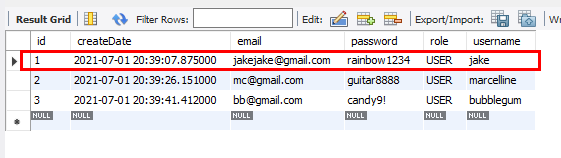
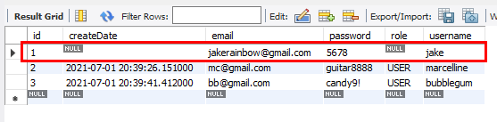
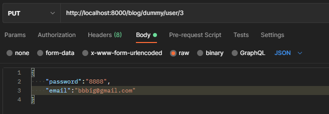
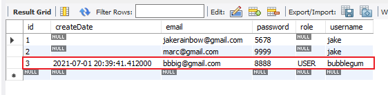
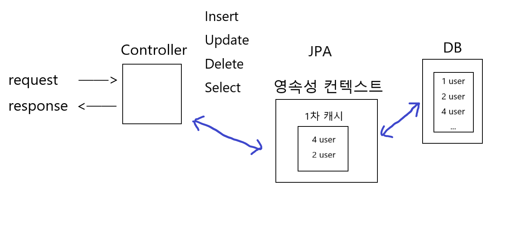

# 영속성 컨텍스트와 더티체킹
*(Persistence Context and Dirty Checking)*

# 1. @RequestBody

```java
@PutMapping("/dummy/user/{id}")
    public User updateUser(@PathVariable int id, @RequestBody User requestUser) {
        System.out.println("id = " + id);
        System.out.println("password = " + requestUser.getPassword());
        System.out.println("email = " + requestUser.getEmail());

        requestUser.setId(id);
        requestUser.setUsername("jake");
        userRepository.save(requestUser);
        return null;
    }
```
- json 데이터를 요청하면 스프링이 Java Object로 변환해서 받아준다.  
MessageConverter의 Jackson 라이브러리가 변환해서 받아준다. 이때 필요한 어노테이션이 @RequestBody이다.
<br>  
<br>  

# 2. save()
- save 메소드는 id를 전달하지 않으면 insert를 해준다.
  
- save 메소드는 id를 전달하면 해당 id에 대한 데이터가 있으면 update를 해준다.

- save 메소드는 id를 전달하면 해당 id에 대한 데이터가 없으면 insert를 한다.
<br>

## 2.1 save()를 통해서 update 하기
```java
@PutMapping("/dummy/user/{id}")
    public User updateUser(@PathVariable int id, @RequestBody User requestUser) {
        System.out.println("id = " + id);
        System.out.println("password = " + requestUser.getPassword());
        System.out.println("email = " + requestUser.getEmail());

        User user = userRepository.findById(id).orElseThrow(() -> {
            return new IllegalArgumentException("수정에 실패하였습니다.");
        });
        user.setPassword(requestUser.getPassword());
        user.setEmail(requestUser.getEmail());

        userRepository.save(user);
        return null;
    }
```
- 하지만 password, email, username을 제외한 다른 값들이 null로 변해버리는 문제가 생긴다.  
    
  
    
<br>

## 2.2 save()를 하지 않고 update 하기 
```java
@Transactional
@PutMapping("/dummy/user/{id}")
public User updateUser(@PathVariable int id, @RequestBody User requestUser) {
    System.out.println("id = " + id);
    System.out.println("password = " + requestUser.getPassword());
    System.out.println("email = " + requestUser.getEmail());

    User user = userRepository.findById(id).orElseThrow(() -> {
        return new IllegalArgumentException("수정에 실패하였습니다.");
    });
    user.setPassword(requestUser.getPassword());
    user.setEmail(requestUser.getEmail());

    return null;
}
```




- save를 안했는데, 어떻게 업데이트가 된 걸까?  
더티체킹에 대해 알아보자.
<br>
<br>


# 4.영속성 컨텍스트

<br>

## 4.1 영속화
- userRepository.save(user); -> insert  
영속성 컨텍스트 안의 `1차 캐시` 안에 user 객체가 쌓인다. 다음 이 user 객체를 db의 user 테이블에 집어 넣는데, 1차 캐시에 user 객체가 쌓여 있는 것을 **`'영속화 되었다'`** 라고 한다.  
그리고 영속화 되어있는 객체를 db에 밀어넣는 것을 **`flush`** 라고 한다.
<br>

## 4.2 flush
- 예를들어 A 창고에 물건들을 쌓아놓고 꽉 차면 A 창고에 있는 물건들을 더 큰 B 창고로 옮겨두고 A 창고에서 다시 새로운 물건들을 받는다고 가정하자.   
이 때 창고에 있는 물건들을 새 창고에 옮기고 비우는 것, 이것이 flush의 개념이다.

- 1차 캐시에 있는 오브젝트를 데이터 베이스에 밀어넣는데, 여기서는 특징이 있다.  
flush긴 한데 비우지 않는다는 것이다. 안날아가고 남아있다.   
<br>

## 4.3 save가 되는 과정
- 이를 어떻게 사용하는지 알아보자.  
Controller에서 4번 user 데이터를 select한다고 가정하자.  
첫번째로 영속화 되었는지 확인한다. 확인해보니 4번 데이터가 오브젝트로 1차 캐시에 영속화 되어있다.  
그렇다면 굳이 DB에 가서 select해서 들고 오지 않고,
영속화되어있는 오브젝트를 들고 온다.  
실제 db에 접근하지 않아도 되니까 부하가 덜하다.

- 이번엔 2번 오브젝트의 password, email을 update한다고 가정하자.  
select를 해서 DB에서 2번 데이터를 들고 와서 
영속성 컨텍스트의 1차 캐시에 영속화 시킨다.  
영속성 컨텍스트의 1차 캐시에 2번 user가 쏙 들어오게 된다.

    ```text
        JPA
    영속성 컨텍스트
        1차캐시
    ┌───────────┐  
    │   user 4  │ 
    │   user 2  │ 
    └───────────┘ 
    ```

- 그리고 이 2번 user 오브젝트를 controller에 들고 와서 영속화된 오브젝트 user의 값을 변경한다.   
변경하고 save를 호출하게 되면 어떻게 될까?  

- 2번 데이터의 pw, email이 변경이 됐는데, 내가 save해서 밀어넣은 user 오브젝트와 1차 캐시에 영속화 되어있는 user 오브젝트를 비교를 해봤더니 같은 아이디이다. (2번 user)  
그렇다면 1차 캐시에 있는 user 오브젝트를 사용하면된다. 굳이 밀어넣을 필요가 없다.   
그러고 나서 같은 2번 user인데 pw, email 값이 바뀌어있으니 밀어넣은 user에 있는 값만 영속화 되어있는 user 객체에 update 시킨다.

- 영속화 되어있는 user의 값이 변경이 될 것이고, 이 user를 flush해서 DB에 밀어넣으면 db에 있는 2번 테이블의 값이 변경이 된다.  
이 과정이 save() 를 하게되면 자동으로 일어난다.
<br>
<br>

# 5. @Transactional
```java
@Transactional
@PutMapping("/dummy/user/{id}")
public User updateUser(...) {
    ...
    User user = userRepository.findById(id).orElseThrow(() -> {
                return new IllegalArgumentException("수정에 실패하였습니다.");
    });

    user.setPassword(requestUser.getPassword());
    user.setEmail(requestUser.getEmail());

    return null;
}
```
## 5.1 언제 영속화가 되고 commit이 되는가?
- updateUser()메소드를 호출할 때 트랜잭션이 시작되고, 컨트롤러의 updateUser메소드가 종료될 때 종료되면서 자동으로 commit이 된다.


- 언제 영속화가 되느냐?  
2번 아이디의 user를 select해서 들고 올 때, 이 때 영속화가 된다.  
그리고 영속화된 이 user 오브젝트의 값을 변경 하고 종료를 하면 종료 시에 commit이 된다. 

    ```java
    user.setPassword(...);
    user.setEmail(...);
    ```


- 영속화된 오브젝트가 commit이 되면 이 오브젝트와 1차 캐시의 오브젝트를 비교를 해서 변경이 되었다는  것을 자동으로 인식 한다.  
1차 캐시의 오브젝트가 변경이 된 것을 인식 해서 컨트롤러 종료시에 이를 DB에 밀어넣고 update문을 수행해준다.

  
- ```java
  user.setPassword(...);
  user.setEmail(...);
  ```
    만일 이 코드가 없다면 영속화만 시킨 게 된다.  
    영속화가 되고 나서 메소드가 종료 될 때 commit이 된다한들 아무것도 되지 않을 것이다.  
    변경이 없기 때문에 1차 캐시의 오브젝트는 데이터 베이스에서 들고 온 그대로이다.  
    업데이트문이 수행될 리가 없다.

- 하지만 영속화 시키고 나서 값을 변경 시키면 트랜잭션이 종료됐을 때 변경을 감지한다.  
변경을 감지해서 데이터베이스에 수정을 날려준다.   이것을 **`더티체킹`** 이라고 한다.