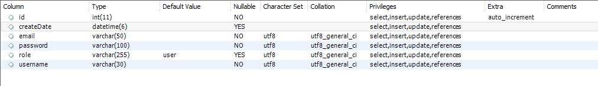
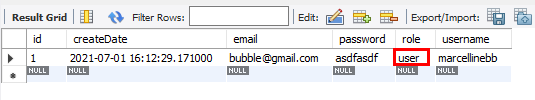

# User

## 1. @Autowired
```java
//@Repository
public interface UserRepository extends JpaRepository<User, Integer> {
}
```
- @Repository는 생략 가능하다.
<br>

```java
@RestController
public class DummyControllerTest {

    @Autowired  // 의존성 주입(DI)
    private UserRepository userRepository;

    @PostMapping("/dummy/join")
    public String join(User user) {

        System.out.println("id = " + user.getId());
        System.out.println("role = " + user.getRole());
        System.out.println("createDate = " + user.getCreateDate());

        System.out.println("username = " + user.getUsername());
        System.out.println("password = " + user.getPassword());
        System.out.println("email = " + user.getEmail());

        userRepository.save(user);
        return "회원가입이 완료되었습니다.";
    }
}
```
- 스프링이 컴포넌트 스캔을 할 때 @RestController 를 보고 DummyControllerTest 를 메모리에 띄울 때 userRepository = null 이다.

- 하지만 **`@Autowired`** 를 달아주면 DummyControllerTest가 메모리에 뜰 때 userRepository도 같이 뜬다.  
@Autowired는 'UserRepository 타입으로 스프링이 관리하고 있는 객체가 있다면 userRepository에 쏙 넣어줘' 라는 의미이기 때문이다.

- 스프링이 컴포넌트 스캔할 때 UserRepository가 메모리에 떠있기때문에 @Autowired를 통해서 userRepository를 들고와서 사용하기만 하면 된다.   
(의존성 주입)
<br>
<br>

## 2. @CreationTimestamp  
```java
@Data
@NoArgsConstructor
@AllArgsConstructor
@Builder
@Entity
public class User {

    @Id // Primary key
    @GeneratedValue(strategy = GenerationType.IDENTITY)
    private int id; 

    @Column(nullable = false, length = 30)
    private String username; 

    @Column(nullable = false, length = 100) 
    private String password;

    @Column(nullable = false, length = 50)
    private String email;

    @ColumnDefault("'user'")
    private String role;

    @CreationTimestamp  
    private Timestamp createDate;
}
``` 
- @CreationTimestamp  
  회원가입을 하고 DB를 확인해보면 createDate에 현재 시간이 자동으로 들어가있다. 자바에서 현재시간을 넣고 insert 해줬기 때문이다.
  (테이블에 insert될 때 현재시간이 자동으로 입력)

- @ColumnDefault("'user'")  
role에는 null로 되어있다. 왜 role에 default값인 user가 insert 되지 않았을까?

```java
@PostMapping("/dummy/join")
public String join(User user) {

    System.out.println("id = " + user.getId());
    System.out.println("role = " + user.getRole());
    System.out.println("createDate = " + user.getCreateDate());

    System.out.println("username = " + user.getUsername());
    System.out.println("password = " + user.getPassword());
    System.out.println("email = " + user.getEmail());

    userRepository.save(user);
    return "회원가입이 완료되었습니다.";
}
```
- System.out.println("createDate = " + user.getCreateDate());  
createDate는 여기에서는 null이다.

- userRepository.save(user);  
save할 때 @CreationTimestamp 작동해서 현재시간을 넣어서 데이터베이스에 insert 해준다. 즉 자바에서 만들어서 insert 해준다.
<br>
<br>

## 3. @ColumnDefault("'user'")  
@ColumnDefault("'user'") 이 경우 role은 데이터베이스에 아래와같이 만들어진다.



콘솔창을 확인해보면 DB에 아래와같이 insert 되었다.

```bash
Hibernate: 
    insert 
    into
        User
        (createDate, email, password, role, username) 
    values
        (?, ?, ?, ?, ?)
```

하지만, @ColumnDefault("'user'") Column에 default 값으로 user가 저장되게 하려면 DB에 아래와같이 insert가 되어야 한다.
<br>

```bash
Hibernate: 
    insert 
    into
        User
        (createDate, email, password, username) 
    values
        (?, ?, ?, ?)
```
@ColumnDefault("'user'"):  
데이터베이스에 insert할 때 role값을 넣지않았으니 default 값으로 user가 들어간다.
<br>

### 3.1 @DynamaicInsert
role 에 null로 들어가고있는 아래와같은 상황에서는 어떻게 해야할까?
```
Hibernate: 
    insert 
    into
        User
        (createDate, email, password, role, username) 
    values
        (?, ?, ?, null, ?)
```
- role과 null을 없애서 insert 하는 방법을 찾아야 한다.

- @DynamaicInsert : insert할 때 null인 필드를 제외한다.
<br>

### 3.2 결과
#### 3.2.1 코드
```java
@DynamicInsert
@Data
@NoArgsConstructor
@AllArgsConstructor
@Builder
@Entity
public class User {

    @Id // Primary key
    @GeneratedValue(strategy = GenerationType.IDENTITY)
    private int id; 

    @Column(nullable = false, length = 30)
    private String username; 

    @Column(nullable = false, length = 100) 
    private String password;

    @Column(nullable = false, length = 50)
    private String email;

    @ColumnDefault("'user'")
    private String role;

    @CreationTimestamp  
    private Timestamp createDate;
}
``` 
<br>

#### 3.2.2 데이터베이스


<br>

#### 3.2.3 쿼리
```bash
Hibernate: 
    insert 
    into
        User
        (createDate, email, password, username) 
    values
        (?, ?, ?, ?)

```
<br>
<br>

## 4. role 직접 설정
@DynamicInsert로 해결을 했지만 이렇게 어노테이션을 추가해나가다보면 끝이 없다.  

```java
@RestController
public class DummyControllerTest {

    @Autowired  // 의존성 주입(DI)
    private UserRepository userRepository;

    @PostMapping("/dummy/join")
    public String join(User user) {

        System.out.println("id = " + user.getId());
        System.out.println("role = " + user.getRole());
        System.out.println("createDate = " + user.getCreateDate());

        System.out.println("username = " + user.getUsername());
        System.out.println("password = " + user.getPassword());
        System.out.println("email = " + user.getEmail());

        user.setRole("user");
        userRepository.save(user);
        return "회원가입이 완료되었습니다.";
    }
}
```
- User 엔티티에 @DynamicInsert는 주석처리하고 DummyControllerTest에서
user.setRole("user"); 코드를 작성한다.
 
- 하지만 개발자가 이렇게 직접 String 타입으로 설정하다보면 오타가 나거나, 잘못 넣을 수 있을 가능성이 크다.
<br>
<br>

## 5. Enum
- Enum은 데이터의 도메인을 만들 때 사용한다. 도메인이라는 것은 범위를 의미하는데, 어떤 범위 안에 데이터를 넣을 때 만일 남, 여밖에 넣을 수가 없는데 String으로 넣다보면 남자, 여자 이런식으로 잘못 넣는 일이 생긴다.  

- Enum을 만들어 사용하게되면 데이터를 넣을 때 값을 강제할 수 있다는 장점이 있다.

```java
public enum RoleType {
    USER, ADMIN
}
```

```java
public class User {
    ...
    private RoleType role;
    ...
}
```

- private String role;   
  -> private RoleType role;

- String으로 직접 넣으면 `USERS` 이렇게 넣어도 잘 들어간다. 하지만 타입을 RoleType으로 하게 되면 **`타입`** 이 **` 강제`** 가 된다. (ADMIN, USER)
<br>

### 5.1 DB에 RolyType 알려주기
```java
public class User {
    ...
    @Enumerated(EnumType.STRING)
    private RoleType role;
    ...
}
```
- DB에는 RoleType이라는 게 없기 때문에 @Enumerated(EnumType.STRING) 어노테이션을 붙여서 해당 타입이 String이라고 알려줘야한다.
<br>

### 5.2 RoleType 셋팅
```java
@RestController
public class DummyControllerTest {

    @Autowired 
    private UserRepository userRepository;

    @PostMapping("/dummy/join")
    public String join(User user) { 
        ...
        user.setRole(RoleType.USER);
        userRepository.save(user);
        return "회원가입이 완료되었습니다.";
    }

}
```
- role을 설정하기 위해 user.setRole에 접근하게 되면 RoleType으로 설정할 수 있다는 것을 알 수 있게 된다. 

- Enum은 내가 넣는 값을 강제할 수 있다. USER 아니면 ADMIN만 넣을 수 있다. String이 아니므로 USER를 users로 잘못 넣는 실수를 막을 수 있다.
<br>

### 5.3 결과
