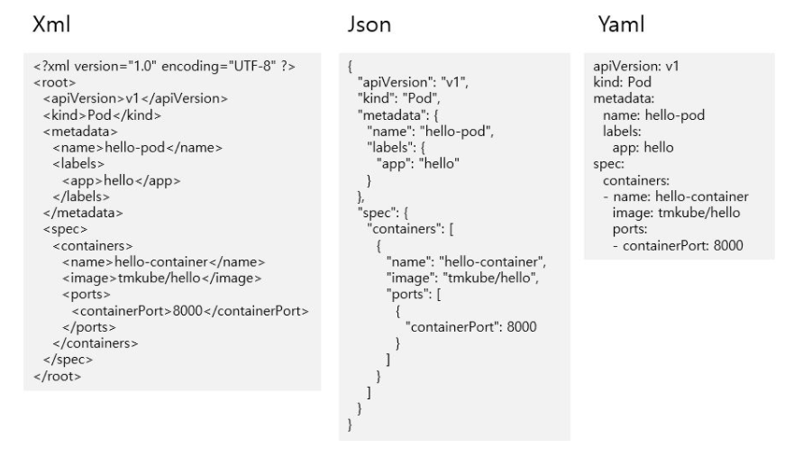

# Xml, Json, Yaml ?

스프링 프로젝트를 설정한다는 의미이다.
스프링에서는 포트, 데이터베이스 연결, 인코딩 등 전반적인 설정을 yaml파일에서 한다. (application.yml)

  - 기존에는 xml파일에서 했는데 지금은 yaml파일에서 한다.
  - 보통 야믈 이라고 읽고, yml이라고도 쓴다.
<br>


## 1. 포맷을 사용하는 이유

타 시스템 간에 데이터를 주고 받을 때 데이터 포맷에 대한 약속이 필요하다.

```
"1-김태민-강사, 2-이초코-학생"
```
- 혼자 시스템을 개발하거나 내부 시스템끼리는 " - (하이픈) "을 파싱해서 순서대로 '1'은 일련번호, "이초코"는 이름, "학생"은 구분, " ,(콤마) "는 리스트를 나타내는 구분자 라는 규칙을 세울 수 있다.

- 내부에서 세운 규칙을 타 시스템들과 데이터를 주고 받을 때 문서로 주고 받기도 번거롭고, 데이터 규칙에 대한 문서들이 많아지게 되는 문제가 있다.

- 그래서 xml이나 json과 같은 데이터 포맷을 정의하고, 포맷에는 규칙도 있다.
<br>


## 2. 포맷 형식

<br>

### 2.1 xml

- 오래전부터 사용되었던 포맷이다.
- 태그 형식으로 key와 value를 구분하고, 태그 안에 태그를 넣어 부모-자식 관계 구조를 나타낸다.
<br>


### 2.2 json
- xml 파일보다 보기가 더 쉽다.
- Object일 경우 {}로 감싸주고, Array일 경우 []로 감싸줘서 구분이 된다.
<br>


### 2.3 yaml (yml)
- ' - (하이픈)'을 통해 Array임을 알 수가 있다.
- key 값에 쌍따옴표가 없고, key와 value사이에는 한 칸을 띄어써야 하는 규칙이 있다. 규칙을 지키지 않으면 파일이 제대로 동작하지 않는다.
- json처럼 하위데이터를 표현하기 위해 중괄호를 사용하지 않기 때문에 훨씬 가볍다.
<br>